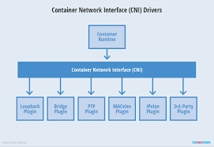
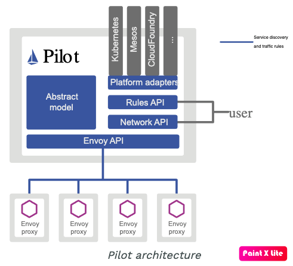

# 트래픽 컨트롤 1부

## 개요

이스티오의 대표 기능은 트래픽 컨트롤입니다. 이제 2장에서 셋팅한 샘플 어플리케이션 [Bookinfo](traffic-control-1.md) 의 트래픽을 제어하며 이스티오의 기능을 경험해보겠습니다.

이 장에서는 이스티오 설치때 정의한 [CRDs](traffic-control-1.md) \(Custom Resource DefinitionS\) 중 [Gateway](traffic-control-1.md), [Virtual Service](traffic-control-1.md), [Destination Rule](traffic-control-1.md) 을 이용하여 트래픽 컨트롤 기능을 간단히 실행해보겠습니다. 이후 트래픽 컨트롤을 담당하는 이스티오의 구성요소 [Pilot](traffic-control-1.md), [Envoy](traffic-control-1.md) 에 대해 살펴봅니다. 마지막으로 트래픽 컨트롤을 활용하여 [Continuous Deploy](traffic-control-1.md) 의 대표적인 방법인 [Canary Deploy](traffic-control-1.md), [Dark Launch](traffic-control-1.md), [A/B Test](traffic-control-1.md) 등의 방식을 어떻게 실현할 수 있는지 알아보겠습니다.

## [Traffic Control Hands-on](traffic-control-1.md) \(트래픽 컨트롤 핸즈온 \)

### 준비

* istio install

Istio 설치는 2 장을 참고하세요. 빠른 진행을 위해 설치에 필요한 스크립트를 제공합니다.

```bash
git clone https://github.com/istiokrsg/handson.git
cd handson/1-install
./install.sh
```

위 스크립트는 handson/download/istio/istio-${VERSION} 에 istio release 버전을 다운받아 동작합니다.

* Bookinfo install

Sample application 동작을 실행해보겠습니다.

```bash
$ cd handson/2-bookinfo
$ ./bookinfo.sh

GATEWAY_URL=localhost:80
Check bookinfo app : http://localhost:80/productpage
```

위 스크립트는 다음 3가지 동작을 수행합니다.

1. default namespace 에 label 을 지정합니다.
   1. kubectl label namespace default istio-injection=enabled
2. application 배포
   1. kubectl apply -f ${ISTIO\_HOME}/samples/bookinfo/platform/kube/bookinfo.yaml
3. istio ingress gateway 설치
   1. kubectl apply -f ${ISTIO\_HOME}/samples/bookinfo/networking/bookinfo-gateway.yaml

스크립트 수행결과 보여지는 링크를 따라 가면 제대로 어플리케이션이 구동되었음을 확인 할 수 있습니다.


### gateway, virtualservice, destinationrule install

#### gateway

여기서 gateway 설치를 통해 클러스터 외부에서 내부 어플리케이션으로의 통신 \(ingress\) 을 가능하게 합니다.

```yaml
apiVersion: networking.istio.io/v1alpha3
kind: Gateway
metadata:
  name: bookinfo-gateway
spec:
  selector:
    istio: ingressgateway # use istio default controller
  servers:
  - port:
      number: 80
      name: http
      protocol: HTTP
    hosts:
    - "*"
```

Gateway spec 에서 `selector.istio : ingressgateway` 는 labels 의 정보에 `istio : ingressgateway` 가 있는 `istio-ingressgateway` 서비스에 대해 gateway 역할을 한다는 의미입니다.

```bash
$ kubectl get svc -n istio-system istio-ingressgateway
NAME                   TYPE           CLUSTER-IP     EXTERNAL-IP   PORT(S)                                                                                                                                      AGE
istio-ingressgateway   LoadBalancer   10.106.36.98   localhost     15020:31669/TCP,80:31380/TCP,443:31390/TCP,31400:31400/TCP,15029:31974/TCP,15030:31207/TCP,15031:30405/TCP,15032:32696/TCP,15443:30447/TCP   19h

$ kubectl get svc -n istio-system istio-ingressgateway -o json | jq -r '.metadata.labels'
{
  "app": "istio-ingressgateway",
  "chart": "gateways",
  "heritage": "Tiller",
  "istio": "ingressgateway",
  "release": "istio"
}
```

따라서 Gateway spec 은 다음과 같이 해석할 수 있습니다.

> `localhost 로 들어오는 모든(*) hosts 주소에 대해 80 port http 프로토콜로 들어오는 모든 트래픽을 받아들인다`

#### virtualservice, destinationrule

Gateway 를 통해 들어온 트래픽을 어떤 경로로 전달하는지\(Route\)를 가리키는 것이 VirtualService 입니다.

```yaml
apiVersion: networking.istio.io/v1alpha3
kind: VirtualService
metadata:
  name: bookinfo
spec:
  hosts:
  - "*"
  gateways:
  - bookinfo-gateway
  http:
  - match:
    - uri:
        exact: /productpage
    - uri:
        prefix: /static
    - uri:
        exact: /login
    - uri:
        exact: /logout
    - uri:
        prefix: /api/v1/products
    route:
    - destination:
        host: productpage
        port:
          number: 9080
```

여기서 `spec.gateways` 는 `.metadata.name` 을 찾습니다.

```bash
$ kubectl get gateway bookinfo-gateway -o json | jq -r '.metadata.name'
bookinfo-gateway
```

또한 uri 가 일치해야만 경로를 지정할 수 있음을 유추할 수 있습니다. 경로는 destination 을 통해 가리키고 있는데 이때 host 는 service 명을 적어야 합니다.

destination 은 destination rule 을 따로 정의할 수도 있습니다. 여기서는 간단하게 virtualservice 에서 같이 정의하였습니다.

```bash
$ kubectl get svc productpage
NAME          TYPE        CLUSTER-IP      EXTERNAL-IP   PORT(S)    AGE
productpage   ClusterIP   10.104.71.146   <none>        9080/TCP   105m
```

따라서 VirtualService spec 은 다음과 같이 해석할 수 있습니다.

> `bookinfo-gateway 를 통해 들어오는 트래픽중에 uri 가 /productpage, login, logout 과 일치하거나, static, api/v1/products 로 시작하는 트래픽들은 productpage 서비스의 9080 port 로 전달한다`

#### Monitor \(Kiali\)

* 이스티오는 sidecar 패턴으로 동작하는 envoy proxy 를 통하는 모든 네트워크 트래픽을 모니터링하고 제어할 수 있습니다. 이를 통해 전체 네트워크 topology 를 모니터링을 도와주는 kiali 를 default 로 제공합니다. 이 또한 실행 하는 스크립트를 제공합니다.

```bash
$ cd handson/2-bookinfo
$ ./kiali.sh

Run Kiali
Default login ID/PW is [admin/admin]
./../downloads/istio/istio-1.5.0/bin/istioctl dashboard kiali
http://localhost:20001/kiali
```


default ID/PW 는 admin/admin 입니다. 접속하면 다음과 같은 화면을 볼 수 있습니다.



### 트래픽 변경 적용

* kiali 에서 보는 화면은 최근 트래픽 발생을 기준입니다. 만약 트래픽 흐름이 변경되면 이를 kiali 화면을 통해 모니터링 할 수 있습니다. 우선 최근 1분간의 트래픽 발생을 기준으로 화면을 보기 위해 Graph 화면 오른쪽 위에 위치한 `Last 1m` 을 선택합니다.
* 이제 주기적으로 curl 을 실행하여 외부에서 트래픽을 발생시켜봅시다. 이를 위한 스크립트는 다음의 위치에 있습니다.

```bash
$ cd hanson/3-traffic-control
$ ./load-periodically.sh
1 : curl localhost/productpage
2 : curl localhost/productpage
3 : curl localhost/productpage
...
```

* 현재 상태를 보면 productpage 서비스는 details, reviews 서비스를 호출하고 reviews 서비스중 v2, v3 subset\(istio concept\) 서비스는 ratings 서비스를 호출하고 있습니다. 이는 subset 에 대한 설정을 하지 않았기 때문에 모든 버전을 round robin 방식으로 트래픽을 보내고 있는 것입니다.
* 이를 모든 v1 subset 으로만 보내도록 변경해보겠습니다. 역시 스크립트로 제공합니다.

```bash
$ cd hanson/3-traffic-control
$ ././ch-only-v1.sh
kubectl apply -f ...
```

* 스크립트는 다음 두가지 설정을 합니다.
  * destination rule 은 모두 열어둡니다.
  * virtual service 를 통해 제어합니다.

```yaml
apiVersion: networking.istio.io/v1alpha3
kind: VirtualService
metadata:
  name: productpage
spec:
  hosts:
  - productpage
  http:
  - route:
    - destination:
        host: productpage
        subset: v1
---
apiVersion: networking.istio.io/v1alpha3
kind: VirtualService
metadata:
  name: reviews
spec:
  hosts:
  - reviews
  http:
  - route:
    - destination:
        host: reviews
        subset: v1
---
apiVersion: networking.istio.io/v1alpha3
kind: VirtualService
metadata:
  name: ratings
spec:
  hosts:
  - ratings
  http:
  - route:
    - destination:
        host: ratings
        subset: v1
---
apiVersion: networking.istio.io/v1alpha3
kind: VirtualService
metadata:
  name: details
spec:
  hosts:
  - details
  http:
  - route:
    - destination:
        host: details
        subset: v1
```

subset 이 v1 인것을 찾아서 매핑되는 pod 로 보내도록 설정되었습니다.

## [Concept](traffic-control-1.md) \(개념 이해하기\)

이스티오의 대표 기능은 트래픽 컨트롤이다. 트래픽 컨트롤은 담당하고 있는 서비스에 대해 내부 및 외부와의 통신등의 제어를 의미한다. 이스티오의 [Pilot](traffic-control-1.md), [Envoy](traffic-control-1.md) 등 두개의 구성요소가 트래픽 컨트롤 제어를 담당하고 있다. 특별한점은 어플리케이션 서비스를 직접 수정하지 않고 [configuration](traffic-control-1.md) 의 수정만으로 트래픽 컨트롤 기능을 제공하고 있다는 점이다. 그리고 [Pilot](traffic-control-1.md), [Envoy](traffic-control-1.md) 이기 때문에 [service discovery](traffic-control-1.md), [traffic routing](traffic-control-1.md), [load balancing](traffic-control-1.md) 등의 특징을 가지게 된다.

간단히 요약해보면

이스티오의 [Pilot](traffic-control-1.md) 은 트래픽 제어를 담당하고 있는 구성요소이다. 이스티오의 [Envoy](traffic-control-1.md) 는 [Pilot](traffic-control-1.md) 을 통해 설정된 구성과 정책을 수행하는 [Proxy](traffic-control-1.md)이다.

이 두가지에 대해서 좀 더 자세히 살펴보자.

### Pilot



위 그림은 이스티오 공식 문서에 나와있다. 그림에서 보면 [Abstract model](traffic-control-1.md) 을 통해 [Kubernetes](traffic-control-1.md) 뿐 아니라 다른 플랫폼 위에서도 트래픽 컨트롤 기능을 제공할 수 있음을 알수 있다. 예를 들어, Kubernetes 어댑터는 Kubernetes API 서버에서 pod 등록 정보 및 서비스 리소스를 변경하는 것을 watch 하는 컨트롤러를 구현했다. Kubernetes 어댑터는 이 데이터를 [Abstract model](traffic-control-1.md) 로 변환한다.

Envoy API 를 통해 Envoy proxy 끼리 서로에 대한 정보를 알도록 하기 위해 [Pilot](traffic-control-1.md) 은 [Abstract model](traffic-control-1.md) 을 사용하여 Envoy-specific configuration 을 생성한다.

Rules API, Network API 등을 사용하여 Pilot 에게 더욱 구체적인 configuration 을 지시하여 세부적으로 제어할 수 있다.

### Envoy proxy

* [Envoy](traffic-control-1.md) 는 L7 Layer 수준의 proxy 를 구현하는 open source 이다.
* Istio 의 트래픽은 데이터 플레인 트래픽 및 컨트롤 플레인 트래픽으로 분류된다.
  * 데이터 플레인 트래픽은 워크로드의 비즈니스 로직이 조작하는 데이터를 말합니다.
  * 컨트롤 플레인 트래픽은 메시의 동작을 프로그래밍하기 위해 Istio 구성 요소간에 전송되는 구성 및 제어 데이터를 말합니다.
  * Istio의 트래픽 관리는 전적으로 데이터 플레인 트래픽을 말합니다.
* Envoy 프록시는 데이터 평면 트래픽과 상호 작용하는 유일한 Istio 구성 요소입니다. Envoy 프록시는 데이터 플레인 트래픽을 메시를 통해 라우팅하고 서비스가 알 필요없이 구성 및 트래픽 규칙을 시행합니다. Envoy 프록시는 메시의 모든 서비스에 대한 모든 인바운드 및 아웃 바운드 트래픽을 중재합니다.
* ... 블라블라

## 활용하여 Continuous Deploy 구현하기

* [CI/CD pipeline](traffic-control-1.md) 개념에서 [CD](traffic-control-1.md) 를 구현하기 위한 다양한 방식들이 있다. 하지만 결국 중요한점은 서비스중인 어플리케이션과 새로 배포할 어플리케이션을 놓고 사용자의 트래픽을 어디로 보낼것인지 결정할때 서비스의 중단이 없어야 한다는 것이다. 이를 구현하기 위해 [Canary Deploy](traffic-control-1.md), [Dark Launch](traffic-control-1.md), [A/B Test](traffic-control-1.md) 등의 방식이 있다. 이스티오가 나오기전에는 어플리케이션에서 지원하거나 [Spinnaker](traffic-control-1.md) 등의 배포 전용 툴을 사용해야 했다. 여기서는 이스티오의 트래픽 컨트롤을 활용하여 각 배포방식을 어떻게 구현했는지 확인해 본다.

### 스마트 카나리

### 다크 런칭

### A/B 테스트

