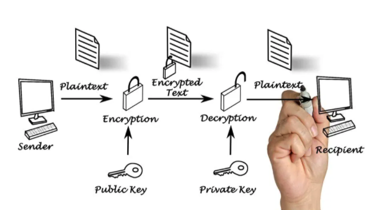

# 5.1.2 PKI \(공개키 기반 암호화\)

## PKI \(Public Key Infrastructure\)

공개키 기반의 암호화 알고리즘 중에서 대표적으로 RSA 가 있습니다. RSA 공개키 암호화 방식의 가장 큰 특징은 암호화 키가 공개키\(Public Key\), 개인키\(Private Key\) 하나의 쌍으로 구성되어 있습니다. 일반적으로 송신자가 공개키로 암호화하여 수신자에게 전송하면, 수신자는 개인키로 복호화 하는 방법입니다. 물론 반대로 개인키로 암호화 하고, 공개키로 복호화도 가능합니다. 이러한 한 쌍의 암호화 키를 이용하여 암/복호화하는 방식이 RSA 알고리즘 입니다.

현재 웹서비스에서 가장 많이 사용하는 SSL/TLS 통신기법은 대칭키를 RSA 공개키로 암호화 하여 수신자에게 안전하게 전송하고, 수신자는 개인키로 복호화 하여 대칭키를 안전하게 공유할 수 있습니다. 이후 송/수신 되는 모든 웹트래픽은 대칭키로 암/복호하하여 안전한 통신을 제공합니다. 일반적으로 PKI 기반의 알고리즘은 대칭키에 비해 컴퓨팅 연산을 많이 필요로 합니다. 따라서 웹 서비스와 같은 TCP 기반의 HTTP 트래픽이 많은 경우 대칭키 암호화 방식이 PKI 기반의 암호화 알고리즘에 비해 효율적입니다.
