# 개요

* 기존 Microservice의 문제점
  * Isio를 사용하는 이유 및 목적
  * Application Level \(Spring Cloud, Netflix OSS 등\) 로 Resilice를 구현하지 않고 Network 및 sidecar pattern으로 하는 이유 ...  

    
* Istio Service Mesh & programtic microservices architecture 
* Polyglot Microservices
  * 개발팀별 autonomous development 환경 등 ...

    

## Service Resiliency

Istio는 Istio Trafiic Management Rule을 통해 런타임에 동적으로 구성 할 수있는 opt-in 오류 복구 기능을 제공합니다. 이러한 기능을 통해 Service Mesh는 장애가 발생한 노드를 견딜 수 있으며 Istio는 오류가 발생한 해당 노드에서 다른 노드로 연쇄적으로 오류가 발생하는 것을 방지 할 수 있는 Service Resiliency를 제공합니다.

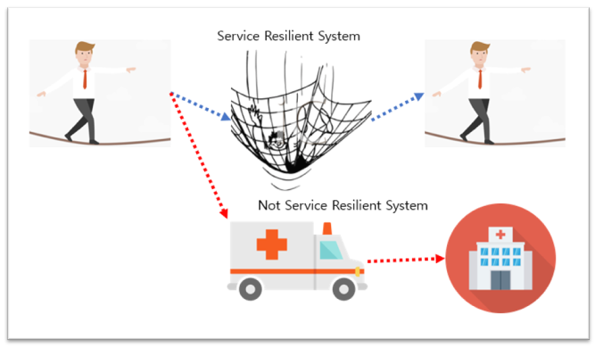

* Timeouts and retries Timeout은 Istio가 요청에 대한 응답을 기다리는 시간입니다. Retry란 작업이 실패하면 작업을 완료하려는 여러번 시도하는 것입니다. Timeout과 Retry 또는 둘 중 하나에 대해 기본값을 설정하고 요청 레벨 대체를 지정할 수 있습니다.
* Circuit breakers Circuit breaker는 업스트림 서비스가 응답하기를 기다리는 동안 Applicaction이 정지되는 것을 방지합니다. 연결 및 요청 제한과 같은 여러 조건에 따라 Circuit breaker를 구성할 수 있습니다.
* Fault injection Fault injection은 오류상태를 견디고 회복할 수 있도록 시스템에 인위적으로 오류를 주입하는 테스트 방법입니다. 네트워크 계층이 아닌 애플리케이션 계층에 장애를 주입하여 더 관련성이 있는 결과를 얻을 수 있습니다.
* Fault tolerance Istio failure recovery 기능을 사용하여 동작이 충돌하지 않는 상황에서 Application의 fault tolerance 라이브러리를 보완 할 수 있습니다.

> Istio 고장 복구 기능은 메시에서 서비스의 신뢰성과 가용성을 향상시키지만, Application은 장애나 오류를 처리하고 적절한 오류 복구 조치를 취해야 합니다. 예를 들어, 로드 밸런싱 풀의 모든 인스턴스가 실패하면, Envoy Proxy는 HTTP 503 코드를 반환합니다. Appliaction은 upstream 서비스에서 HTTP 503 오류 코드를 처리하는 데 필요한 모든 Fallback Logic을 구현해야 합니다.

## Timeouts and retries

Istio의 트래픽 관리 리소스를 사용하여 모든 발신자에게 적용되는 서비스 및 Subset 당 Timeout 및 Retry에 대한 기본값을 설정할 수 있습니다.

### timeout 설정하기

HTTP 요청에 대한 기본 timeout는 15초입니다. 예를 들어 라우팅 규칙을 사용하여 기본값을 재정의하도록 가상 서비스를 구성할 수 있습니다.


### Retry 횟수 및 timeout 설정하기

Virtual Service에서 HTTP 요청의 최대 Retry 횟수를 지정할 수 있으며 Retry에 특정 timeout를 제공하여 호출 서비스가 성공 또는 실패 여부를 예측 가능한 시간 내에 확인할 수 있습니다.

Envoy Proxy에서는 과부하 업스트림 서비스에 대한 Retry의 잠재적 영향을 최소화하기 위해 Retry 사이에 변수 Jitter를 자동으로 추가합니다.

다음 Virtaul Service는 2 초의 timeout으로 세 번의 Retry를 구성합니다.


서비스 사용자는 특별 HTTP 헤더를 통해 요청 수준 재정의로 Timeout 및 Retry 기본값을 재정의 할 수도 있습니다. Envoy Proxy는 다음 헤더를 사용할 수 있도록합니다.

* timeout : x-envoy-upstream-rq-timeout-ms
* retry : X-envoy-max-retries

## Fault injection

Fault injection를 사용하여 Application 전체에서 End to End 오류 복구 기능을 테스트할 수 있습니다. 장애 복구 정책을 잘못 구성하면 중요한 서비스를 사용할 수 없게 될 수 있습니다. 잘못된 구성의 예로는 서비스 호출 간 호환되지 않거나 제한적인 시간 초과가 포함됩니다.

Istio를 사용하면 Pod를 죽이거나 Packet을 지연 시키거나 TCP Layer에서 Packcet을 오류를 발생시키는 대신 Application Layer에서 Fault Injection을 사용할 수 있습니다. Application Layer에서 더 많은 관련 오류 \(예 : HTTP 오류 코드\)를 Injection하여 Application의 Resilience을 테스트 할 수 있습니다.

특정 조건과 일치하는 Request에 결함을 Inject할 수 있으며, 결함 대상 Istio의 Request에 대하여 결함 발생 비율을 조절할 수 있습니다.

두 가지 유형의 오류를 주입 할 수 있습니다.

* Delay : Delay는 Network Latency가 증가하거나 과부하 된 업스트림 서비스를 모방등으로 Delay되는 시간차를 발생시킨 결함입니다.
* Abort : Abort은 업스트림 서비스의 실패를 모방하여 발생시킨 결함이고 일반적으로 중단은 HTTP 오류 코드 또는 TCP 연결 실패의 형태로 나타납니다.

HTTP 요청을 규칙의 해당 요청 대상으로 전달하는 동안 하나 이상의 결함를 Injection하도록 Virtual Service를 구성 할 수 있습니다. 결함은 지연되거나 중단 될 수 있습니다.

### Delay : Http Request의 10%에 5초 Delay 하기

ratings 서비스에 대한 Http Request의 10 %에 대해 5 초 Delay을 적용하는 Virtual Service를 구성 할 수 있습니다. 

### Abort : Http Request의 10%에 대하여 http 400 오류 발생시키기

Request 중단하는 대신에 abort를 구성하고 결함을 시뮬레이션을 할 수 있습니다. 

### delay과 abort 조합한 결함

delay과 abort 결함을 함께 사용할 수 있습니다. 다음 구성은 review 서비스의 v2 Subset에서 ratings 서비스의 v1 Subset까지의 모든 Http Request에 대해 5초 Delay을 발생시키고 그 중 10%에 대한 Abort \(Http 400 error\)을 발생시킨다. 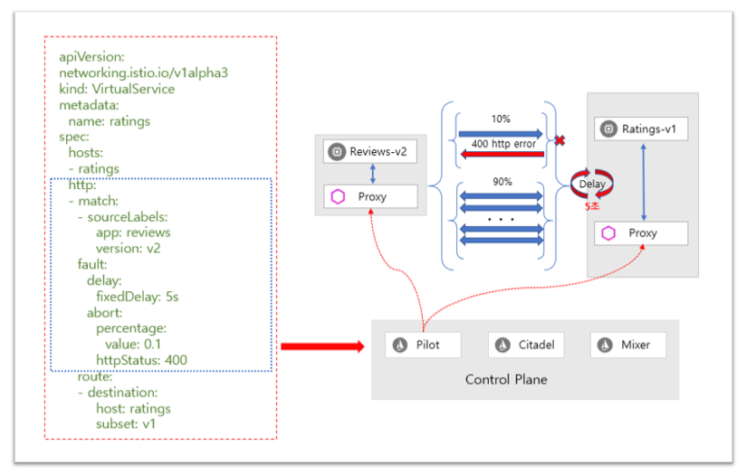

### Application 수준의 결함 처리와의 호환성

Istio 장애 복구 기능은 Application에 완전히 투명합니다. Envoy sidecar Proxy가 응답을 반환하기 전에 호출 된 업스트림 서비스에 대한 오류를 처리하는지 여부는 Application에서 알 수 없습니다.

Application 수준의 내결함성\(fault tolerance\) 라이브러리와 Envoy Proxy 오류 복구 정책\(failure recovery policies\)을 동시에 사용하는 경우 둘 다 독립적으로 작동하므로 충돌 할 수 있음을 기억해야합니다.

예를 들어, 두 개의 timeout \(하나는 Virtual Service에 구성되고 다른 하나는 Application에 구성됨\)를 가질 수 있다고 가정합니다. Application은 서비스에 대한 API 호출에 대해 2 초의 timeout를 설정합니다. 그러나 Virtual Service에서 1회 retry로 3 초의 timeout을 구성했습니다. 이 경우 Application의 timeout가 먼저 발생하므로 Envoy timeout 및 retry가 아무런 영향을 미치지 않습니다.

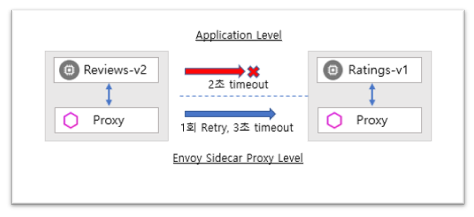

### Hands-on : Fault Injection

#### 준비 작업

* 설치 안내서의 지침에 따라 Istio를 설정하세요. [https://istio.io/docs/setup/kubernetes/install/](https://istio.io/docs/setup/kubernetes/install/)
* 기본 대상 규칙\(default destination rules\)을 포함하여 Bookinfo 샘플 Appliction을 배포합니다. [https://istio.io/docs/examples/bookinfo/](https://istio.io/docs/examples/bookinfo/)
* 요청 라우팅 작업을 수행하거나 다음 명령을 실행하여 Application 버전 라우팅을 적용합니다.

```text
$ kubectl apply -f samples/bookinfo/networking/virtual-service-all-v1.yaml
$ kubectl apply -f samples/bookinfo/networking/virtual-service-reviews-test-v2.yaml
```

* 위의 구성을 통해 요청 흐름 방식은 다음과 같습니다.

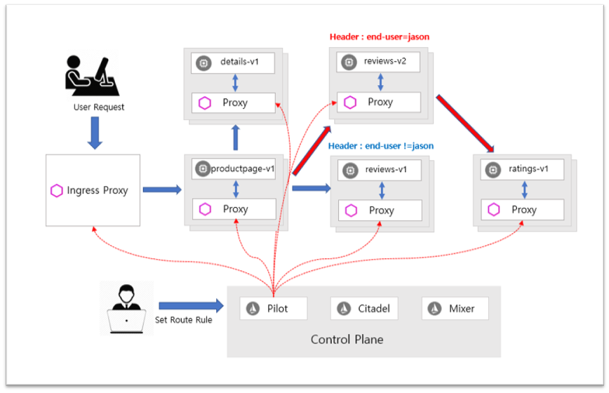


#### Injecting an HTTP delay fault

탄력성\(resiliency\)을 위해 Bookinfo Application 마이크로 서비스\(Microservice\)를 테스트하려면 사용자가 jason인 경우 review2-v2와 ratings 마이크로 서비스 사이에 7초 지연 \(delay\)을 주입합니다. 이 테스트는 Bookinfo 앱에 의도적으로 주입 된 결함을 발견할 수 있습니다.

reviews-v2 서비스에는 ratings 서비스 호출에 대한 연결 시간 제한 \(connection timeout\)이 10 초로 하드 코딩되어 있습니다. 주입 \(introduced, injected\) 한 7 초 지연 시간 \(delay\)에도 불구하고 여전히 오류없이 종단 간 흐름\(end-to-end flow\)을 계속 진행하는 것을 기대합니다.

* 테스트 사용자 jason에서 오는 트래픽을 지연시키는 오류 주입 규칙\(fault injection rule\)을 적용합니다.

```text
$ kubectl apply -f samples/bookinfo/networking/virtual-service-ratings-test-delay.yaml
```

* 적용된 오류 주입 규칙\(fault injection rule\)을 확인합니다.

```text
$ kubectl get virtualservice ratings -o yaml
apiVersion: networking.istio.io/v1alpha3
kind: VirtualService
metadata:
  name: ratings
  ...
spec:
  hosts:
  - ratings
  http:
  - fault:
      delay:
        fixedDelay: 7s
        percent: 100
    match:
    - headers:
        end-user:
          exact: jason
    route:
    - destination:
        host: ratings
        subset: v1
  - route:
    - destination:
        host: ratings
        subset: v1
```

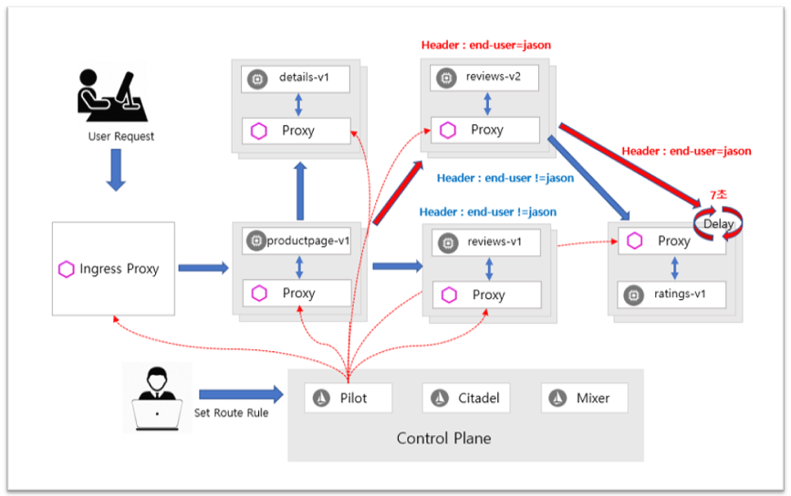

#### Testing the delay configuration

* 브라우저에서 Bookinfo Web Application을 엽니다.
* /productpage Web Page에서 사용자 jason으로 로그인하세요.

\[로그인 화면\]

약 7초 안에 Bookinfo 홈페이지가 오류\(error\)없이 로드 될 것으로 기대합니다. 그러나 문제가 있습니다 : reviews 섹션에 오류 메시지가 표시됩니다.

```text
  Error fetching product reviews!
  Sorry, product reviews are currently unavailable for this book.
```


* 웹 페이지 응답 시간보기 :
  * 웹 브라우저에서 개발자 도구 메뉴를 엽니다.
  * 네트워크 탭을 엽니 다.
  * /productpage 웹 페이지를 다시로드하세요. 페이지가 실제로 약 6초 안에 로드된다는 것을 알 수 있습니다.


#### Understanding what happened

버그를 발견했습니다. reviews 서비스가 실패하게 만든 마이크로 서비스에는 하드 코딩 된 시간 초과\(timeout\)가 있습니다.

예상과 같이, 주입된 7초 시간 지연은 reviews-v2와 ratings-v1 서비스 간의 시간 초과가 10초로 하드 코딩되기 때문에 reviews-v2 서비스에 영향을 미치지 않습니다. 그러나 productpage 페이지와 reviews-v2 서비스 간에는 하드 코드 된 시간 초과가 있으며 2번의 재시도\(retry\), 시간초과\(timeout\) 3초로 하드 코딩되었기 때문에 결과적으로 reviews-v2에 대한 productpage 페이지 호출이 조기에 시간 초과되고 6초 후에 오류가 발생합니다.


> [https://github.com/istio/istio/blob/master/samples/bookinfo/src/reviews/reviews-application/src/main/java/application/rest/LibertyRestEndpoint.java](https://github.com/istio/istio/blob/master/samples/bookinfo/src/reviews/reviews-application/src/main/java/application/rest/LibertyRestEndpoint.java) [https://github.com/istio/istio/blob/master/samples/bookinfo/src/productpage/productpage.py](https://github.com/istio/istio/blob/master/samples/bookinfo/src/productpage/productpage.py)
>
> fault injection 테스트는 로그인한 사용자가 Jason일 때에만 수행된다는 점에 유의하세요. 다른 사용자로 로그인하면 지연이 발생하지 않습니다.

이와 같은 버그는 여러 팀이 서로 다른 마이크로 서비스를 독립적으로 개발하는 일반적인 엔터프라이즈 애플리케이션에서 발생할 수 있습니다. Istio의 fault injection rule은 최종 사용자에게 영향을 미치지 않고 비정상적인 작동에 대하여 식별하는데 도움이 됩니다.

#### Fixing the bug

일반적으로 다음과 같이 문제를 해결할 것입니다.

\(1\) 서비스 시간 초과를 검토하기 위해 productpage 시간을 늘리거나 reviews 시간을 줄입니다. \(2\) 고정 된 마이크로 서비스를 중지하고 다시 시작합니다. \(3\) /productpage 웹 페이지가 오류\(Error\)없이 응답을 반환하는지 확인합니다.

그러나 reviews 서비스의 v3에서 이미 수정 된 사항이 있습니다. reviews v3 서비스는 평가를 10 초에서 2.5 초로 제한하여 다운 스트림으로 productpage 요청의 timeout \(미만\)와 호환되도록합니다. 모든 트래픽을 reviews v3으로 마이그레이션하는 경우 지연 규칙\(delay rule\)을 2.5초\(예: 2초\)보다 작은 값으로 변경하고 오류 없이 엔드투엔드 흐름이 계속되는지 확인할 수 있습니다.

```text
kubectl apply -f - <<EOF
apiVersion: networking.istio.io/v1alpha3
kind: VirtualService
metadata:
  name: reviews
spec:
  hosts:
    - reviews
  http:
  - match:
    - headers:
        end-user:
          exact: jason
    route:
    - destination:
        host: reviews
        subset: v3
  - route:
    - destination:
        host: reviews
        subset: v1
EOF
```


#### Injecting an HTTP abort fault

microservice resilience \(마이크로 서비스 탄력성\)을 테스트하는 또 다른 방법은 HTTP abort fault\(중단 오류\)를 적용하는 것입니다. 이 작업에서는 테스트 사용자 인 jason의 ratings 마이크로 서비스에 HTTP abort\(중단\)를 소개합니다.

이 경우 페이지가 즉시 로드되고 ratings 서비스는 현재 사용할 수 없다는 메시지가 표시됩니다.

\(1\) 사용자 jason에게 HTTP 중단\(Abort\)을 보내려면 오류 주입 규칙\(fault injection rule\)을 만듭니다.

```text
    $ kubectl apply -f samples/bookinfo/networking/virtual-service-ratings-test-abort.yaml
```

\(2\) 적용된 규칙이 만들어 졌는지 확인합니다.

```text
    $ kubectl get virtualservice ratings -o yaml
    apiVersion: networking.istio.io/v1alpha3
    kind: VirtualService
    metadata:
      name: ratings
      ...
    spec:
      hosts:
      - ratings
      http:
      - fault:
          abort:
            httpStatus: 500
            percent: 100
        match:
        - headers:
            end-user:
              exact: jason
        route:
        - destination:
            host: ratings
            subset: v1
      - route:
        - destination:
            host: ratings
            subset: v1
```


#### Testing the abort configuration

\(1\) 브라우저에서 Bookinfo Web Application을 엽니다. \(2\) /productpage 페이지에서 사용자 jason으로 로그인하세요. Rule이 모든 Pod에 성공적으로 전파되면 페이지가 즉시 로드되고 ratings 서비스를 현재 사용할 수 없다는 메시지가 나타납니다. \(3\) 사용자 jason에서 로그 아웃하거나 익명 창 \(또는 다른 브라우저\)에서 Bookinfo Application을 열면 /productpage가 여전히 jason을 제외한 모든 사용자에 대해 v1 \(평가를 전혀 호출하지 않음\)을 호출한다는 것을 알 수 있습니다. 따라서 오류 메시지가 표시되지 않습니다.

#### Cleanup

* Application 라우팅 규칙 제거 

```text
$ kubectl delete -f samples/bookinfo/networking/virtual-service-all-v1.yaml
```

### Hands-on : Request timeouts

다음은 Application에서 Timeout을 통해 Service Resiliency를 추가하는 방법을 보여주는 예제 입니다. rating에 대한 2 초의 시간 지연\(Fault Injection\)을 설정하여 Review가 1 초 이내에 응답하지 않으면 productpage에서 review에서 대한 오류 메세지를 보여줍니다.

#### 준비 작업

* 설치 안내서의 지침에 따라 Istio를 설정하세요. [https://istio.io/docs/setup/kubernetes/install/](https://istio.io/docs/setup/kubernetes/install/)
* 기본 대상 규칙\(default destination rules\)을 포함하여 Bookinfo 샘플 Appliction을 배포합니다. [https://istio.io/docs/examples/bookinfo/](https://istio.io/docs/examples/bookinfo/) 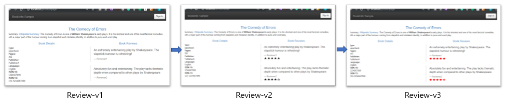
* 아래와 같은 명령으로 모든 Request가 Bookinfo Sample Application내에 있는 서비스별로 Version 1를 호출할 수 있도록 변경합니다.

```text
$ kubectl apply -f samples/bookinfo/networking/virtual-service-all-v1.yaml
```

* 위의 명령을 실행 후 웹브라우저에서 다음과 같은 웹페이지를 확인할 수 있습니다.


Http Request에 대한 Timeout은 Route Rule의 _timeout_ 필드를 사용하여 지정할 수 있습니다. 기본적으로 Timeout되면 실행 중지되지만 이 작업에서는 Review 서비스 Timeout를 1초로 재정의합니다. 하지만, 그렇게 하기 위해서는 Rating 서비스를 2초 동안 호출을 지연시킵니다.

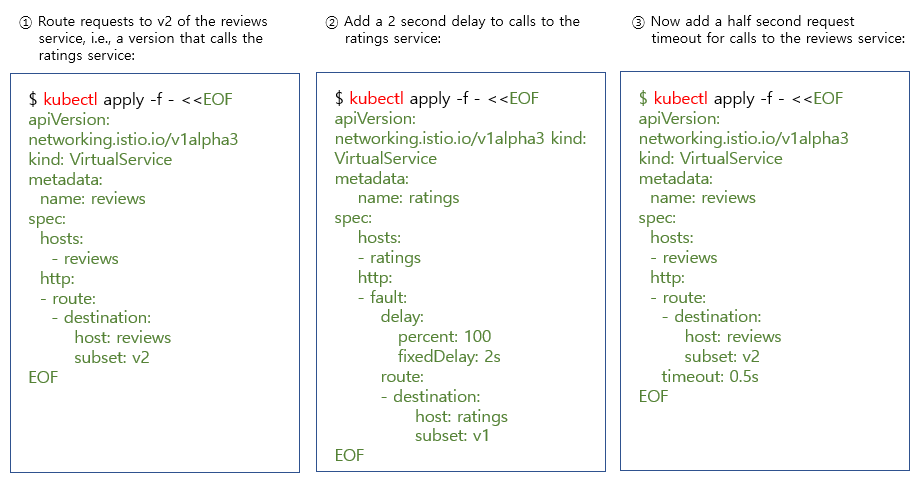

위의 \(1\),\(2\),\(3\)번 yaml 파일을 적용 후의 서비스의 흐름도 입니다. 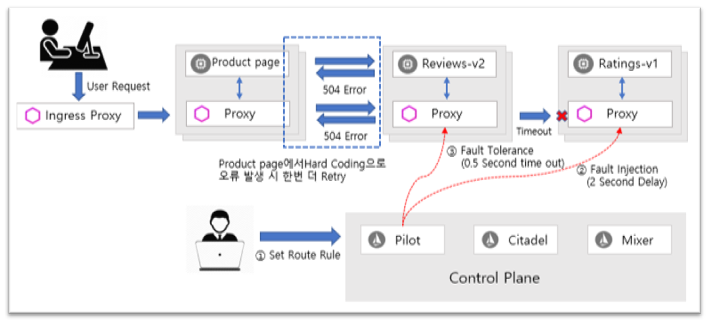

위의 \(1\)번 yaml파일으로 모든 Request를 Review 서비스의 v2으로 라우팅하고 -&gt; \(2\)번 yaml파일로는 Rating 서비스에 2초 지연 시킨 후 \(Fault Injection\) 후 웹브라우저에서 확인하면 2초 후 아래와 같은 웹페이지를 보여줍니다.


대규모 서비스의 일부 기능에서 다양한 원인으로 이런 지연 현상이 발생하면 시스템의 종속 및 호출 관계에 있는 컴포넌트간의 누적적인 지연으로 서비스 전체에 영향을 미쳐 비즈니스 지속성의 문제가 될 수 있으므로 이런 종류의 문제 영향을 최소화하기 위하여 \(3\)번과 같은 Timeout 기능을 활용하여 Service Resiliency를 보장한다.

위의 \(3\)번 yaml 파일을 적용 후 웹브라우저를 Refresh하면 Rating 서비스는 2초 동안 지연시키고 Review 서비스는 Rating 서비스를 호출 후 1초내에 응답하지 않으면 웹브라우저에서는 아래와 같은 웹페이지를 확인할 수 있습니다.


> Review의 timeout이 0.5 초로 구성 되어 있지만 응답에 1 초가 소요되는 이유는 Productpage 서비스에 Hard Coding으로 Review 호출 시 오류가 발생하면 재 시도를 한번 더 하기 때문입니다.

```python
istio/samples/bookinfo/src/productpage/productpage.py 에서 Review 호출 부분 참조

def getProductReviews(product_id, headers):
    ## Do not remove. Bug introduced explicitly for illustration in fault injection task
    ## TODO: Figure out how to achieve the same effect using Envoy retries/timeouts
    for _ in range(2):
        try:
            url = reviews['name'] + "/" + reviews['endpoint'] + "/" + str(product_id)
            res = requests.get(url, headers=headers, timeout=3.0)
        except:
            res = None
        if res and res.status_code == 200:
            return 200, res.json()
    status = res.status_code if res is not None and res.status_code else 500
    return status, {'error': 'Sorry, product reviews are currently unavailable for this book.'}
```

## Circuit breakers

시간 초과\(timeout\) 및 재시도\(retry\)처럼 서비스를 변경하지 않고도 회로 차단기 패턴 \(Circuit Breaker Pattern\)을 구성할 수 있습니다.. Application이 일시적인 오류\(Error\)로부터 복구되도록 Retry하는 동안 회로 차단기 패턴은 업스트림\(Upstream\) 서비스가 응답하기를 기다리는 동안 Application이 지연되는 것을 방지합니다.

* 회로 차단기 패턴을 구성하면 Application이 빠르게 실패\(Fail\)하도록 허용하고, 예를 들어 경고\(Alert\)를 트리거하여 오류\(Error\)를 적절하게 처리할 수 있습니다.
* 연결\(Connection\) 및 요청 제한 \(Request limit\)과 같은 여러 조건을 기반으로 간단한 회로 차단기 패턴을 구성 할 수 있습니다.

#### 연결\(Connection\) 100개 제한하기

다음 대상 규칙은 v1 Subset의 reviews 서비스 작업 부하에 대한 연결 수를 100으로 제한합니다.

### Circuit Breaker Settings

Envoy는 응용 프로그램의 서비스에서 활용할 수있는 즉시 사용 가능한 opt-in 오류 복구 기능 \(failure recovery features\)을 제공합니다. 동시 연결의 수와 업스트림 서비스에 대한 요청 수에 제한을 둘 수 있으므로 많은 수의 요청으로 시스템은 압도 되지 않습니다.

```text
trafficPolicy:
  connectionPool:
    http:
      http1MaxPendingRequests: 10
      maxRequestsPerConnection: 1
    tcp:
      maxConnections: 1
```

* maxConnections : 백엔드에 대한 최대 연결수 \(\(Maximum Connections\)입니다. 초과된 연결\(Connection\)은 Queue에서 대기 중입니다.
* http1MaxPendingRequests : 백엔드에 대기중인 최대 요청 수 \(Maximum Pending Requests\) 입니다. 초과 보류중인 요청은 거부됩니다.  
* maxRequestsPerConnection : 주어진 시간에 클러스터내에서 최대 요청 수입니다.

## Hands-on : Circuit Breaking

이 작업에서는 연결 \(Connection\), 요청\(Request\) 및 이상치 탐지 \(Outlier detection\)에 대한 회선 차단\(Circuit Breaking\)을 구성하는 방법을 보여줍니다.

회로 차단\(Circuit Breaking\)은 탄력적인 Microservice Application을 개발하는데 중요한 패턴입니다. 회로 차단 기능을 사용하면 장애\(Failure\), 대기 시간 급상승 \(Latency Spike\) 및 네트워크 특성의 기타 바람직하지 않은 영향의 영향을 제한하는 Appication을 개발할 수 있습니다.

이 작업에서는 회로 차단 규칙\(Circuit Breaking Rule\)을 구성한 다음 의도적으로 회로 차단기\(Circuit Breaker\)를 "Tripping"하여 테스트합니다.

### 준비 작업

* 설치 안내서의 지침에 따라 Istio를 설정하세요.

  [https://istio.io/docs/setup/kubernetes/install/](https://istio.io/docs/setup/kubernetes/install/)

* httpbin sample을 시작하세요.
  * 자동적으로 사이드카 주입으로 할 수 있도록 활성화 한 경우

    ```text
    $ kubectl apply -f samples/httpbin/httpbin.yaml
    ```

    ```text
    service "httpbin" created
    deployment.extensions "httpbin" created
    ```

  * 그렇지 않으면 httpbin 응용 프로그램을 배포하기 전에 를 수동으로 Sidecar를 주입해야합니다.

    ```text
     $ kubectl apply -f <(istioctl kube-inject -f samples/httpbin/httpbin.yaml)
    ```

    httpbin Application는 이 작업의 백엔드 서비스로 사용됩니다.

### circuit breaker 구성하기

* httpbin 서비스를 호출 할 때 circuit breaker\(회로 차단\) 설정을 적용하는 대상 규칙\(destination rule\)을 만듭니다.

  > mutual TLS authentication\(상호 TLS 인증\)을 사용하도록 Istio를 설치 / 구성한 경우 적용하기 전에 DestinationRule에 TLS 트래픽 정책 모드 : ISTIO\_MUTUAL을 추가해야합니다. 그렇지 않으면 요청은 여기에 설명 된대로 503 http 오류를 생성합니다.

  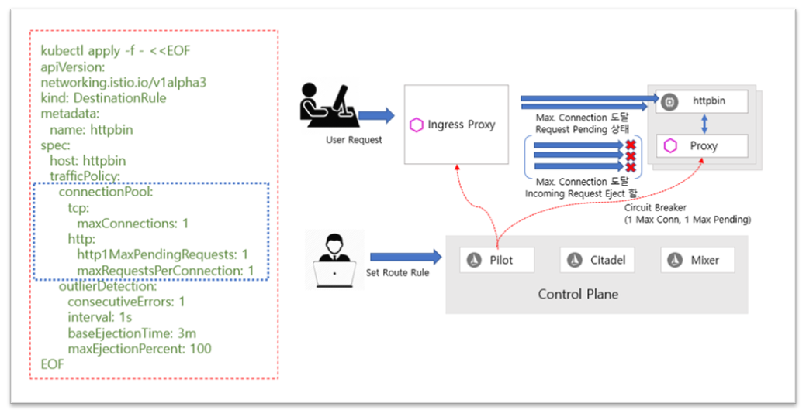

#### Outlier Detection

이상치 탐지\(Outlier Detection\)는 비정상적인 호스트 동작을 감지하고 클러스터 내의 부하 분산 된 정상 호스트 집합에서 비정상적인 호스트를 제거하는 Istio 탄력성 전략 \(Istio Resiliency strategy\)입니다. 자동으로 각 개별 호스트의 상태를 추적하고 서비스 호출과 관련된 연속적인 오류 \(consecutive error\) 및 지연\(latency\)과 같은 메트릭을 검사합니다. 이상치\(Outlier\)를 발견하면 자동으로 제거\(evict\)됩니다.

Ejection/Eviction은 호스트가 비정상적인 것으로 식별되고 load balancing process의 일부로 사용자 요청을 처리하는데 사용되지 않는다는 것을 의미합니다. 요청이 서비스 인스턴스로 보내지고 실패 할 경우 \(50X 오류 코드 반환\) Istio는 지정된 기간 동안 load-balanced pool에서 인스턴스를 방출\(ejects\) 됩니다. 이것은 sleep window으로 구성됩니다.

이 전체 프로세스는 healthy pod만 사용자 요청을 처리하는데 참여함으로써 서비스의 전체 가용성\(availability\)을 높입니다.


```text
outlierDetection:
  baseEjectionTime: 20s
  consecutiveErrors: 3
  interval: 10s
  maxEjectionPercent: 100
```

* BaseEjectionTime :  호스트의 최대 방출 지속 시간 \(maximum ejection duration\) 입니다. 예를 들어 요청 처리를 위해 다시 평가되기 전에 호스트가 20 초 동안 방출됩니다.
* ConsecutiveErrors : 호스트가 연결 풀에서 방출\(Inject\)되기 전의 연속적으로 오류 발생 횟수입니다. 예를 들어 서비스와 상호 작용하는 동안 세 번의 연속적인 오류가 발생하면 Istio는 Pod을 unhealthy한 것으로 표시합니다.
* 시간 간격 : 방출 분석\(ejection analysis\)을 위한 시간 간격. 예를 들어 서비스 의존성은 매 10초마다 확인됩니다.
* MaxEjectionPercent : 부하가 분산 된 풀\(load-balanced pool\)에서 꺼낼 수있는 \(eject\) 호스트의 최대 비율입니다. 예를 들어 이 필드를 100으로 설정하면 연속적인 오류를 발생시키는 비정상적인 포드\(unhealthy pod\)를 방출\(eject\) 할 수 있고 요청은 정상 포드\(healthy pod\)로 다시 라우팅됩니다.

Outlier Detection은 load balancing pool에 연결된 최소 수의 정상 호스트\(healthy host\)가 있을 때까지 사용 가능하게됩니다.

DestinationRule을 만드는 동안 TrafficPolicy 섹션에 Circuit Breaker 필드를 언급 할 수 있습니다. 아래는 샘플 DestinationRule 입니다.

```text
apiVersion: networking.istio.io/v1alpha3
kind: DestinationRule
metadata:
  name: reviews
spec:
  host: reviews
  subsets:
  - labels:
      version: v1
    name: reviews-v1
    trafficPolicy:
      connectionPool:
        http: {}
        tcp: {}
      loadBalancer:
        simple: RANDOM
      outlierDetection:
        baseEjectionTime: 20s
        consecutiveErrors: 3
        interval: 10s
        maxEjectionPercent: 100
  - labels:
      version: v2
    name: reviews-v2
    trafficPolicy:
      connectionPool:
        http: {}
        tcp: {}
      loadBalancer:
        simple: RANDOM
      outlierDetection:
        baseEjectionTime: 20s
        consecutiveErrors: 3
        interval: 10s
        maxEjectionPercent: 100
```

### Client 추가

httpbin 서비스에 Traffic을 전송하는 Client를 만듭니다. Client는 fortio라는 간단한 부하 테스트 Client입니다. Fortio에서는 발신\(outgoing\) HTTP 호출에 대한 연결 수, 동시성\(Concurrency\) 및 지연\(Delay\)을 제어 할 수 있습니다. 이 Client를 사용하여 DestinationRule에서 설정 한 회로 차단기 정책 \(circluit breaker policy\)을 "트립합니다".

* 네트워크 상호 작용이 Istio에 의해 제어되도록 Client를 Istio Sidecar Proxy로 주입\(Inject\)합니다.

  ```text
    $ kubectl apply -f <(istioctl kube-inject -f samples/httpbin/sample-client/fortio-deploy.yaml)
  ```

  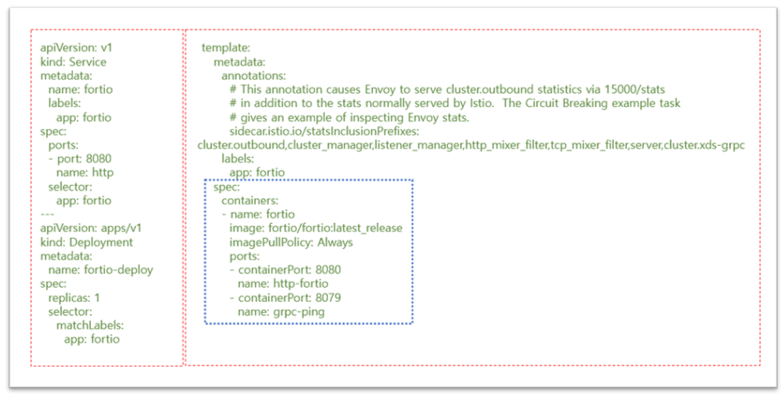

  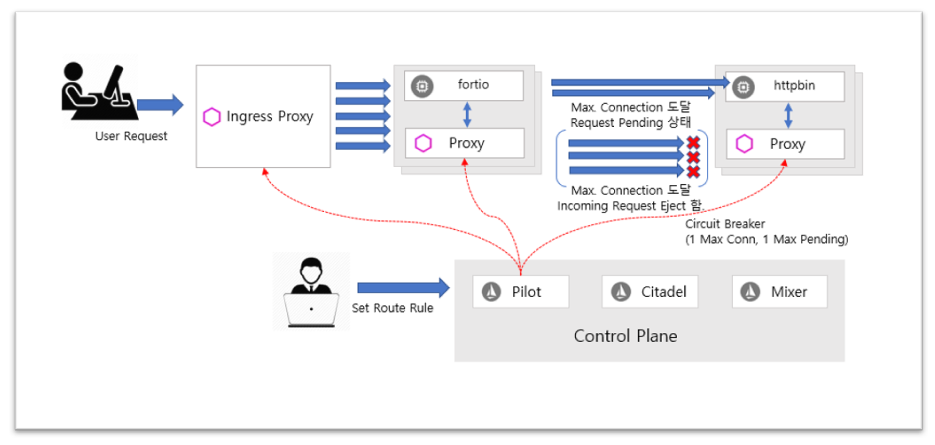

* Client Pod에 로그인하고 fortio 도구를 사용하여 httpbin을 호출합니다.

  ```text
    $ FORTIO_POD=$(kubectl get pod | grep fortio | awk '{ print $1 }')
    $ kubectl exec -it $FORTIO_POD  -c fortio /usr/bin/fortio -- load -curl  http://httpbin:8000/get
    HTTP/1.1 200 OK
    server: envoy
    date: Tue, 16 Jan 2018 23:47:00 GMT
    content-type: application/json
    access-control-allow-origin: *
    access-control-allow-credentials: true
    content-length: 445
    x-envoy-upstream-service-time: 36

    {
      "args": {},
      "headers": {
        "Content-Length": "0",
        "Host": "httpbin:8000",
        "User-Agent": "istio/fortio-0.6.2",
        "X-B3-Sampled": "1",
        "X-B3-Spanid": "824fbd828d809bf4",
        "X-B3-Traceid": "824fbd828d809bf4",
        "X-Ot-Span-Context": "824fbd828d809bf4;824fbd828d809bf4;0000000000000000",
        "X-Request-Id": "1ad2de20-806e-9622-949a-bd1d9735a3f4"
      },
      "origin": "127.0.0.1",
      "url": "http://httpbin:8000/get"
    }
  ```

> * Fortio \(Φορτίο\)는 Istio의 부하 테스트 도구로 시작하여 이제는 자체 오픈 소스 프로젝트 입니다.
> * Fortio는 초당 지정된 쿼리 \(qps\)로 실행되고 실행 시간의 막대 그래프를 기록하고 백분율을 계산합니다 \(예 : p99, 즉 요청의 99 %와 같은 응답 시간은 초 \(SI 단위\)\). 설정된 시간 동안, 고정 된 수의 호출 동안, 또는 중단 될 때까지 \(일정한 목표 QPS에서, 또는 max speed/load per connection/thread\) 실행될 수 있습니다.
> * Reference : [https://github.com/fortio/fortio](https://github.com/fortio/fortio)

**Command Line Argument**

| Flag | Description, example |
| :--- | :--- |
| -qps rate | Queries Per Seconds or 0 for no wait/max qps |
| -c connections | Number of parallel simultaneous connections \(and matching go routine\) |
| -t duration | How long to run the test \(for instance -t 30min for 30 minutes\) or 0 to run until ^C, example \(default 5s\) |
| -n numcalls | Run for exactly this number of calls instead of duration. Default \(0\) is to use duration \(-t\). |
| -r resolution | Resolution of the histogram lowest buckets in seconds \(default 0.001 i.e 1ms\), use 1/10th of your expected typical latency |
| -H "header: value" | Can be specified multiple times to add headers \(including Host:\) |
| -a | Automatically save JSON result with filename based on labels and timestamp |
| -json filename | Filename or - for stdout to output json result \(relative to -data-dir by default, should end with .json if you want fortio report to show them; using -a is typicallly a better option\) |
| -labels "l1 l2 ..." | Additional config data/labels to add to the resulting JSON, defaults to target URL and hostname |

트리핑\(발을 걸어 상대편을 넘어지게 하는 반칙 행위\).

### Tripping the circuit breaker

DestinationRule 설정에서 maxConnections : 1 및 http1MaxPendingRequests : 1을 지정합니다.이 규칙은 둘 이상의 연결을 초과하여 동시에 요청하는 경우 istio-proxy가 추가 요청 및 연결을 위해 회선을 열 때 약간의 실패가 표시되어야 함을 나타냅니다.

* 두 개의 동시 연결 \(-c 2\)으로 서비스를 호출하고 20 개의 요청 \(-n 20\)을 보냅니다.

```text
$ kubectl exec -it $FORTIO_POD  -c fortio /usr/bin/fortio -- load -c 2 -qps 0 -n 20 -loglevel Warning http://httpbin:8000/get
Fortio 0.6.2 running at 0 queries per second, 2->2 procs, for 5s: http://httpbin:8000/get
Starting at max qps with 2 thread(s) [gomax 2] for exactly 20 calls (10 per thread + 0)
23:51:10 W http.go:617> Parsed non ok code 503 (HTTP/1.1 503)
Ended after 106.474079ms : 20 calls. qps=187.84
Aggregated Function Time : count 20 avg 0.010215375 +/- 0.003604 min 0.005172024 max 0.019434859 sum 0.204307492
# range, mid point, percentile, count
>= 0.00517202 <= 0.006 , 0.00558601 , 5.00, 1
> 0.006 <= 0.007 , 0.0065 , 20.00, 3
> 0.007 <= 0.008 , 0.0075 , 30.00, 2
> 0.008 <= 0.009 , 0.0085 , 40.00, 2
> 0.009 <= 0.01 , 0.0095 , 60.00, 4
> 0.01 <= 0.011 , 0.0105 , 70.00, 2
> 0.011 <= 0.012 , 0.0115 , 75.00, 1
> 0.012 <= 0.014 , 0.013 , 90.00, 3
> 0.016 <= 0.018 , 0.017 , 95.00, 1
> 0.018 <= 0.0194349 , 0.0187174 , 100.00, 1
# target 50% 0.0095
# target 75% 0.012
# target 99% 0.0191479
# target 99.9% 0.0194062
Code 200 : 19 (95.0 %)
Code 503 : 1 (5.0 %)
Response Header Sizes : count 20 avg 218.85 +/- 50.21 min 0 max 231 sum 4377
Response Body/Total Sizes : count 20 avg 652.45 +/- 99.9 min 217 max 676 sum 13049
All done 20 calls (plus 0 warmup) 10.215 ms avg, 187.8 qps
```

* 거의 모든 요청이 완료되었음을 알 수 있습니다. istio-proxy는 약간의 여유를 허용합니다.

```text
Code 200 : 19 (95.0 %)
Code 503 : 1 (5.0 %)
```

* 동시 연결 수를 최대 3 개로 증가 시킵니다.

```text
$ kubectl exec -it $FORTIO_POD  -c fortio /usr/bin/fortio -- load -c 3 -qps 0 -n 30 -loglevel Warning http://httpbin:8000/get
Fortio 0.6.2 running at 0 queries per second, 2->2 procs, for 5s: http://httpbin:8000/get
Starting at max qps with 3 thread(s) [gomax 2] for exactly 30 calls (10 per thread + 0)
23:51:51 W http.go:617> Parsed non ok code 503 (HTTP/1.1 503)
23:51:51 W http.go:617> Parsed non ok code 503 (HTTP/1.1 503)
23:51:51 W http.go:617> Parsed non ok code 503 (HTTP/1.1 503)
23:51:51 W http.go:617> Parsed non ok code 503 (HTTP/1.1 503)
23:51:51 W http.go:617> Parsed non ok code 503 (HTTP/1.1 503)
23:51:51 W http.go:617> Parsed non ok code 503 (HTTP/1.1 503)
23:51:51 W http.go:617> Parsed non ok code 503 (HTTP/1.1 503)
23:51:51 W http.go:617> Parsed non ok code 503 (HTTP/1.1 503)
23:51:51 W http.go:617> Parsed non ok code 503 (HTTP/1.1 503)
23:51:51 W http.go:617> Parsed non ok code 503 (HTTP/1.1 503)
23:51:51 W http.go:617> Parsed non ok code 503 (HTTP/1.1 503)
Ended after 71.05365ms : 30 calls. qps=422.22
Aggregated Function Time : count 30 avg 0.0053360199 +/- 0.004219 min 0.000487853 max 0.018906468 sum 0.160080597
# range, mid point, percentile, count
>= 0.000487853 <= 0.001 , 0.000743926 , 10.00, 3
> 0.001 <= 0.002 , 0.0015 , 30.00, 6
> 0.002 <= 0.003 , 0.0025 , 33.33, 1
> 0.003 <= 0.004 , 0.0035 , 40.00, 2
> 0.004 <= 0.005 , 0.0045 , 46.67, 2
> 0.005 <= 0.006 , 0.0055 , 60.00, 4
> 0.006 <= 0.007 , 0.0065 , 73.33, 4
> 0.007 <= 0.008 , 0.0075 , 80.00, 2
> 0.008 <= 0.009 , 0.0085 , 86.67, 2
> 0.009 <= 0.01 , 0.0095 , 93.33, 2
> 0.014 <= 0.016 , 0.015 , 96.67, 1
> 0.018 <= 0.0189065 , 0.0184532 , 100.00, 1
# target 50% 0.00525
# target 75% 0.00725
# target 99% 0.0186345
# target 99.9% 0.0188793
Code 200 : 19 (63.3 %)
Code 503 : 11 (36.7 %)
Response Header Sizes : count 30 avg 145.73333 +/- 110.9 min 0 max 231 sum 4372
Response Body/Total Sizes : count 30 avg 507.13333 +/- 220.8 min 217 max 676 sum 15214
All done 30 calls (plus 0 warmup) 5.336 ms avg, 422.2 qps
```

* 요청의 63.3 % 만 성공했고 나머지는 회로 차단에 걸렸습니다.

```text
Code 200 : 19 (63.3 %)
Code 503 : 11 (36.7 %)
```

* istio-proxy 통계를 쿼리하여 자세한 내용을 확인합니다.

```text
$ kubectl exec -it $FORTIO_POD  -c istio-proxy  -- sh -c 'curl localhost:15000/stats' | grep httpbin | grep pending
cluster.outbound|80||httpbin.springistio.svc.cluster.local.upstream_rq_pending_active: 0
cluster.outbound|80||httpbin.springistio.svc.cluster.local.upstream_rq_pending_failure_eject: 0
cluster.outbound|80||httpbin.springistio.svc.cluster.local.upstream_rq_pending_overflow: 12
cluster.outbound|80||httpbin.springistio.svc.cluster.local.upstream_rq_pending_total: 39
```

upstream\_rq\_pending\_overflow 값에 대해 12를 볼 수 있으며, 이는 지금까지 12개의 호출이 회로 차단용으로 플래그가 설정되었음을 의미합니다.

### Cleaning up

* Remove the rules:

```text
$ kubectl delete destinationrule httpbin
```

* Shutdown the httpbin service and client:

```text
$ kubectl delete deploy httpbin fortio-deploy
$ kubectl delete svc httpbin
```

