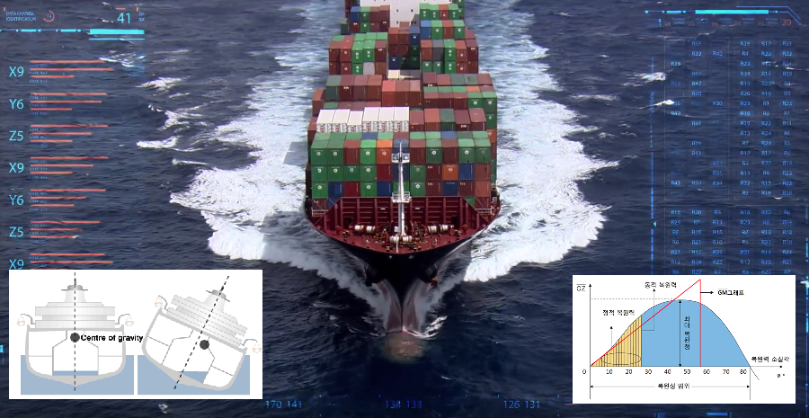

# Service Resiliency 개요

[https://istio.io/docs/concepts/traffic-management/\#network-resilience-and-testing](https://istio.io/docs/concepts/traffic-management/#network-resilience-and-testing)

Istio는 트래픽 관리 규칙\(Traffic Management Rule\)을 통하여 메시 트래픽\(mesh traffic\)을 직접 제어할 뿐만 아니라 실행 중에도 동적으로 구성 할 수 있는 명시적 장애 복구 \(opt-in failure recovery\) 및 결함 주입 기능\(fault injection features\)을 제공합니다. 이러한 기능을 통하여 어플리케이션\(Application\)이 안정적으로 운영하고 서비스 메시\(Service Mesh\)는 장애 발생한 노드\(failing node\)가 내결함성\(fault tolerance\)을 가질 수 있도록 하고 특정 지역 노드에서 발생한 장애 \(Localized Failure\)가 도미노 같이 다른 노드까지 연쇄적으로 장애가 발생하는 것을 방지할 수 있는 서비스 복원력\(Service Resiliency\)을 다음과 같은 기능으로 제공합니다.

* Timeouts and retries
* Circuit breakers
* Fault injection
* Fault tolerance

서비스 복원력\(service resiliency\)은 바다의 풍랑속에 있는 선박 또는 외줄타기 하는 사람처럼 다양한 장애 요인 및 환경에서도 어플리케이션의 안정적인 운영이 될 수 있도록 합니다.

### 

