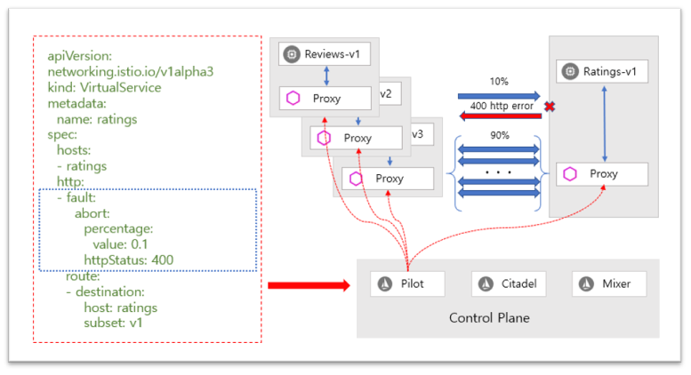
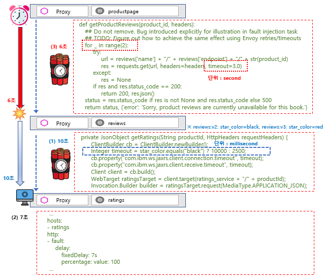

#

## Service Mesh : Istio

### Service Resiliency

https://istio.io/docs/concepts/traffic-management/#network-resilience-and-testing

Istio는 트래픽 관리 규칙(Traffic Management Rule)을 통하여 메시 트래픽(mesh traffic)을 직접 제어할 뿐만 아니라 실행 중에도 동적으로 구성 할 수 있는 명시적 장애 복구 (opt-in failure recovery) 및 결함 주입 기능(fault injection features)을 제공합니다. 이러한 기능을 통하여 어플리케이션(Application)이 안정적으로 운영하고 서비스 메시(Service Mesh)는 장애 발생한 노드(failing node)가 내결함성(fault tolerance)을 가질 수 있도록 하고 특정 지역 노드에서 발생한 장애 (Localized Failure)가 도미노 같이 다른 노드까지 연쇄적으로 장애가 발생하는 것을 방지할 수 있는 서비스 복원력(Service Resiliency)을 다음과 같은 기능으로 제공합니다.

- Timeouts and retries
- Circuit breakers
- Fault injection
- Fault tolerance
  
서비스 복원력(service resiliency)은 바다의 풍랑속에 있는 선박 또는 외줄타기 하는 사람처럼 다양한 장애 요인 및 환경에서도 어플리케이션의 안정적인 운영이 될 수 있도록 합니다.

#### 시간 초과 (Timeouts)

시간 초과 (timeout)는 사이드카 프록시(Envoy Proxy, Sidecar Proxy)가 지정된 서비스에서 응답을 기다리는 시간으로, 서비스가 응답을 무기한으로 기다리지 않고 호출이 예측 가능한 시간 내에 성공 또는 실패 하도록 합니다. HTTP 요청의 기본 시간 제한 (default timeout)은 15초이고 서비스가 15초 내에 응답하지 않으면 호출이 실패 합니다.

일부 어플리케이션 및 서비스의 경우, Istio의 기본 시간 초과(default timeout)가 적절하지 않을 수 있습니다. 예를 들어 시간 초과가 너무 길면 서비스 실패로 인한 응답을 기다리는 대기 시간이 지나치게 길어질 수 있으며 시간이 너무 짧으면 여러 서비스가 포함된 작업이 반환 될 때까지 호출이 불필요한 실패를 할 수 있습니다.

최적의 시간 초과 설정으로 사용하기 위하여 Istio를 사용하면 서비스 코드를 수정하지 않고도 Istio 트래픽 제어 관련 가상 서비스 (Virtual Service)를 사용하여 서비스별로 쉽게 시간 초과를 동적으로 조정할 수 있는 Istio의 장점을 활용할 수 있습니다.

- Zero Code Change
- Policy Driven

다음 예제는 ratings 서비스 대상으로 v1 이라는 하위 집합(subset) 대상으로 호출(Call)의 10초 시간 초과(timeout)를 설정하는 가상 서비스입니다.

#### 재시도 (Retries)

재시도(retry) 설정은 초기 호출이 실패 할 경우 사이드카 프록시(Envoy proxy, sidecar proxy)가 서비스에 연결을 시도하는 최대 횟수를 설정합니다. 재시도는 일시적으로 과부하 된 서비스 또는 네트워크와 같은 일시적인 문제로 인해 호출이 영구적으로 실패하지 않도록 하여 서비스 가용성(service availability)과 애플리케이션 성능(Application Performance)을 향상시킬 수 있습니다.

재시도 시간 간격 (25ms 이상)은 가변적이며 Istio에 의해 자동으로 결정되므로 호출된 서비스를 과도한 요청을 방지할 수 있고 기본적으로 Envoy 프록시는 서비스 연결을 실패(first failure)하면 서비스를 다시 연결하려고 시도하지 않습니다.

시간 초과(timeout)와 마찬가지로 Istio의 기본 재시도 (default retry) 동작은 대기 시간 (Latency, 서비스에 실패한 서비스를 너무 많은 재시도하면 속도가 느려 질 수 있음) 또는 가용성 (Availability) 측면에서 어플리케이션 요구에 적합하지 않을 수 있습니다.

시간 초과 (timeout)와 마찬가지로 서비스 코드를 수정없이 가상 서비스(Virtual Service)에서 서비스별로 재시도 (retry) 설정을 조정할 수 있고 재시도별 시간 초과 (per-retry timeout)를 추가하여 각 재시도가 서비스에 성공적으로 연결할 시간을 설정하여 재시도 동작 (retry behavior)을 추가적으로 세분화 할 수 있습니다.

가상 서비스 (Virtual Service)에서 HTTP 요청의 최대 재시도(Retry) 횟수를 설정할 수 있으며 재시도에 특정한 시간 초과(timeout)를 제공하여 호출한 서비스가 성공 또는 실패 여부를 예측 가능한 시간 내에 확인할 수 있습니다.

다음 예제는 초기 호출 실패 (initial call failure)하면 매 2초의 시간 초과(timeout)가 있는 서비스 하위 집합 대상으로 연결하기 위하여 최대 3번의 재시도를 설정한 것입니다.

~~~yml
apiVersion: networking.istio.io/v1alpha3
kind: VirtualService
metadata:
  name: ratings-route
spec:
  hosts:
  - ratings.prod.svc.cluster.local
  http:
  - route:
    - destination:
        host: ratings.prod.svc.cluster.local
        subset: v1
    retries:
      attempts: 3
      perTryTimeout: 2s
      retryOn: gateway-error,connect-failure,refused-stream
~~~

- attempts (int32 데이터타입, 필수) : 호출한 요청에 대한 재시도 횟수이고 재시도 간격은 자동으로 결정되며 (25ms +) 시도한 실제 재시도 횟수는 HTTP 경로 (HTTP route)의 요청 시간 초과(timeout)에 따라 다릅니다.
- perTryTimeout (Duration 데이터타입, 선택) : 호출한 요청에 대한 재 시도당 시간 초과이고 형식으로는 "1h/1m/1s/1ms" 으로 1ms 이상이여야 합니다.
- retryOn (string 데이터타입, 선택) : 재시도 조건을 설정하는 것으로 코마 "," 구분으로 목록을 사용할 수 있으며 하나 이상의 정책을 설정할 수 있습니다.
  
    **HTTP 재시도 정책**

    ~~~HTTP 재시도 정책
    (1) 5xx
        Envoy는 업스트림 서버가 5xx 응답 코드로 응답하거나 전혀 응답하지 않으면 (재연결 / 재설정 / 읽기 시간 초과) 재시도를 시도합니다. (연결 실패 및 거부 스트림 포함)
    (2) gateway-error
        이 정책은 5xx 정책과 유사하지만 502, 503 또는 504를 발생시키는 요청만 재시도합니다.
    (3) reset
        Envoy는 업스트림 서버가 전혀 응답하지 않으면 재시도합니다. (연결해제 / 재설정 / 읽기 시간 초과).
    (4) connect-failure
        Envoy는 업스트림 서버에 대한 연결 실패 (연결 시간 초과 등)로 인해 요청이 실패하면 재시도합니다. (5xx에 포함)
    (5) retriable-4xx
        Envoy는 업스트림 서버가 재시도 가능한 4xx 응답 코드로 응답하면 재시도합니다. 현재 이 카테고리의 유일한 응답 코드는 409입니다.
    (6) refused-stream
        Envoy는 업스트림 서버가 REFUSED_STREAM 오류 코드로 스트림을 재설정하면 재시도합니다. 이 재설정 유형은 요청을 재시도해도 안전하다는 것을 나타냅니다. (5xx에 포함)
    (7) retriable-status-codes
        Envoy는 업스트림 서버가 재시도 정책 또는 x-envoy-retriable-status-codes 헤더에 정의된 응답 코드로 응답하는 경우 재시도합니다.
        - 이 헤더를 설정하면 재시도 가능한 상태 코드 재시도 정책과 함께 사용될 때 재 시도 할 수 있는 상태 코드에 대해 Envoy에 알립니다. 
        - 해당 재시도 정책이 설정되면 다른 재시도 정책을 통해 재 시도 할 수 있는 상태 코드 외에도 재시도 가능한 상태 코드 목록이 재시도 가능한 것으로 간주됩니다.
        - 목록은 쉼표로 구분 된 정수 목록으로 "409"는 409를 재시도 할 수 있는 반면 "504,409"는 504와 409를 모두 재시도 할 수 있는 것으로 간주합니다.
        - 이 헤더는 내부 클라이언트의 요청에만 적용됩니다.
    ~~~
  
    **gRPC 재시도 정책**

    ~~~gRPC 재시도 정책
    Envoy는 다음과 같은 응답 헤더의 gRPC 상태 코드로 설정할 수 있습니다.
    - cancelled
    - deadline-exceeded
    - internal
    - resource-exhausted
    - unavailable
    ~~~

    **참조 URL :**

    ~~~http
    https://istio.io/docs/reference/config/networking/virtual-service/#HTTPRetry
    https://www.envoyproxy.io/docs/envoy/latest/configuration/http/http_filters/router_filter#x-envoy-retry-on
    ~~~

#### 전송 경로 차단기 (회로 차단기, Circuit breakers)

전송 경로 차단기(회로 차단기, circuit breaker)는 탄력적인 마이크로 서비스 기반 애플리케이션을 생성하기 위해 Istio가 제공하는 또 다른 유용한 메커니즘입니다.

전송 경로 차단기(회로 차단기, circuit breaker)에서는 동시 연결 수 또는 이 호스트에 대한 호출이 실패한 횟수와 같이 서비스 내의 개별 호스트에 대한 호출 제한을 설정합니다. 이 한계에 도달하면 전송 경로 차단기(회로 차단기, circuit breaker)가 개폐(trip)되고 해당 호스트에 대한 추가적으로 발생한 연결이 중단됩니다. 전송 경로 차단기(회로 차단기, circuit breaker) 패턴을 사용하면 클라이언트가 과부하 되거나 장애가 발생한 호스트(failing host)에 연결하지 않고 빠른 장애(fast failure)를 발생시킬 수 있습니다.

전송 경로 차단(회로 차단, circuit breaking) 를 로드 밸런싱 풀의 "실제" 메시 대상에 적용하려면 서비스의 개별 호스트에 대하여 Istio의 대상 규칙(Destination Rule) 설정으로 전송 경로 차단기(회로 차단기, circuit breaker) 임계값(threshold)을 구성합니다.

다음 예제는 샘플 서비스인 Reviews에 있는 v1 하위집합의 작업 부하(workload)에 대하여 동시 연결 수(concurrent connections)를 100으로 제한합니다.

#### 결함 주입 (Fault injection)

장애 복구 정책 (failure recovery policies)을 포함하여 네트워크를 구성한 후 Istio의 결함 주입 메커니즘(fault injection mechanisms)을 사용하여 어플리케이션의 전체 장애 복구 용량(failure recovery capacity)을 테스트 할 수 있습니다.

결함 주입(Fault injection)은 시스템에 오류(errors)를 도입하여 오류 조건(error conditions)을 극복하고 복구할 수 있도록 하는 테스트 방법 입니다.

결함 주입을 사용하는 것은 장애 복구 정책(failure recovery policies)이 비호환적이거나 너무 제한적이지 않다는 것이고 잠재적으로 중요한 서비스의 비가용한 상태를 야기 않는 것을 확인할 수 있습니다.

네트워크 계층에서 패킷 지연 또는 파드(pod) 종료와 같은 오류(errors)를 발생시키는 다른 메커니즘과 달리 Istio를 사용하면 어플리케이션(Application) 계층에 결함(fault)을 주입 할 수 있습니다. 이를 통해 HTTP 오류 코드 (error codes)와 같은 관련성 높은 오류(failures)를 삽입하여 보다 관련성 높은 결과를 얻을 수 있습니다.

가상 서비스 (Virtual Service)를 사용하여 구성된 두 가지 유형의 결함(Fault)을 주입 할 수 있습니다.

- 지연(delay) : 지연은 네트워크 대기시간 (Network Latency) 가 증가하거나 과부하 된 업스트림 서비스를 모방하여 지연되는 시간차를 발생시킨 결함입니다.
- 중단(abort) : 중단은 업스트림 서비스의 실패(failure)를 모방하여 발생시킨 결함(fault)이고 일반적으로 중단은 HTTP 오류 코드 (Error codes)또는 TCP 연결 실패 (TCP connection failures)의 형태로 나타납니다.

[용어 설명] 업스트림(upstream)은 클라이언트나 로컬 기기(일반적으로 컴퓨터나 모바일기기)에서 서버나 원격 호스트(이하 서버)로 보내지는(전송되는) 데이터 또는 보내는 것을 의미한다.

예를 들어 가상 서비스 (Virtual Service)는 1,000 개의 요청(Requests) 중 1개에 대해 Ratings 서비스에 5초 지연 (Delay)을 발생시킵니다.

다음 예제는 요청(Request) 중단 하는 대신에 중단(abort)를 구성하고 결함(Fault)을 시뮬레이션을 할 수 있습니다.

지연(delay)과 중단(abort) 결함(fault)을 함께 사용할 수 있는 예제로 review 서비스의 v2 하위집합(subnet)에서 ratings 서비스의 v1 하위집합(Subset)까지의 모든 Http 요청(Request)에 대해 5초 지연(Delay)을 발생시키고 그 중 10%에 대한 중단(Abort) 시켜 Http 400 오류(error)를 발생시킵니다.

#### 어플리케이션 수준의 결함 처리와의 호환성

Istio 장애 복구 기능(failure recovery features)은 애플리케이션(Application)에 완전히 투명합니다.
사이드카 프록시(Envoy, sidecar proxy)가 응답(response)을 리턴 하기 전에 호출된 서비스의 실패(Failures)를 처리하는지 여부를 애플리케이션이 알 수 없습니다.

어플리케이션 코드(Application code)에서 내결함성(fault tolerance) 라이브러리 활용해 구성한 것과 Envoy 프록시 장애 복구 정책(failure recovery policies)을 설정하는 경우 둘 다 독립적으로 작동하므로 충돌할 수 있음을 명심해야 합니다.
예를 들어, 하나는 가상 서비스 (Virtual Service)에 설정되고 다른 하나는 어플리케이션내 코딩으로 제한 시간이 두 개가 있다고 가정합니다.

어플리케이션내 API 호출 서비스에 대한 2초 시간 초과(timeout)를 코딩하고 가상 서비스(Virtual Service)에서 1번의 재시도(Retry)로 3초 시간 초과(timeout)를 설정 하는 경우에는 어플리케이션 코드의 시간 초과(timeout)가 먼저 실행이 되기 때문에 가상 서비스(Virtual Service)에서 설정한 시간 초과(timeout) 및 재시도(retry)는 효과가 없습니다.

Istio 장애 복구 기능(failure recovery features)은 메시에서 서비스의 신뢰성(reliability)과 가용성(availability)을 향상시키는 반면, 어플리케이션은 실패(failure)나 오류(error)를 처리하고 적절한 대비책에 대한 조치(fallback action)를 실행해야 합니다.

예를 들어 부하 분산 풀(load balancing pool)내의 모든 인스턴스가 실패하면 사이드카 프록시(Envoy, sidecar proxy)는 HTTP 503 코드를 반환하고 어플리케이션(Application)은 HTTP 503 오류 코드(error code)를 처리하는데 필요한 대비책(fallback) 로직을 구현 해야 합니다.

### Hands-on : 결함주입(Fault Injection)

#### 준비 작업

- 설치 안내서의 지침에 따라 Istio를 설정하세요.
  https://istio.io/docs/setup/kubernetes/install/

- 기본 대상 규칙(default destination rules)이 포함된 Bookinfo 샘플 어플리케이션(Application)을 배포합니다.
  https://istio.io/docs/examples/bookinfo/
- 시작하기 전에 서비스 복원성(Service Resiliency)에서 결함주입(Fault Injection)을 다시 한번 보세요.

- 요청 라우팅 작업(request routing task)을 수행하거나 다음 명령을 실행하여 어플리케이션 버전 별 전송 경로(routing)를 적용합니다.

    ~~~bash
    $kubectl apply -f samples/bookinfo/networking/virtual-service-all-v1.yaml
    ~~~

    ~~~yml
    apiVersion: networking.istio.io/v1alpha3
    kind: VirtualService
    metadata:
      name: productpage
    spec:
      hosts:
      - productpage
      http:
      - route:
        - destination:
            host: productpage
            subset: v1
    ---
    apiVersion: networking.istio.io/v1alpha3
    kind: VirtualService
    metadata:
      name: reviews
    spec:
      hosts:
      - reviews
      http:
      - route:
        - destination:
            host: reviews
            subset: v1
    ---
    apiVersion: networking.istio.io/v1alpha3
    kind: VirtualService
    metadata:
      name: ratings
    spec:
      hosts:
      - ratings
      http:
      - route:
        - destination:
            host: ratings
            subset: v1
    ---
    apiVersion: networking.istio.io/v1alpha3
    kind: VirtualService
    metadata:
      name: details
    spec:
      hosts:
      - details
      http:
      - route:
        - destination:
            host: details
            subset: v1
    ---
    ~~~

    ~~~bash
    $kubectl apply -f samples/bookinfo/networking/virtual-service-reviews-test-v2.yaml
    ~~~

    ~~~yml
    apiVersion: networking.istio.io/v1alpha3
    kind: VirtualService
    metadata:
      name: reviews
    spec:
      hosts:
        - reviews
      http:
      - match:
        - headers:
            end-user:
              exact: jason
        route:
        - destination:
            host: reviews
            subset: v2
      - route:
        - destination:
            host: reviews
            subset: v1
    ~~~

    위의 설정을 통한 요청 흐름 방식은 다음과 같습니다.  
    (1) productpage -> review:v2 -> ratings (사용자가 jason인 경우)  
    (2) productpage -> review:v1 (이외 모든 사용자인 경우)  

    
    

#### HTTP 지연 결함 주입하기 (Injecting an HTTP delay fault)

서비스 복원성(service resiliency)을 위한 Bookinfo 어플리케이션(Application) 마이크로 서비스(Microservice)를 테스트하기 위해서 사용자가 jason인 경우 review2:v2와 ratings 마이크로 서비스 사이에 7초 지연 (delay)을 주입(inject)한 테스트는 Bookinfo 어플리케이션에 의도적으로 주입된 결함을 발견할 수 있습니다.

reviews:v2 서비스는 ratings 서비스 호출하기 위해서 연결 시간 제한 (connection timeout)을 10초로 어플리케이션내 **하드 코딩 (hard-coded)** 되어 있는 것을 주의하세요. 적용한 7초 지연 시간 (delay)에도 불구하고 여전히 오류(errors)없이 종단 간 흐름(end-to-end flow)을 계속 진행되는 것을 기대합니다.

1. 테스트 사용자인 jason에서 오는 트래픽을 지연시키는 결함 주입 규칙(fault injection rule)을 설정합니다.

    ~~~bash
    $kubectl apply -f samples/bookinfo/networking/virtual-service-ratings-test-delay.yaml
    ~~~

2. 설정된 결함 주입 규칙(fault injection rule)을 확인합니다.

    ~~~bash
    $kubectl get virtualservice ratings -o yaml
    apiVersion: networking.istio.io/v1alpha3
    kind: VirtualService
    metadata:
      name: ratings
      ...
    spec:
      hosts:
      - ratings
      http:
      - fault:
          delay:
            fixedDelay: 7s
            percent: 100
        match:
        - headers:
            end-user:
              exact: jason
        route:
        - destination:
            host: ratings
            subset: v1
      - route:
        - destination:
            host: ratings
            subset: v1
    ~~~

    새 규칙이 모든 파드(pod)에 전파되는데 몇 초가 걸립니다.

    

#### 지연 설정 테스트 하기 (Testing the delay configuration)

1. 웹 브라우저에서 Bookinfo 웹 애플리케이션 (Application)을 엽니다.
2. /productpage 웹페이지에서 사용자 jason으로 로그인하세요.

      [로그인 화면]  
      약 7초 안에 Bookinfo 홈페이지가 오류(error)없이 로드 될 것으로 기대하지만 문제가 있습니다 : reviews 섹션에 오류(error) 메시지가 표시됩니다.

      ~~~message
      Error fetching product reviews!
      Sorry, product reviews are currently unavailable for this book.
      ~~~

    

3. 웹 페이지 응답(Response) 시간 보기 :  
  (1) 웹 브라우저에서 개발자 도구 메뉴를 엽니다. 
  (2) 네트워크 탭을 엽니다.  
  (3) /productpage 웹 페이지를 재로드하면 페이지가 실제로 약 6초 안에 로드 된다는 것을 알 수 있습니다.  

    

#### 무슨 일이 일어났는지를 이해하기 (Understanding what happened)

reviews 서비스에 있는 시간 초과(timeout)의 하드 코딩(hard-coded) 때문에 서비스 실패를 야기하는 버그(bug)를 발견할 수 있습니다.

예상되는 것은 (1) reviews와 ratings 서비스 간의 시간 제한(timeout)이 10 초로 하드 코딩(hard coded)되어 있기 때문에 (2) 적용된 7초 지연(delay)은 reviews 서비스에는 영향이 없을 것입니다.  
그러나 (3) productpage와 reviews 서비스간에 하드 코딩 된 시간 제한(hard-coded timeout)으로 총 6초 동안 3초(timeout) + 1회 재시도(retry)로 코딩 되어 있으므로 결과적으로 productpage가 reviews 서비스 호출이 예상한 것 보다 너무 빠른 6초 후에 시간 초과(timeout)가 발생하는 오류(error)가 있습니다.

- 결함 주입 테스트(fault injection test)는 로그인 사용자가 jason일 때에만 수행된다는 점에 유의하세요. (reviews:v2 전송경로 설정된/routing 경우)
- 다른 사용자로 로그인하면 지연이 발생하지 않습니다. (reviews:v1 또는 reviews:v3로 라우팅 되는 경우)

이와 같은 버그(bug)는 다른 팀이 서로 다른 마이크로 서비스를 독립적으로 개발하는 일반적인 엔터프라이즈 응용 프로그램 (Enterprise application)에서 발생할 수 있습니다. Istio의 결함 주입 규칙 (Fault injection rules)은 최종 사용자에게 영향을 미치지 않으면서 이러한 이상(anomalies)을 식별하는데 도움이 됩니다.

[참고 URL]

~~~http
https://github.com/istio/istio/blob/master/samples/bookinfo/src/productpage/productpage.py
https://github.com/istio/istio/blob/master/samples/bookinfo/src/reviews/reviews-application/src/main/java/application/rest/LibertyRestEndpoint.java
~~~

#### 버그 수정하기 (Fixing the bug)

6초 후 시간 초과 발생하는 문제는 일반적으로 다음과 같이 해결할 수 있습니다.

1. productpage를 reviews 서비스 시간 초과 (service timeout) 보다 늘리거나 reviews를 ratings 시간 초과를 줄이세요.
2. 수정한 마이크로 서비스를 중단 후 재시작을 하세요.
3. /productpage 웹페이지의 응답이 오류(Error)가 없는지를 확인합니다.

그러나 reviews 서비스의 v3에서 이미 하드 코딩된 것이 있으며 reviews:v3 서비스는 ratings를 10초에서 2.5초로 제한하여 (위의 그림에서 1번 참조) 다운스트림으로 productpage 요청의 시간 초과 timeout (미만)에 영향을 줍니다.

~~~python
Integer timeout = star_color.equals("black") ? 10000 : 2500
~~~

- reviews:v2 인 경우 ratings 서비스의 등급(별 모양) 컬러는 검정색(black) 이고
- reviews:v3 인 경우 ratings 서비스의 등급(별 모양) 컬러는 빨간색(red) 입니다.

모든 트래픽을 reviews:v3으로 마이그레이션하고 ratings 서비스의 지연 규칙(delay rule)을 2.5초 보다 작은 값(예를 들면 2초)으로 변경하면 오류 없이 종단 간의 (end-to-end) 흐름이 계속되는지를 확인할 수 있습니다.

1. 모든 트래픽을 reviews:v3으로 마이그레이션 및 응답시간 확인

    ~~~bash
    $kubectl apply -f samples/bookinfo/networking/virtual-service-reviews-v3.yaml
    ~~~

    ~~~yml
    apiVersion: networking.istio.io/v1alpha3
    kind: VirtualService
    metadata:
      name: reviews
    spec:
      hosts:
        - reviews
      http:
      - route:
        - destination:
            host: reviews
            subset: v3
    ~~~

    

2. ratings 서비스의 지연 규칙(delay rule) 변경 (7초 -> 2초)

    ~~~bash
    $ kubectl apply -f - <<EOF
    apiVersion: networking.istio.io/v1alpha3
    kind: VirtualService
    metadata:
      name: ratings
      ...
    spec:
      hosts:
      - ratings
      http:
      - fault:
          delay:
            fixedDelay: 2s
            percent: 100
        match:
        - headers:
            end-user:
              exact: jason
        route:
        - destination:
            host: ratings
            subset: v1
      - route:
        - destination:
            host: ratings
            subset: v1
    EOF
    ~~~

#### HTTP 중단 결함 주입하기 (Injecting an HTTP abort fault)

마이크로 서비스 복원력(microservice resiliency)을 테스트하는 또 다른 방법은 HTTP 중단 오류 (HTTP abort fault)를 발생시키는 것이고 이 작업에서는 테스트 사용자 jason의 ratings 마이크로 서비스에 대한 HTTP 중단(abort)을 소개합니다.

이 경우에서는 페이지(Page)가 즉시 로드되고 ratings 서비스는 현재 사용할 수 없다는 메시지가 표시됩니다.

1. 사용자 jason에게 HTTP 중단(abort)을 전송하는 결함 주입 규칙(fault injection injection) 작성

    ~~~bash
    $kubectl apply -f samples/bookinfo/networking/virtual-service-ratings-test-abort.yaml
    ~~~

2. 규칙이 생성되었는지를 확인

    ~~~bash
    $kubectl get virtualservice ratings -o yaml
    apiVersion: networking.istio.io/v1alpha3
    kind: VirtualService
    metadata:
      name: ratings
      ...
    spec:
      hosts:
      - ratings
      http:
      - fault:
          abort:
            httpStatus: 500
            percentage:
              value: 100
        match:
        - headers:
            end-user:
              exact: jason
        route:
        - destination:
            host: ratings
            subset: v1
      - route:
        - destination:
            host: ratings
            subset: v1
    ~~~

  

##### 중단 설정 테스트하기 (Testing the abort configuration)

1. 브라우저에서 Bookinfo 웹 어플리케이션을 엽니다.
2. /productpage 페이지에서 사용자 jason으로 로그인합니다.
    가상 서비스 규칙(Virtual Service rule)이 모든 파드(pod)에 성공적으로 전파되면 페이지가 즉시 로드되고 "Ratings service is currently unavailable" 메시지를 보여줍니다.

    

3. 사용자 jason에서 로그 아웃하거나 Bookinfo 웹 어플리케이션을 익명 창 (또는 다른 브라우저)에서 열면 /productpage는 여전히 jason을 제외한 모든 사용자에 대해 reviews:v1 (ratings를 전혀 호출하지 않음)을 호출한다는 것을 알 수 있습니다. 따라서 오류 메시지(error message)가 표시되지 않습니다.

    

##### 정리

- 어플리케이션 전송 경로 규칙(routing rule)제거

    ~~~bash
    $kubectl delete -f samples/bookinfo/networking/virtual-service-all-v1.yaml
    ~~~

#### Hands-on : 시간 초과 요청 (Request timeouts)

예제는 Istio를 사용하여 사이드카 프록시(Envoy proxy, sidecar proxy)에서 요청 시간 초과를 설정하는 방법을 보여줍니다.

좀 더 상세하게 예제를 설명하면 어플리케이션에서 시간 초과(Timeout)을 통하여 서비스 복원성(Service Resiliency)를 추가하는 방법을 보여주는 예제로 ratings 서비스에 대하여 2초의 시간 지연(delay fault Injection)을 설정하여 reviews 서비스가 1초 이내에 응답하지 않으면 productpage 웹페이지에서 reviews 서비스에 대한 오류 메세지를 보여줍니다.

##### 준비 작업

- 아래 사이트에 있는 설치 안내서의 지침에 따라 Istio를 설정하세요.

    ~~~http
    https://istio.io/docs/setup/kubernetes/install/
    ~~~~

- 기본 대상 규칙(default destination rules)을 포함하여 Bookinfo 샘플 어플리케이션을 배포하세요.
- 다음 명령으로 모든 요청이 Bookinfo 어플리케이션내에 있는 v1 (Version 1)을 서비스별로 호출할 수 있도록 변경합니다.

    ~~~bash
    $kubectl apply -f samples/bookinfo/networking/virtual-service-all-v1.yaml
    ~~~

    ~~~yml
    apiVersion: networking.istio.io/v1alpha3
    kind: VirtualService
    metadata:
      name: productpage
    spec:
      hosts:
      - productpage
      http:
      - route:
        - destination:
            host: productpage
            subset: v1
    ---
    apiVersion: networking.istio.io/v1alpha3
    kind: VirtualService
    metadata:
      name: reviews
    spec:
      hosts:
      - reviews
      http:
      - route:
        - destination:
            host: reviews
            subset: v1
    ---
    apiVersion: networking.istio.io/v1alpha3
    kind: VirtualService
    metadata:
      name: ratings
    spec:
      hosts:
      - ratings
      http:
      - route:
        - destination:
            host: ratings
            subset: v1
    ---
    apiVersion: networking.istio.io/v1alpha3
    kind: VirtualService
    metadata:
      name: details
    spec:
      hosts:
      - details
      http:
      - route:
        - destination:
            host: details
            subset: v1
    ---
    ~~~

- 위의 가상 서비스 (Virtual Service) 적용 후 웹 브라우저에서 다음과 같은 웹페이지를 확인할 수 있습니다.

    

- 사용자 요청에 대한 서비스 흐름은 다음과 같으며 reviews:v1 서비스는 ratings 서비스를 호출하지 않기 때문에 productpage 웹페이지는 rating 관련 정보를 볼 수 없습니다.

    

#### 요청 시간 초과 (Request timeouts)

전송 경로 규칙(route rule)의 제한 시간 필드(timeout field)를 사용하여 HTTP 요청에 대한 제한 시간을 설정할 수 있습니다. 기본적으로 시간 초과(timeout)는 비활성화되어 있지만 이 작업에서는 reviews 서비스 시간 초과(service timeout)를 1초로 설정합니다. 그러나 그 효과를 확인하기 위해서는 ratings 서비스 호출(call)에 에 대하여 2초 지연(delay)을 설정해야 합니다.

1. ratings 서비스를 호출하는 reviews:v2 서비스쪽으로 요청(Request)을 보낼 수 있는 가상서비스 (Virtual Service)를 설정합니다.

    ~~~bash
    $ kubectl apply -f - <<EOF
    apiVersion: networking.istio.io/v1alpha3
    kind: VirtualService
    metadata:
      name: reviews
    spec:
      hosts:
        - reviews
      http:
      - route:
        - destination:
            host: reviews
            subset: v2
    EOF
    ~~~

2. ratings 서비스 호출(call)될 때 2초 지연(delay)이 발생되도록 가상서비스(Virtual Service)를 설정합니다. 

    ~~~bash
    $ kubectl apply -f - <<EOF
    apiVersion: networking.istio.io/v1alpha3
    kind: VirtualService
    metadata:
      name: ratings
    spec:
      hosts:
      - ratings
      http:
      - fault:
          delay:
            percent: 100
            fixedDelay: 2s
        route:
        - destination:
            host: ratings
            subset: v1
    EOF
    ~~~

3. 브라우저에서 Bookinfo URL(http://$GATEWAY_URL/productpage)를 접속하여 서비스를 확인합니다.

    

   Bookinfo 어플리케이션이 정상적으로 작동하는 것을 볼 수 있지만 (ratings서비스의 별들이 표시됨) 페이지를 리플레쉬(refresh)할 때 마다 2초 지연(delay)되고 이유는 아래와 같습니다.

   위의 (1)번 설정에서는 모든 요청(request)를 reviews 서비스의 v2으로 전송(routing)하고 위의 (2)번 설정에서는 ratings 서비스 호출할 때 2초 지연 결함을 주입(delay Fault Injection)했기 때문입니다.

   

4. 이제는 reviews 서비스 호출에 0.5초의 요청 시간 제한(request timeout)을 추가합니다.

    ~~~bash
    $ kubectl apply -f - <<EOF
    apiVersion: networking.istio.io/v1alpha3
    kind: VirtualService
    metadata:
      name: reviews
    spec:
      hosts:
      - reviews
      http:
      - route:
        - destination:
            host: reviews
            subset: v2
        timeout: 0.5s
    EOF
    ~~~

5. Bookinfo 웹페이지를 리플레쉬(refresh) 하면 2초가 아닌 약 1초 후에 반환되며 reviews는 사용할 수 없음을 알 수 있습니다.

  

  

  시간 초과(timeout)가 0.5초로 구성되어 있어도 응답이 1초가 걸리는 이유는 productpage 서비스에 하드 코딩 된 재시도 (hard-coded retry)가 있기 때문에 리턴하기 전에 시간 초과된 reviews 서비스 (timing out)를 두 번 호출(call)하기 때문입니다.

  [참고사항] istio/samples/bookinfo/src/productpage/productpage.py 에서 reviews 서비스 호출 부분
  

#### 무슨 일이 일어났는지를 이해하기 (Understanding what happened)

이 작업에서는 Istio를 사용하여 reviews 마이크로 서비스 호출(call)에 대한 요청 시간 초과(request timeout)를 0.5초로 설정했습니다.
기본적으로 요청 시간 초과 (request timeout)는 비활성화되어 있습니다. reviews 서비스는 이후에 처리되는 요청은 ratings 서비스를 호출하기 때문에 Istio를 사용하여 ratings 호출에 2초의 지연(delay)을 주입(inject)하여 ratings 서비스에 연결 및 처리 완료하는데 0.5초 이상 걸리므로 시간 초과(timeout)가 실제로 발생하는 것을 볼 수 있습니다.

reviews 데이터를 보여주는 대신 Bookinfo product 페이지 (페이지를 채우려면 reviews 서비스를 호출 함)에 다음과 같은  메시지를 보여줍니다.

 

  ~~~message
  Sorry, product reviews are currently unavailable for this book.
  ~~~

이것은 reviews 서비스에서 시간 초과 오류 (timeout error)가 발생한 결과입니다.

결함 주입 작업(fault injection task)을 검토하면 productpage 마이크로 서비스에는 또한 reviews 마이크로 서비스 호출을 위한 자체 어플리케이션 레벨 시간 초과 (3초)가 있음을 알 수 있습니다. 이 작업에서는 Istio 전송 경로 규칙(Istio route rule)을 사용하여 시간 초과(timeout)를 0.5초로 설정했습니다. 대신에 시간 제한을 3초 (예 : 4초)보다 큰 값으로 설정 한 경우 시간 제한(timeout)이 좀 더 제한적이기 때문에 시간 제한(timeout)에 영향을 미치지 않습니다.

[참고사항] istio/samples/bookinfo/src/productpage/productpage.py 에서 reviews 서비스 호출 부분

Istio에서 시간 초과(timeout)에 대해 한 가지 더 주의사항은 작업 같이 경로 규칙(route rule)에서 시간 초과(timeout)를 재정의하는 것 외에도 어플리케이션에서 아웃바운드 요청 (outbound request)의 헤더에서 "x-envoy-upstream-rq-timeout-ms"는 시간 초과(timeout)는 초(second)가 아닌 밀리 초(milliseconds)로 설정합니다.

##### 정리

어플리케이션 전송 경로 규칙(routing rule) 제거

~~~bash
$kubectl delete -f samples/bookinfo/networking/virtual-service-all-v1.yaml
~~~

### Hands-on : 전송 경로 차단 (회로 차단, Circuit Breaking)

이 예제에서는 연결(connections), 요청 (request) 및 이상 값 탐지 (outlier detection)에 대한 전송 경로 차단(회로 차단, circuit breaking)을 구성하는 방법을 보여줍니다.

전송 경로 차단(회로 차단, circuit breaking)은 복원력 있는 마이크로 서비스 어플리케이션 (resilient microservice application)을 만드는데 중요한 패턴입니다. 전송 경로 차단을 사용하면 장애(failure), 대기 시간 스파이크 (latency spike) 및 기타 네트워크 특성의 바람직하지 않은 영향으로 인한 영향을 제한하는 어플리케이션을 작성할 수 있습니다.

또한 이 예제에서는 전송 경로 차단 규칙 (회로 차단 규칙, circuit breaking rules)을 구성한 다음 전송 경로 차단기(회로 차단기, circuit breaker)를 의도적으로 "개폐(tripping)"하여 구성한 것을 테스트 합니다.

#### 준비 작업

- 아래 사이트에 있는 설치 안내서의 지침에 따라 Istio를 설정하세요.

- httpbin 샘플을 실행하세요.
  자동 사이드카 주입 (automatic sidecar injection)을 사용하고 있다면 다음과 같이 httpbin 서비스를 배포(deploy)하세요.

  ~~~bash
  $kubectl apply -f samples/httpbin/httpbin.yaml
  ~~~
  
  그렇지 않으면 httpbin 어플리케이션을 배포(deploy)하기 전에 수동으로 사이드카(sidecar)를 주입(inject) 해야 합니다.

  ~~~bash
  $kubectl apply -f <(istioctl kube-inject -f samples/httpbin/httpbin.yaml)
  ~~~

httpbin 어플리케이션은 이 예제에서는 백엔드 서비스 역할을 합니다.

#### 전송 경로 차단을 구성하기 (회로 차단을 구성하기, Configuring the circuit breaker)

1. httpbin 서비스를 호출 할 때 전송 경로 차단 (회로 차단, circuit breaking)설정을 적용 할 대상 규칙(destination rule)을 설정하세요.

    ~~~bash
    $kubectl apply -f - <<EOF
    apiVersion: networking.istio.io/v1alpha3
    kind: DestinationRule
    metadata:
      name: httpbin
    spec:
      host: httpbin
      trafficPolicy:
        connectionPool:
          tcp:
            maxConnections: 1
          http:
            http1MaxPendingRequests: 1
            maxRequestsPerConnection: 1
        outlierDetection:
          consecutiveErrors: 1
          interval: 1s
          baseEjectionTime: 3m
          maxEjectionPercent: 100
    EOF
    ~~~

    상호 TLS 인증(mutual TLS authentication)을 사용하여 Istio를 설치/구성한 경우에는 적용 전에 대상 규칙(Destination Rule)에 TLS 트래픽 정책 모드 (TLS traffic policy mode, trafficPolicy)에  ISTIO_MUTUAL을 추가해야 합니다. 그렇지 않으면 요청(request)은 아래에서 설명한 대로 503 오류(errors)가 발생됩니다.
  
    **대상 규칙 (destination rule) 적용 후 503 오류가 발생하는 경우**

    대상 규칙(Destination Rule)을 적용한 후 서비스 요청(service request)으로 HTTP 503 오류가 바로 발생하기 시작하면 대상 규칙(Destination Rule)을 제거하거나 되돌릴 때까지 오류(errors)가 계속된다면 대상 규칙(Destination Rule)이 서비스에 대해 TLS 충돌을 발생시킬 수 있습니다.

    예를 들어 클러스터에서 상호 TLS(mutual TLS)를 전역적(globally)으로 구성하는 경우 대상규칙(Destination Rule)에는 다음 트래픽 정책(trafficPolicy)가 포함해야 합니다.

    ~~~yml
    trafficPolicy:
      tls:
        mode: ISTIO_MUTUAL
    ~~~

    그렇지 않으면, 기본적으로 모드는 사용 안함(DISABLE)으로 설정되기 때문에 클라이언트 프록시 사이드카(client proxy sidecars)가 TLS 암호화된 요청 대신 일반적인(암호화 안된) HTTP 요청을 합니다. 하지만 서버 프록시(server proxy)는 암호화된 요청을 기대하고 있기 때문에 요청이 서버 프록시(server proxy)에 제대로 전송이 안됩니다.  

    대상 규칙(Destination Rule)을 적용할 때마다 트래픽 정책(trafficPolicy) TLS 모드가 전역적인(global) 서버 구성과 일치하는지를 확인하세요.

2. 대상 규칙(destination rule)이 올바르게 설정되었는지를 확인하세요.

    ~~~bash
    $kubectl get destinationrule httpbin -o yaml
    apiVersion: networking.istio.io/v1alpha3
    kind: DestinationRule
    metadata:
      name: httpbin
      ...
    spec:
      host: httpbin
      trafficPolicy:
        connectionPool:
          http:
            http1MaxPendingRequests: 1
            maxRequestsPerConnection: 1
          tcp:
            maxConnections: 1
        outlierDetection:
          baseEjectionTime: 180.000s
          consecutiveErrors: 1
          interval: 1.000s
          maxEjectionPercent: 100
    ~~~

#### 전송 경로 차단기 (회로 차단기, circuit breaker)

사이드카 프록시(sidecar proxy, Envoy proxy)는 어플리케이션의 서비스에서 활용할 사용 가능한 사전 동의 오류 복구 기능 (opt-in failure recovery features)을 제공합니다. 동시 연결의 갯수와 요청 대기 갯수를 제한할 수 있어서 시스템이 과도한 요청으로 인한 장애 상태가 되지 않도록 합니다.

전송 경로 차단기(회로 차단기, circuit breaker)는 대상 규칙(Destination Rule)의 트래픽 정책(trafficPolicy)에서 연결풀(connection pool)에서 아래와 같이 설정할 수 있습니다.

1. TCP 연결풀 설정
    - HTTP 및 TCP 업스트림 연결(upstream connection)에 대한 공통적인 설정
    - 관련 매개 변수 (Parameter)
        - maxConnections : 대상 호스트(destination host)에 대한 최대 HTTP1 / TCP 연결 갯수이고 기본값(default)은 2 ^ 32-1 개 입니다.
        - connectTimeout : TCP 연결 시간 초과 (connection timeout)
        - tcpKeepalive : 해당 속성이 설정된 경우 TCP Keepalives를 사용하기 위해서는 소켓(socket)에서 SO_KEEPALIVE를 설정하세요.  
2. HTTP 연결풀 설정
    - HTTP1.1 / HTTP2 / GRPC 연결에 적용 가능한 설정
    - 관련 매개 변수 (Parameter)
        - http1MaxPendingRequests : 대상(destination)에 대기중인 최대 HTTP 요청 갯수이고 기본값(default)은 2 ^ 32-1 개이며 초과 대기 중인 요청(request)은 방출(eject) 됩니다.
        - http2MaxRequests : 백엔드(Backend)에 대한 최대 요청(request) 갯수이고 기본값(default)은 2 ^ 32-1 개 입니다.
        - maxRequestsPerConnection : 백엔드(backend) 연결(connection) 당 최대 요청(request) 갯수로 이 매개 변수(parameter)를 1로 설정(setting)하면 연결 유지(keep alive)가 비활성화(disable)되고 기본값은 "무제한(unlimited)"을 의미하며 최대 2 ^ 29 입니다.
        - maxRetries : 지정된 시간에 클러스터내의 모든 호스트에서 처리될 수 있는 최대 재시도 횟수입니다. 기본값은 2 ^ 32-1 입니다.
        - idleTimeout : 업스트림 연결 풀 연결에 대한 유휴 시간 제한(idle timeout). 유휴 시간 제한은 활성 요청이 없는 기간으로 정의되고 설정하지 않으면 기본값은 1 시간으로 유휴 시간 초과에 도달하면 연결이 닫힙니다. 요청 기반 시간 제한은 HTTP/2 핑(PING)이 연결을 유지하지 않음을 의미하는 것으로 HTTP1.1 및 HTTP2 연결에 모두 적용됩니다.

#### 이상치 감지 (Outlier Detection)

이상치 탐지(Outlier Detection)는 비정상적인 호스트 동작을 감지하고 클러스터 내의 부하분산풀(load-balanced pool)에서 비정상적인 호스트(unhealthy host)를 방출(eject)하는 Istio 복원성 전략 (Istio Resiliency strategy)으로 정상적인 호스트(healthy host)만 사용자 요청을 처리하는데 참여함으로써 서비스의 전체 가용성(availability)을 높일 수 있습니다.

업스트림 서비스에서 각 개별 호스트의 상태를 추적하는 회로 차단기로서 HTTP 및 TCP 서비스 모두에 적용 가능합니다.

- HTTP 서비스의 경우 API 호출에 대해 5xx 오류와 같은 연속적인 오류(consecutive error)를 반환하는 호스트는 사전 정의 된 기간(baseEjectionTime) 동안 부하분산풀에서 방출(eject)됩니다. 
- TCP 서비스의 경우 연속적인 오류 메트릭(consecutive errors metric)을 측정 할 때 지정된 호스트에 대한 연결 시간 초과(connection timeouts) 또는 연결 실패(connection failures)가 오류(error)로 계산됩니다.

아래 설정을 사용하면 업스트림 서비스(upstream service, 종속 서비스/dependent service)가 1초 마다 검색(scan)되고 5xx 오류 코드(error code)로 1번 이상 실패(fail)하는 호스트(host)가 있으면 로드 밸런스 풀(load-balanced pool)에서 3분 동안 방출(eject)됩니다.

- consecutiveGatewayErrors: 연결 풀에서 호스트를 방출(eject) 전의 게이트웨이 오류(gateway errors) 발생 횟수이고 업스트림 호스트가 HTTP를 통해 액세스해서 리턴 코드가 502, 503 또는 504 이면 게이트웨이 오류(gateway errors)로 규정하고 불명확한 TCP 연결(opaque TCP connection)을 통해 업스트림 호스트에 액세스하면 연결 시간 초과 (connect timeouts) 및 연결 오류/실패 이벤트(connection error/failure events)가 게이트웨이 오류(connect timeouts)로 간주되며 이 기능은 기본적으로(default) 또는 값 0으로 설정되면 비활성화됩니다.

- consecutive5xxErrors : 호스트가 연결 풀에서 방출(Inject)되기 전의 연속적으로 오류 (consecutive errors) 발생 횟수이고 불명확한 TCP 연결 (opaque TCP connection)을 통해 업스트림 호스트에 액세스 한 경우에는 연결 시간 종료(connect timeouts), 연결 오류/실패(connection error/failure) 및 요청 실패 이벤트(request failure events)는 5xx 오류로 규정되며 기본값은 5이지만 값을 0으로 설정하여 비활성화 할 수 있습니다.

[참고사항] consecutiveGatewayErrors/consecutive5xxErrors

~~~message
consecutivegatewayerrors 및 consecutive5xxerrors는 개별적으로 또는 함께 사용할 수 있습니다. consecutivegatewayerrors에 의해 계산된 오류는 consecutive5xxerrors에도 포함되므로 consecutivegatewayerrors 값이 consecutive5xxerrors 값보다 크거나 같으면 consecutivegatewayerrors가 적용되지 않습니다.
~~~

- baseEjectionTime : 최소 방출 시간 (maximum ejection duration)으로 호스트는 최소 방출 지속 시간과 호스트 방출 횟수와 같은 기간 동안 방출 상태를 유지하며 이 기술을 통해 시스템은 비정상 업스트림 서버의 방출 기간을 자동으로 늘릴 수 있습니다. 형식은 "1h/1m/1s/1ms" 이고 1ms 이상이여야 하며 기본값은 30초입니다.

- interval : 방출 분석 (ejection sweep analysis) 사이의 시간 간격이고 형식은 "1h/1m/1s/1ms" 가지며 최소 1ms 이상으로 기본값은 10입니다.

- maxEjectionPercent : 부하분산풀(load-balanced pool)에서 방출할 수 있는 (eject) 호스트의 최대 비율로 기본값은 10% 이고 예를 들어 이 매개변수(parameter)를 100으로 설정하면 연속적인 오류를 발생시키는 비정상적인 호스트(unhealthy host)를 방출(eject) 할 수 있고 요청은 다시 정상적인 호스트(healthy host) 경로로 다시 전송합니다.

- minHealthPercent : 연관된 부하분산풀(load balancing pool)에 정상 모드(healthy mode)에서 최소 상태 백분율 (min-health percent, minHealthPercent) 호스트가 있으면 이상치 감지(Outlier detection)가 사용 가능합니다. 부하분산풀(load balancing pool)의 정상 호스트(healthy hosts ) 백분율이 임계값(threshold) 아래로 떨어지면 이상치 감지가(Outlier detection) 비활성화되고 프록시는 풀(pool)내 비정상 호스트(unhealthy host)를 포함한 모든 호스트 대상으로 부하분산(load balance)을 수행합니다. 임계값(threshold)은 0%로 설정하여 비활성화 할 수 있고 서비스별 포드 수가 적은 k8 환경에서는 일반적으로 적용할 수 없으므로 기본값은 0%입니다.

이상치 감지(Outlier Detection)는 부하분산풀(load balancing pool)에 연결된 최소 수의 정상 호스트(healthy host)가 있을 때까지 사용 가능하게 됩니다.

#### 클라이언트 추가 (Adding a client)

httpbin 서비스로 트래픽을 보낼 클라이언트를 만듭니다.. 클라이언트는 fortio라는 간단한 로드 테스트 클라이언트(load-testing client) 입니다. Fortio를 사용하면 발신 HTTP 호출(outgoing HTTP calls)에 대한 연결(connections) 갯수, 동시성(concurrency) 및 지연(delays) 갯수를 제어 할 수 있습니다. 이 클라이언트를 사용하여 대상 규칙(Destination Rule)에서 설정 한 전송 경로 차단기 (회로 차단기 정책, circuit breaker policies)을 "개폐(trip)" 합니다.

Inject the client with the Istio sidecar proxy so network interactions are governed by Istio.

1. 네트워크 상호 작용이 Istio에 의해 통제되도록 클라이언트에 Istio 사이드카 프록시(Istio sidecar proxy)를 주입(inject)하세요.

    자동 사이드카 주입(automatic sidecar injection)을 사용하도록 설정 한 경우에는 아래와 같이 fortio 서비스를 배포하세요.

    ~~~bash
    $kubectl apply -f samples/httpbin/sample-client/fortio-deploy.yaml
    ~~~

    ~~~yml
    apiVersion: v1
    kind: Service
    metadata:
      name: fortio
      labels:
        app: fortio
    spec:
      ports:
      - port: 8080
        name: http
      selector:
        app: fortio
    ---
    apiVersion: apps/v1
    kind: Deployment
    metadata:
      name: fortio-deploy
    spec:
      replicas: 1
      selector:
        matchLabels:
          app: fortio
      template:
        metadata:
          annotations:
            # This annotation causes Envoy to serve cluster.outbound statistics via 15000/stats
            # in addition to the stats normally served by Istio.  The Circuit Breaking example task
            # gives an example of inspecting Envoy stats.
            sidecar.istio.io/statsInclusionPrefixes: cluster.outbound,cluster_manager,listener_manager,http_mixer_filter,tcp_mixer_filter,server,cluster.xds-grpc
          labels:
            app: fortio
        spec:
          containers:
          - name: fortio
            image: fortio/fortio:latest_release
            imagePullPolicy: Always
            ports:
            - containerPort: 8080
              name: http-fortio
            - containerPort: 8079
              name: grpc-ping
    ~~~

    그렇지 않으면 fortio 어플리케이션을 배포하기 전에 사이드카(sidecar)를 수동으로 주입(inject)해야 합니다.

    ~~~bash
    $kubectl apply -f <(istioctl kube-inject -f samples/httpbin/sample-client/fortio-deploy.yaml)
    ~~~

2. 아래는 클라이언트 파드(client pod)에 로그인하고 fortio 툴(tool)을 사용하여 httpbin을 호출하는 것으로 우선 fortio 파드(pod) ID를 환경 변수에 저장하고 해당 환경변수를 이용해 curl 명령어(command)를 fortio 파드(pod)에 전달해 한번만 실행합니다.

    ~~~bash
    $FORTIO_POD=$(kubectl get pod | grep fortio | awk '{ print $1 }')
    $kubectl exec -it $FORTIO_POD  -c fortio /usr/bin/fortio -- load -curl http://httpbin:8000/get
    HTTP/1.1 200 OK
    server: envoy
    date: Tue, 25 Feb 2020 20:25:52 GMT
    content-type: application/json
    content-length: 586
    access-control-allow-origin: *
    access-control-allow-credentials: true
    x-envoy-upstream-service-time: 36
    {
      "args": {},
      "headers": {
        "Content-Length": "0",
        "Host": "httpbin:8000",
        "User-Agent": "fortio.org/fortio-1.3.1",
        "X-B3-Parentspanid": "8fc453fb1dec2c22",
        "X-B3-Sampled": "1",
        "X-B3-Spanid": "071d7f06bc94943c",
        "X-B3-Traceid": "86a929a0e76cda378fc453fb1dec2c22",
        "X-Forwarded-Client-Cert": "By=spiffe://cluster.local/ns/default/sa/httpbin;Hash=68bbaedefe01ef4cb99e17358ff63e92d04a4ce831a35ab9a31d3c8e06adb038;Subject=\"\";URI=spiffe://cluster.local/ns/default/sa/default"
      },
      "origin": "127.0.0.1",
      "url": "http://httpbin:8000/get"
    }

모든 것이 제대로 설정이 되면 위의 같이 요청(request)가 성공하는 것을 볼 수 있습니다.

#### 전송경로 차단기 개폐 (회로 차단기 개폐, Tripping the circuit breaker)

대상 규칙(Destination Rule) 설정(settings)에서 maxConnections : 1 및 http1MaxPendingRequests : 1을 지정했습니다.이 규칙은 둘 이상의 연결과 요청(connection and request)을 동시에 초과하면 istio-proxy가 앞으로 추가되는 요청 및 연결(connection and request)에 대해 전송 경로(회로, circuit)를 오픈할 때 오류가 (failures) 발생하는 것을 볼 수 있습니다.

1. 환경변수에 저장된 fortio의 파드 ID를 이용해 해당 파드 내에서 fortio 실행하면서 인자(agument)로 "-c 2", "-n 20" 지정하여 두 개의 동시 연결(concurrent connections)로 서비스를 호출(call)하고 20개의 요청을 보냅니다.

    ~~~bash
    $kubectl exec -it $FORTIO_POD  -c fortio /usr/bin/fortio -- load -c 2 -qps 0 -n 20 -loglevel Warning http://httpbin:8000/get
    20:33:46 I logger.go:97> Log level is now 3 Warning (was 2 Info)
    Fortio 1.3.1 running at 0 queries per second, 6->6 procs, for 20 calls: http://httpbin:8000/get
    Starting at max qps with 2 thread(s) [gomax 6] for exactly 20 calls (10 per thread + 0)
    20:33:46 W http_client.go:679> Parsed non ok code 503 (HTTP/1.1 503)
    20:33:47 W http_client.go:679> Parsed non ok code 503 (HTTP/1.1 503)
    20:33:47 W http_client.go:679> Parsed non ok code 503 (HTTP/1.1 503)
    Ended after 59.8524ms : 20 calls. qps=334.16
    Aggregated Function Time : count 20 avg 0.0056869 +/- 0.003869 min 0.000499 max 0.0144329 sum 0.113738
    # range, mid point, percentile, count
    >= 0.000499 <= 0.001 , 0.0007495 , 10.00, 2
    > 0.001 <= 0.002 , 0.0015 , 15.00, 1
    > 0.003 <= 0.004 , 0.0035 , 45.00, 6
    > 0.004 <= 0.005 , 0.0045 , 55.00, 2
    > 0.005 <= 0.006 , 0.0055 , 60.00, 1
    > 0.006 <= 0.007 , 0.0065 , 70.00, 2
    > 0.007 <= 0.008 , 0.0075 , 80.00, 2
    > 0.008 <= 0.009 , 0.0085 , 85.00, 1
    > 0.011 <= 0.012 , 0.0115 , 90.00, 1
    > 0.012 <= 0.014 , 0.013 , 95.00, 1
    > 0.014 <= 0.0144329 , 0.0142165 , 100.00, 1
    # target 50% 0.0045
    # target 75% 0.0075
    # target 90% 0.012
    # target 99% 0.0143463
    # target 99.9% 0.0144242
    Sockets used: 4 (for perfect keepalive, would be 2)
    Code 200 : 17 (85.0 %)
    Code 503 : 3 (15.0 %)
    Response Header Sizes : count 20 avg 195.65 +/- 82.19 min 0 max 231 sum 3913
    Response Body/Total Sizes : count 20 avg 729.9 +/- 205.4 min 241 max 817 sum 14598
    All done 20 calls (plus 0 warmup) 5.687 ms avg, 334.2 qps
    ~~~

    거의 모든 요청(requests)이 처리된 istio-proxy는 약간의 여유를 허용합니다.

    ~~~message
    Code 200 : 17 (85.0 %)
    Code 503 : 3 (15.0 %)
    ~~~

    **[참고사항] Fortio 부하 테스트 툴**

    ~~~message
    - Fortio (Φορτίο)는 Istio의 부하 테스트 툴로 시작하여 이제는 자체 오픈 소스 프로젝트 입니다.
    - Fortio는 초당 지정된 쿼리 (qps)로 실행되고 실행 시간의 막대 그래프를 기록하고 백분율을 계산합니다 (예 : p99, 즉 요청의 99 %와 같은 응답 시간은 초 (SI 단위)). 설정된 시간 동안, 고정 된 수의 호출 동안, 또는 중단 될 때까지 (일정한 목표 QPS에서, 또는 max speed/load per connection/thread) 실행될 수 있습니다.
    - 참고 URL : https://github.com/fortio/fortio
    ~~~

    **명령어 라인 인자 (Command Line Argument)**

    Flag|Description, example
    ----|--------------------
    -qps rate    |Queries Per Seconds or 0 for no wait/max qps
    -c connections    |Number of parallel simultaneous connections (and matching go routine)
    -t duration    |How long to run the test (for instance -t 30min for 30 minutes) or 0 to run until ^C, example (default 5s)
    -n numcalls    |Run for exactly this number of calls instead of duration. Default (0) is to use duration (-t).
    -r resolution    |Resolution of the histogram lowest buckets in seconds (default 0.001 i.e 1ms), use 1/10th of your expected typical latency
    -H "header: value"    |Can be specified multiple times to add headers (including Host:)
    -a    |Automatically save JSON result with filename based on labels and timestamp
    -json filename    |Filename or - for stdout to output json result (relative to -data-dir by default, should end with .json if you want fortio report to show them; using -a is typicallly a better option)
    -labels "l1 l2 ..."    |Additional config data/labels to add to the resulting JSON, defaults to target URL and hostname

2. 동시 연결 (concurrent connections) 갯수를 최대 3으로 설정해 fortio를 실행합니다.

    ~~~bash
    $kubectl exec -it $FORTIO_POD  -c fortio /usr/bin/fortio -- load -c 3 -qps 0 -n 30 -loglevel Warning http://httpbin:8000/get
    20:32:30 I logger.go:97> Log level is now 3 Warning (was 2 Info)
    Fortio 1.3.1 running at 0 queries per second, 6->6 procs, for 30 calls: http://httpbin:8000/get
    Starting at max qps with 3 thread(s) [gomax 6] for exactly 30 calls (10 per thread + 0)
    20:32:30 W http_client.go:679> Parsed non ok code 503 (HTTP/1.1 503)
    20:32:30 W http_client.go:679> Parsed non ok code 503 (HTTP/1.1 503)
    20:32:30 W http_client.go:679> Parsed non ok code 503 (HTTP/1.1 503)
    20:32:30 W http_client.go:679> Parsed non ok code 503 (HTTP/1.1 503)
    20:32:30 W http_client.go:679> Parsed non ok code 503 (HTTP/1.1 503)
    20:32:30 W http_client.go:679> Parsed non ok code 503 (HTTP/1.1 503)
    20:32:30 W http_client.go:679> Parsed non ok code 503 (HTTP/1.1 503)
    20:32:30 W http_client.go:679> Parsed non ok code 503 (HTTP/1.1 503)
    20:32:30 W http_client.go:679> Parsed non ok code 503 (HTTP/1.1 503)
    20:32:30 W http_client.go:679> Parsed non ok code 503 (HTTP/1.1 503)
    20:32:30 W http_client.go:679> Parsed non ok code 503 (HTTP/1.1 503)
    20:32:30 W http_client.go:679> Parsed non ok code 503 (HTTP/1.1 503)
    20:32:30 W http_client.go:679> Parsed non ok code 503 (HTTP/1.1 503)
    20:32:30 W http_client.go:679> Parsed non ok code 503 (HTTP/1.1 503)
    20:32:30 W http_client.go:679> Parsed non ok code 503 (HTTP/1.1 503)
    20:32:30 W http_client.go:679> Parsed non ok code 503 (HTTP/1.1 503)
    20:32:30 W http_client.go:679> Parsed non ok code 503 (HTTP/1.1 503)
    20:32:30 W http_client.go:679> Parsed non ok code 503 (HTTP/1.1 503)
    20:32:30 W http_client.go:679> Parsed non ok code 503 (HTTP/1.1 503)
    Ended after 51.9946ms : 30 calls. qps=576.98
    Aggregated Function Time : count 30 avg 0.0040001633 +/- 0.003447 min 0.0004298 max 0.015943 sum 0.1200049
    # range, mid point, percentile, count
    >= 0.0004298 <= 0.001 , 0.0007149 , 16.67, 5
    > 0.001 <= 0.002 , 0.0015 , 36.67, 6
    > 0.002 <= 0.003 , 0.0025 , 50.00, 4
    > 0.003 <= 0.004 , 0.0035 , 60.00, 3
    > 0.004 <= 0.005 , 0.0045 , 66.67, 2
    > 0.005 <= 0.006 , 0.0055 , 76.67, 3
    > 0.006 <= 0.007 , 0.0065 , 83.33, 2
    > 0.007 <= 0.008 , 0.0075 , 86.67, 1
    > 0.008 <= 0.009 , 0.0085 , 90.00, 1
    > 0.009 <= 0.01 , 0.0095 , 96.67, 2
    > 0.014 <= 0.015943 , 0.0149715 , 100.00, 1
    # target 50% 0.003
    # target 75% 0.00583333
    # target 90% 0.009
    # target 99% 0.0153601
    # target 99.9% 0.0158847
    Sockets used: 20 (for perfect keepalive, would be 3)
    Code 200 : 11 (36.7 %)
    Code 503 : 19 (63.3 %)
    Response Header Sizes : count 30 avg 84.366667 +/- 110.9 min 0 max 231 sum 2531
    Response Body/Total Sizes : count 30 avg 451.86667 +/- 277.1 min 241 max 817 sum 13556
    All done 30 calls (plus 0 warmup) 4.000 ms avg, 577.0 qps
    ~~~

    이제 예상되는 전송 경로 차단 동작 (회로 차단 동작, circuit breaking behavior)을 확인하세요. 요청(requests)의 36.7%만이 성공했으며 나머지는 전송 경로 차단(회로 차단, circuit breaking)으로 인해 갇혔습니다.

    ~~~message
    Code 200 : 11 (36.7 %)
    Code 503 : 19 (63.3 %)
    ~~~

3. istio-proxy 통계를 조회하여 자세한 내용을 확인하시기 바랍니다.

    ~~~bash
    $kubectl exec $FORTIO_POD -c istio-proxy -- pilot-agent request GET stats | grep httpbin | grep pending
    cluster.outbound|8000||httpbin.default.svc.cluster.local.circuit_breakers.default.rq_pending_open: 0
    cluster.outbound|8000||httpbin.default.svc.cluster.local.circuit_breakers.high.rq_pending_open: 0
    cluster.outbound|8000||httpbin.default.svc.cluster.local.upstream_rq_pending_active: 0
    cluster.outbound|8000||httpbin.default.svc.cluster.local.upstream_rq_pending_failure_eject: 0
    cluster.outbound|8000||httpbin.default.svc.cluster.local.upstream_rq_pending_overflow: 21
    cluster.outbound|8000||httpbin.default.svc.cluster.local.upstream_rq_pending_total: 29
    ~~~

    upstream_rq_pending_overflow 값에 대해 21을 볼 수 있습니다. 이는 지금까지 21개의 호출(calls)이 전송 경로 차단 (회로 차단, circuit breaking)으로 플래그 지정되었음을 의미합니다.

#### 정리

1. httpbin에 대한 대상 규칙 (destination rule) 삭제합니다.

   ~~~bash
   $kubectl delete destinationrule httpbin
   ~~~

2. httpbin 서비스 및 클라이언트를 종료합니다.

    ~~~bash
    $kubectl delete deploy httpbin fortio-deploy
    $kubectl delete svc httpbin fortio
    ~~~
