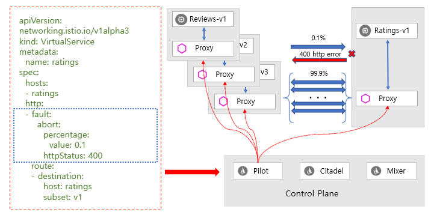
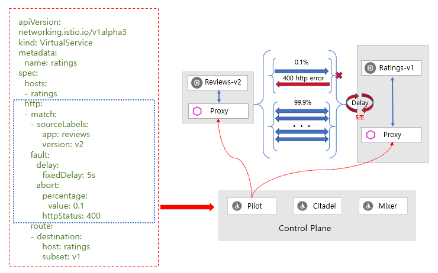

# 결함 주입 \(Fault injection\)

장애 복구 정책 \(failure recovery policies\)을 포함하여 네트워크를 구성한 후 Istio의 결함 주입 메커니즘 \(fault injection mechanisms\)을 사용하여 어플리케이션의 전체에 대한 장애 복구 능력 \(failure recovery capacity\)을 테스트 할 수 있습니다.

결함 주입 \(Fault injection\)은 시스템 내부에 오류 \(errors\)를 주입하여 해당 오류 조건 \(error conditions\)에 대한 극복 및 복구할 수 있도록 하는 테스트 방법 입니다.

결함 주입을 사용하는 것은 장애 복구 정책 \(failure recovery policies\)이 비호환적이거나 너무 제한적이지 않다는 것이고 잠재적으로 중요한 서비스의 비가용한 상태가 되지 않는 것을 확인할 수 있습니다.

네트워크 계층에서 패킷 지연 또는 파드\(pod\) 종료와 같은 오류\(errors\)를 발생시키는 다른 메커니즘과 달리 Istio를 사용하면 어플리케이션\(Application\) 계층에 결함\(fault\)을 주입 할 수 있습니다. 이를 통해 HTTP 오류 코드 \(error codes\)와 같은 관련성 높은 오류\(failures\)를 삽입하여 보다 관련성 높은 결과를 얻을 수 있습니다.

가상 서비스 \(Virtual Service\)를 사용하여 구성된 두 가지 유형의 결함\(Fault\)을 주입 할 수 있습니다.

* 시간 지연 \(delay\) : 지연은 네트워크 대기시간 \(Network Latency\) 가 증가하거나 과부하 된 업스트림 서비스를 모방하여 지연되는 시간차를 발생시킨 결함입니다.
* 작동 중단 \(abort\) : 작동 중단은 업스트림 서비스의 실패 \(failure\)를 모방하여 발생시킨 결함 \(fault\)이고 일반적으로 중단은 HTTP 오류 코드 \(Error codes\) 또는 TCP 연결 실패 \(TCP connection failures\)의 형태로 나타납니다.

\[용어 설명\] 업스트림 \(upstream\)은 클라이언트나 로컬 기기 \(일반적으로 컴퓨터나 모바일기기\)에서 서버나 원격 호스트 \(이하 서버\)로 보내지는 \(전송되는\) 데이터 또는 보내는 것을 의미한다.

예를 들어 가상 서비스 \(Virtual Service\)는 1,000 개의 서비스 요청\(Requests\) 중 1개의 Ratings 서비스 호출에 대하여 5초 정도의 시간 지연 \(Delay\)을 발생시킵니다.

다음은 작동 중단\(abort\)를 구성하여 결함\(Fault\)을 시뮬레이션을 할 수 있습니다.

마지막으로는 시간 지연\(delay\)과 작동 중단\(abort\) 결함\(fault\)을 함께 사용하는 것으로 review 서비스의 v2 하위집합 \(subset\)에서 ratings 서비스의 v1 하위집합\(Subset\)까지의 모든 HTTP 요청\(Request\)에 대해 5초 정도의 시간 지연 \(Delay\)을 발생시키고 그 중 0.1%에 대해서는 작동 중단\(Abort\)을 시켜 HTTP 400 오류 \(error\)를 발생시킵니다.

