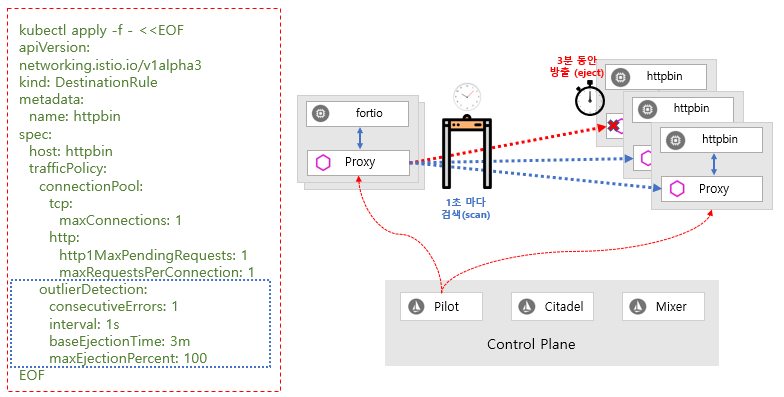

# Hands-on : 써킷 브레이킹 \(Circuit Breaking\)

이 예제에서는 연결\(connections\), 요청 \(request\) 및 이상 값 탐지 \(outlier detection\)에 대한 써킷 브레킹 \(circuit breaking\)을 구성하는 방법을 보여줍니다.

써킷 브레이킹 \(circuit breaking\)은 복원력 있는 마이크로 서비스 어플리케이션 \(resilient microservice application\)을 만드는데 중요한 패턴입니다. 써킷 브레킹을 사용하면 장애 \(failure\), 대기 시간 스파이크 \(latency spike\) 및 기타 네트워크 특성의 바람직하지 않은 영향으로 인한 영향을 제한하는 어플리케이션을 작성할 수 있습니다.

또한 이 예제에서는 써킷 브레이킹 \(circuit breaking\)을 구성한 다음 써킷 브레이커 \(circuit breaker\)를 의도적으로 "개폐\(tripping\)"하여 구성한 것을 테스트 합니다.

### 준비 작업

* 아래 사이트에 있는 설치 안내서의 지침에 따라 Istio를 설정하세요. [https://istio.io/docs/setup/kubernetes/install/](https://istio.io/docs/setup/kubernetes/install/)
* httpbin 샘플을 실행하세요. 자동 사이드카 주입 \(automatic sidecar injection\)을 사용하고 있다면 다음과 같이 httpbin 서비스를 배포\(deploy\)하세요.

  ```bash
  $kubectl apply -f samples/httpbin/httpbin.yaml
  ```

  그렇지 않으면 httpbin 어플리케이션을 배포 \(deploy\)하기 전에 수동으로 사이드카 \(sidecar\)를 주입 \(inject\) 해야 합니다.

  ```bash
  $kubectl apply -f <(istioctl kube-inject -f samples/httpbin/httpbin.yaml)
  ```

httpbin 어플리케이션은 이 예제에서는 백엔드 서비스 역할을 합니다.

### 써킷 브레이커을 구성하기 \(Configuring the circuit breaker\)

1. httpbin 서비스를 호출 할 때 써킷 브레이킹 \(circuit breaking\) 설정을 적용 할 대상 규칙\(destination rule\)을 설정하세요.

   ```bash
    $kubectl apply -f - <<EOF
    apiVersion: networking.istio.io/v1alpha3
    kind: DestinationRule
    metadata:
      name: httpbin
    spec:
      host: httpbin
      trafficPolicy:
        connectionPool:
          tcp:
            maxConnections: 1
          http:
            http1MaxPendingRequests: 1
            maxRequestsPerConnection: 1
        outlierDetection:
          consecutiveErrors: 1
          interval: 1s
          baseEjectionTime: 3m
          maxEjectionPercent: 100
    EOF
   ```

   상호 TLS 인증\(mutual TLS authentication\)을 사용하여 Istio를 설치/구성한 경우에는 적용 전에 대상 규칙\(Destination Rule\)에 TLS 트래픽 정책 모드 \(TLS traffic policy mode, trafficPolicy\)에 ISTIO\_MUTUAL을 추가해야 합니다. 그렇지 않으면 요청\(request\)은 아래에서 설명한 대로 503 오류\(errors\)가 발생됩니다.  

2. 대상 규칙\(destination rule\)이 올바르게 설정되었는지를 확인하세요.

   ```bash
    $kubectl get destinationrule httpbin -o yaml
    apiVersion: networking.istio.io/v1alpha3
    kind: DestinationRule
    metadata:
      name: httpbin
      ...
    spec:
      host: httpbin
      trafficPolicy:
        connectionPool:
          http:
            http1MaxPendingRequests: 1
            maxRequestsPerConnection: 1
          tcp:
            maxConnections: 1
        outlierDetection:
          baseEjectionTime: 180.000s
          consecutiveErrors: 1
          interval: 1.000s
          maxEjectionPercent: 100
   ```

#### **대상 규칙 \(destination rule\) 적용 후 503 오류가 발생하는 경우**

대상 규칙 \(Destination Rule\)을 적용한 후 서비스 요청 \(service request\)으로 HTTP 503 오류가 바로 발생하기 시작하면 대상 규칙 \(Destination Rule\)을 제거하거나 되돌릴 때까지 오류 \(errors\)가 계속된다면 대상 규칙 \(Destination Rule\)이 서비스에 대해 TLS 충돌을 발생시킬 수 있습니다.

예를 들어 클러스터에서 상호 TLS \(mutual TLS\)를 전역적 \(globally\)으로 구성하는 경우 대상규칙 \(Destination Rule\)에는 다음 트래픽 정책 \(trafficPolicy\)가 포함해야 합니다.

```text
 trafficPolicy:
   tls:
     mode: ISTIO_MUTUAL
```

그렇지 않으면, 기본적으로 모드는 사용 안함\(DISABLE\)으로 설정되기 때문에 클라이언트 프록시 사이드카\(client proxy sidecars\)가 TLS 암호화된 요청 대신 일반적인\(암호화 안된\) HTTP 요청을 합니다. 하지만 서버 프록시\(server proxy\)는 암호화된 요청을 기대하고 있기 때문에 요청이 서버 프록시\(server proxy\)에 제대로 전송이 안됩니다.

대상 규칙\(Destination Rule\)을 적용할 때마다 트래픽 정책\(trafficPolicy\) TLS 모드가 전역적인\(global\) 서버 구성과 일치하는지를 확인하세요.

### 써킷 브레이커 \(circuit breaker\)

사이드카 프록시\(sidecar proxy, Envoy proxy\)는 어플리케이션의 서비스에서 활용할 사용 가능한 사전 동의 오류 복구 기능 \(opt-in failure recovery features\)을 제공합니다. 동시 연결의 갯수와 요청 대기 갯수를 제한할 수 있어서 시스템이 과도한 요청으로 인한 장애 상태가 되지 않도록 합니다.


써킷 브레이커 \(circuit breaker\)는 대상 규칙\(Destination Rule\)의 트래픽 정책\(trafficPolicy\)에서 커넥션 풀\(connection pool\)에서 아래와 같이 설정할 수 있습니다.

#### TCP 커넥션 풀 설정

HTTP 및 TCP 업스트림 커넥션\(upstream connection\)에 대한 공통적인 설정

| 파라미터 | 설 |
| :--- | :--- |
| maxConnections | 대상 호스트\(destination host\)에 대한 최대 HTTP1 / TCP 연결 갯수이고 기본값\(default\)은 2 ^ 32-1 개 입니다. |
| connectTimeout | TCP 연결 시간 초과 \(connection timeout\) |
| tcpKeepalive | 해당 속성이 설정된 경우 TCP Keepalives를 사용하기 위해서는 소켓\(socket\)에서 SO\_KEEPALIVE를 설정하세요.   |

#### HTTP 커넥션 풀 설정

HTTP1.1 / HTTP2 / GRPC 커넥션에 적용 가능한 설정

| 파라미 | 설 |
| :--- | :--- |
| http1MaxPendingRequests | 대상\(destination\)에 대기중인 최대 HTTP 요청 갯수이고 기본값\(default\)은 2 ^ 32-1 개이며 초과 대기 중인 요청\(request\)은 방출\(eject\) 됩니다. |
| http2MaxRequests | 백엔드\(Backend\)에 대한 최대 요청\(request\) 갯수이고 기본값\(default\)은 2 ^ 32-1 개 입니다. |
| maxRequestsPerConnection | 백엔드\(backend\) 연결\(connection\) 당 최대 요청\(request\) 갯수로 이 매개 변수\(parameter\)를 1로 설정\(setting\)하면 연결 유지\(keep alive\)가 비활성화\(disable\)되고 기본값은 "무제한\(unlimited\)"을 의미하며 최대 2 ^ 29 입니다. |
| maxRetries | 지정된 시간에 클러스터내의 모든 호스트에서 처리될 수 있는 최대 재시도 횟수입니다. 기본값은 2 ^ 32-1 입니다. |
| idleTimeout | 업스트림 연결 풀 연결에 대한 유휴 시간 제한\(idle timeout\). 유휴 시간 제한은 활성 요청이 없는 기간으로 정의되고 설정하지 않으면 기본값은 1 시간으로 유휴 시간 초과에 도달하면 연결이 닫힙니다. 요청 기반 시간 제한은 HTTP/2 핑\(PING\)이 연결을 유지하지 않음을 의미하는 것으로 HTTP1.1 및 HTTP2 연결에 모두 적용됩니다. |

### 이상치 감지 \(Outlier Detection\)

이상치 탐지\(Outlier Detection\)는 비정상적인 호스트 동작을 감지하고 클러스터 내의 로드 밸런싱 풀 \(load-balanced pool\)에서 비정상적인 호스트\(unhealthy host\)를 방출\(eject\)하는 Istio 복원성 전략 \(Istio Resiliency strategy\)으로 정상적인 호스트\(healthy host\)만 사용자 요청을 처리하는데 참여함으로써 서비스의 전체 가용성\(availability\)을 높일 수 있습니다.

업스트림 서비스에서 각 개별 호스트의 상태를 추적하는 써킷 브레이커 \(circuit breaker\) 로서 HTTP 및 TCP 서비스 모두에 적용 가능합니다.

* HTTP 서비스의 경우 API 호출에 대해 5xx 오류와 같은 연속적인 오류\(consecutive error\)를 반환하는 호스트는 사전 정의 된 기간\(baseEjectionTime\) 동안 로드 밸런싱 풀에서 방출\(eject\)됩니다. 
* TCP 서비스의 경우 연속적인 오류 메트릭\(consecutive errors metric\)을 측정 할 때 지정된 호스트에 대한 연결 시간 초과\(connection timeouts\) 또는 연결 실패 \(connection failures\)가 오류\(error\)로 계산됩니다.

아래 설정을 사용하면 업스트림 서비스\(upstream service, 종속 서비스/dependent service\)가 1초 마다 검색\(scan\)되고 5xx 오류 코드\(error code\)로 1번 이상 실패\(fail\)하는 호스트\(host\)가 있으면 로드 밸런스 풀\(load-balanced pool\)에서 3분 동안 방출\(eject\)됩니다.



* consecutiveGatewayErrors: 연결 풀에서 호스트를 방출\(eject\) 전의 게이트웨이 오류\(gateway errors\) 발생 횟수이고 업스트림 호스트가 HTTP를 통해 액세스해서 리턴 코드가 502, 503 또는 504 이면 게이트웨이 오류\(gateway errors\)로 규정하고 불명확한 TCP 연결 \(opaque TCP connection\)을 통해 업스트림 호스트에 액세스하면 연결 시간 초과 \(connect timeouts\) 및 연결 오류/실패 이벤트\(connection error/failure events\)가 게이트웨이 오류\(connect timeouts\)로 간주되며 이 기능은 기본적으로\(default\) 또는 값 0으로 설정되면 비활성화됩니다.
* consecutive5xxErrors : 호스트가 연결 풀에서 방출\(Inject\)되기 전의 연속적으로 오류 \(consecutive errors\) 발생 횟수이고 불명확한 TCP 연결 \(opaque TCP connection\)을 통해 업스트림 호스트에 액세스 한 경우에는 연결 시간 종료\(connect timeouts\), 연결 오류/실패\(connection error/failure\) 및 요청 실패 이벤트\(request failure events\)는 5xx 오류로 규정되며 기본값은 5이지만 값을 0으로 설정하여 비활성화 할 수 있습니다.

\[참고사항\] consecutiveGatewayErrors/consecutive5xxErrors

```text
consecutivegatewayerrors 및 consecutive5xxerrors는 개별적으로 또는 함께 사용할 수 있습니다. consecutivegatewayerrors에 의해 계산된 오류는 consecutive5xxerrors에도 포함되므로 consecutivegatewayerrors 값이 consecutive5xxerrors 값보다 크거나 같으면 consecutivegatewayerrors가 적용되지 않습니다.
```

* baseEjectionTime : 최소 방출 시간 \(maximum ejection duration\)으로 호스트는 최소 방출 지속 시간과 호스트 방출 횟수와 같은 기간 동안 방출 상태를 유지하며 이 기술을 통해 시스템은 비정상 업스트림 서버의 방출 기간을 자동으로 늘릴 수 있습니다. 형식은 "1 h/1 m/1 s/1 ms" 이고 1 ms 이상이여야 하며 기본값은 30초입니다.
* interval : 방출 분석 \(ejection sweep analysis\) 사이의 시간 간격이고 형식은 "1 h/1 m/1 s/1 ms" 가지며 최소 1 ms 이상으로 기본값은 10입니다.
* maxEjectionPercent : 로드 밸런싱 풀\(load-balanced pool\)에서 방출할 수 있는 \(eject\) 호스트의 최대 비율로 기본값은 10% 이고 예를 들어 이 파라미터\(parameter\)를 100으로 설정하면 연속적인 오류를 발생시키는 비정상적인 호스트\(unhealthy host\)를 방출\(eject\) 할 수 있고 요청은 다시 정상적인 호스트\(healthy host\) 경로로 다시 전송합니다.
* minHealthPercent : 연관된 로드 밸런싱 풀 \(load balancing pool\)에 정상 모드\(healthy mode\)에서 최소 상태 백분율 \(min-health percent, minHealthPercent\) 호스트가 있으면 이상치 감지\(Outlier detection\)가 사용 가능합니다.  로드 밸런싱 풀 \(load balancing pool\)의 정상 호스트\(healthy hosts \) 백분율이 임계값\(threshold\) 아래로 떨어지면 이상치 감지가\(Outlier detection\) 비활성화되고 프록시는 풀\(pool\)내 비정상 호스트\(unhealthy host\)를 포함한 모든 호스트 대상으로 부하분산\(load balance\)을 수행합니다. 임계값\(threshold\)은 0%로 설정하여 비활성화 할 수 있고 서비스별 포드 수가 적은 K8S 환경에서는 일반적으로 적용할 수 없으므로 기본값은 0%입니다.

이상치 감지\(Outlier Detection\)는 로드 밸런싱 풀 \(load balancing pool\)에 연결된 최소 수의 정상 호스트\(healthy host\)가 있을 때까지 사용 가능하게 됩니다.

### 클라이언트 추가 \(Adding a client\)

httpbin 서비스로 트래픽을 보낼 클라이언트를 만듭니다. 클라이언트는 Fortio라는 간단한 로드 테스트 클라이언트\(load-testing client\) 입니다. Fortio를 사용하면 발신 HTTP 호출 \(outgoing HTTP calls\)에 대한 커넥션 \(connections\) 갯수, 동시성 \(concurrency\) 및 시간 지연 \(delays\) 갯수를 제어 할 수 있습니다. 이 클라이언트를 사용하여 대상 규칙 \(Destination Rule\)에서 설정 한 써킷 브레이커 정책 \(회로 차단기 정책, circuit breaker policies\)을 "개폐 \(trip\)" 합니다.

1. 네트워크 상호 작용이 Istio에 의해 통제되도록 클라이언트에 Istio 사이드카 프록시 \(Istio sidecar proxy\)를 주입 \(inject\)하세요.

   자동 사이드카 주입 \(automatic sidecar injection\)을 사용하도록 설정 하는 경우에는 아래와 같이 fortio 서비스를 배포하세요.

   ```bash
    $kubectl apply -f samples/httpbin/sample-client/fortio-deploy.yaml
   ```

   ```text
    apiVersion: v1
    kind: Service
    metadata:
      name: fortio
      labels:
        app: fortio
    spec:
      ports:
      - port: 8080
        name: http
      selector:
        app: fortio
    ---
    apiVersion: apps/v1
    kind: Deployment
    metadata:
      name: fortio-deploy
    spec:
      replicas: 1
      selector:
        matchLabels:
          app: fortio
      template:
        metadata:
          annotations:
            # This annotation causes Envoy to serve cluster.outbound statistics via 15000/stats
            # in addition to the stats normally served by Istio.  The Circuit Breaking example task
            # gives an example of inspecting Envoy stats.
            sidecar.istio.io/statsInclusionPrefixes: cluster.outbound,cluster_manager,listener_manager,http_mixer_filter,tcp_mixer_filter,server,cluster.xds-grpc
          labels:
            app: fortio
        spec:
          containers:
          - name: fortio
            image: fortio/fortio:latest_release
            imagePullPolicy: Always
            ports:
            - containerPort: 8080
              name: http-fortio
            - containerPort: 8079
              name: grpc-ping
   ```

   그렇지 않으면 fortio 어플리케이션을 배포하기 전에 사이드카 \(sidecar\)를 수동으로 주입 \(inject\)해야 합니다.

   ```bash
    $kubectl apply -f <(istioctl kube-inject -f samples/httpbin/sample-client/fortio-deploy.yaml)
   ```

2. 아래는 클라이언트 파드\(client pod\)에 로그인하고 fortio 툴 \(tool\)을 사용하여 httpbin을 호출하는 것으로 우선 fortio 파드 \(pod\) ID를 환경 변수에 저장하고 해당 환경변수를 이용해 curl 명령어\(command\)를 fortio 파드\(pod\)에 전달해 한번만 실행합니다.       

```text

$FORTIO_POD=$(kubectl get pod | grep fortio | awk '{ print $1 }')
$kubectl exec -it $FORTIO_POD  -c fortio /usr/bin/fortio -- load -curl http://httpbin:8000/get
HTTP/1.1 200 OK
server: envoy
date: Tue, 25 Feb 2020 20:25:52 GMT
content-type: application/json
content-length: 586
access-control-allow-origin: *
access-control-allow-credentials: true
x-envoy-upstream-service-time: 36
{
  "args": {},
  "headers": {
    "Content-Length": "0",
    "Host": "httpbin:8000",
    "User-Agent": "fortio.org/fortio-1.3.1",
    "X-B3-Parentspanid": "8fc453fb1dec2c22",
    "X-B3-Sampled": "1",
    "X-B3-Spanid": "071d7f06bc94943c",
    "X-B3-Traceid": "86a929a0e76cda378fc453fb1dec2c22",
    "X-Forwarded-Client-Cert": "By=spiffe://cluster.local/ns/default/sa/httpbin;Hash=68bbaedefe01ef4cb99e17358ff63e92d04a4ce831a35ab9a31d3c8e06adb038;Subject=\"\";URI=spiffe://cluster.local/ns/default/sa/default"
  },
  "origin": "127.0.0.1",
  "url": "http://httpbin:8000/get"
}
 
```

모든 것이 제대로 설정이 되면 위의 같이 요청 \(request\)가 성공하는 것을 볼 수 있습니다.

### 써킷 브레이커 개폐 \(Tripping the circuit breaker\)

대상 규칙 \(Destination Rule\) 설정 \(settings\)에서 maxConnections : 1 및 http1MaxPendingRequests : 1을 설정했습니다. 이 규칙은 둘 이상의 커넥션과 요청\(connection and request\)을 동시에 초과하면 istio-proxy가 앞으로 추가되는 커넥션과 요청 \(connection and request\)에 대해 전송 경로\(circuit\)를 오픈할 때 오류가 \(failures\) 발생하는 것을 볼 수 있습니다.

1. 환경변수에 저장된 fortio의 파드 ID를 이용해 해당 파드 내에서 fortio 실행하면서 인자 \(argument\)로 "-c 2", "-n 20" 지정하여 두 개의 동시 커넥션\(concurrent connections\) 으로 서비스를 호출 \(call\)하고 20개의 요청을 보냅니다.

   ```bash
    $kubectl exec -it $FORTIO_POD  -c fortio /usr/bin/fortio -- load -c 2 -qps 0 -n 20 -loglevel Warning http://httpbin:8000/get
    20:33:46 I logger.go:97> Log level is now 3 Warning (was 2 Info)
    Fortio 1.3.1 running at 0 queries per second, 6->6 procs, for 20 calls: http://httpbin:8000/get
    Starting at max qps with 2 thread(s) [gomax 6] for exactly 20 calls (10 per thread + 0)
    20:33:46 W http_client.go:679> Parsed non ok code 503 (HTTP/1.1 503)
    20:33:47 W http_client.go:679> Parsed non ok code 503 (HTTP/1.1 503)
    20:33:47 W http_client.go:679> Parsed non ok code 503 (HTTP/1.1 503)
    Ended after 59.8524ms : 20 calls. qps=334.16
    Aggregated Function Time : count 20 avg 0.0056869 +/- 0.003869 min 0.000499 max 0.0144329 sum 0.113738
    # range, mid point, percentile, count
    >= 0.000499 <= 0.001 , 0.0007495 , 10.00, 2
    > 0.001 <= 0.002 , 0.0015 , 15.00, 1
    > 0.003 <= 0.004 , 0.0035 , 45.00, 6
    > 0.004 <= 0.005 , 0.0045 , 55.00, 2
    > 0.005 <= 0.006 , 0.0055 , 60.00, 1
    > 0.006 <= 0.007 , 0.0065 , 70.00, 2
    > 0.007 <= 0.008 , 0.0075 , 80.00, 2
    > 0.008 <= 0.009 , 0.0085 , 85.00, 1
    > 0.011 <= 0.012 , 0.0115 , 90.00, 1
    > 0.012 <= 0.014 , 0.013 , 95.00, 1
    > 0.014 <= 0.0144329 , 0.0142165 , 100.00, 1
    # target 50% 0.0045
    # target 75% 0.0075
    # target 90% 0.012
    # target 99% 0.0143463
    # target 99.9% 0.0144242
    Sockets used: 4 (for perfect keepalive, would be 2)
    Code 200 : 17 (85.0 %)
    Code 503 : 3 (15.0 %)
    Response Header Sizes : count 20 avg 195.65 +/- 82.19 min 0 max 231 sum 3913
    Response Body/Total Sizes : count 20 avg 729.9 +/- 205.4 min 241 max 817 sum 14598
    All done 20 calls (plus 0 warmup) 5.687 ms avg, 334.2 qps
   ```

   거의 모든 요청\(requests\)이 처리된 istio-proxy는 약간의 여유를 허용합니다.

   ```text
    Code 200 : 17 (85.0 %)
    Code 503 : 3 (15.0 %)
   ```

   **\[참고사항\] Fortio 부하 테스트 툴**

   ```text
    - Fortio (Φορτίο)는 Istio의 부하 테스트 툴로 시작하여 이제는 자체 오픈 소스 프로젝트 입니다.
    - Fortio는 초당 지정된 쿼리 (qps)로 실행되고 실행 시간의 막대 그래프를 기록하고 백분율을 계산합니다 (예 : p99, 즉 요청의 99 %와 같은 응답 시간은 초 (SI 단위)). 설정된 시간 동안, 고정 된 수의 호출 동안, 또는 중단 될 때까지 (일정한 목표 QPS에서, 또는 max speed/load per connection/thread) 실행될 수 있습니다.
    - 참고 URL : https://github.com/fortio/fortio
   ```

   **명령어 라인 인자 \(Command Line Argument\)**

   <table>
     <thead>
       <tr>
         <th style="text-align:left">Flag</th>
         <th style="text-align:left">Description, example</th>
       </tr>
     </thead>
     <tbody>
       <tr>
         <td style="text-align:left">-qps rate</td>
         <td style="text-align:left">Queries Per Seconds or 0 for no wait/max qps</td>
       </tr>
       <tr>
         <td style="text-align:left">-c connections</td>
         <td style="text-align:left">Number of parallel simultaneous connections (and matching go routine)</td>
       </tr>
       <tr>
         <td style="text-align:left">-t duration</td>
         <td style="text-align:left">
           <p>How long to run the test (for instance -t 30 min for 30 minutes)</p>
           <p>or 0 to run until ^C, example (default 5 s)</p>
         </td>
       </tr>
       <tr>
         <td style="text-align:left">-n numcalls</td>
         <td style="text-align:left">
           <p>Run for exactly this number of calls instead of duration.</p>
           <p>Default (0) is to use duration (-t).</p>
         </td>
       </tr>
       <tr>
         <td style="text-align:left">-r resolution</td>
         <td style="text-align:left">
           <p>Resolution of the histogram lowest buckets in seconds</p>
           <p>(default 0.001 i.e 1 ms), use 1/10th of your expected typical latency</p>
         </td>
       </tr>
       <tr>
         <td style="text-align:left">-H &quot;header: value&quot;</td>
         <td style="text-align:left">Can be specified multiple times to add headers (including Host:)</td>
       </tr>
       <tr>
         <td style="text-align:left">-a</td>
         <td style="text-align:left">Automatically save JSON result with filename based on labels and timestamp</td>
       </tr>
       <tr>
         <td style="text-align:left">-json filename</td>
         <td style="text-align:left">
           <p>Filename or - for stdout to output json result (relative to -data-dir
             by default,</p>
           <p>should end with .json if you want fortio report to show them;</p>
           <p>using -a is typically a better option)</p>
         </td>
       </tr>
       <tr>
         <td style="text-align:left">-labels &quot;l1 l2 ...&quot;</td>
         <td style="text-align:left">
           <p>Additional config data/labels to add to the resulting JSON,</p>
           <p>defaults to target URL and hostname</p>
         </td>
       </tr>
     </tbody>
   </table>

2. 동시 커넥션 \(concurrent connections\) 갯수를 최대 3으로 설정해 fortio를 실행합니다.

   ```bash
    $kubectl exec -it $FORTIO_POD  -c fortio /usr/bin/fortio -- load -c 3 -qps 0 -n 30 -loglevel Warning http://httpbin:8000/get
    20:32:30 I logger.go:97> Log level is now 3 Warning (was 2 Info)
    Fortio 1.3.1 running at 0 queries per second, 6->6 procs, for 30 calls: http://httpbin:8000/get
    Starting at max qps with 3 thread(s) [gomax 6] for exactly 30 calls (10 per thread + 0)
    20:32:30 W http_client.go:679> Parsed non ok code 503 (HTTP/1.1 503)
    20:32:30 W http_client.go:679> Parsed non ok code 503 (HTTP/1.1 503)
    20:32:30 W http_client.go:679> Parsed non ok code 503 (HTTP/1.1 503)
    20:32:30 W http_client.go:679> Parsed non ok code 503 (HTTP/1.1 503)
    20:32:30 W http_client.go:679> Parsed non ok code 503 (HTTP/1.1 503)
    20:32:30 W http_client.go:679> Parsed non ok code 503 (HTTP/1.1 503)
    20:32:30 W http_client.go:679> Parsed non ok code 503 (HTTP/1.1 503)
    20:32:30 W http_client.go:679> Parsed non ok code 503 (HTTP/1.1 503)
    20:32:30 W http_client.go:679> Parsed non ok code 503 (HTTP/1.1 503)
    20:32:30 W http_client.go:679> Parsed non ok code 503 (HTTP/1.1 503)
    20:32:30 W http_client.go:679> Parsed non ok code 503 (HTTP/1.1 503)
    20:32:30 W http_client.go:679> Parsed non ok code 503 (HTTP/1.1 503)
    20:32:30 W http_client.go:679> Parsed non ok code 503 (HTTP/1.1 503)
    20:32:30 W http_client.go:679> Parsed non ok code 503 (HTTP/1.1 503)
    20:32:30 W http_client.go:679> Parsed non ok code 503 (HTTP/1.1 503)
    20:32:30 W http_client.go:679> Parsed non ok code 503 (HTTP/1.1 503)
    20:32:30 W http_client.go:679> Parsed non ok code 503 (HTTP/1.1 503)
    20:32:30 W http_client.go:679> Parsed non ok code 503 (HTTP/1.1 503)
    20:32:30 W http_client.go:679> Parsed non ok code 503 (HTTP/1.1 503)
    Ended after 51.9946ms : 30 calls. qps=576.98
    Aggregated Function Time : count 30 avg 0.0040001633 +/- 0.003447 min 0.0004298 max 0.015943 sum 0.1200049
    # range, mid point, percentile, count
    >= 0.0004298 <= 0.001 , 0.0007149 , 16.67, 5
    > 0.001 <= 0.002 , 0.0015 , 36.67, 6
    > 0.002 <= 0.003 , 0.0025 , 50.00, 4
    > 0.003 <= 0.004 , 0.0035 , 60.00, 3
    > 0.004 <= 0.005 , 0.0045 , 66.67, 2
    > 0.005 <= 0.006 , 0.0055 , 76.67, 3
    > 0.006 <= 0.007 , 0.0065 , 83.33, 2
    > 0.007 <= 0.008 , 0.0075 , 86.67, 1
    > 0.008 <= 0.009 , 0.0085 , 90.00, 1
    > 0.009 <= 0.01 , 0.0095 , 96.67, 2
    > 0.014 <= 0.015943 , 0.0149715 , 100.00, 1
    # target 50% 0.003
    # target 75% 0.00583333
    # target 90% 0.009
    # target 99% 0.0153601
    # target 99.9% 0.0158847
    Sockets used: 20 (for perfect keepalive, would be 3)
    Code 200 : 11 (36.7 %)
    Code 503 : 19 (63.3 %)
    Response Header Sizes : count 30 avg 84.366667 +/- 110.9 min 0 max 231 sum 2531
    Response Body/Total Sizes : count 30 avg 451.86667 +/- 277.1 min 241 max 817 sum 13556
    All done 30 calls (plus 0 warmup) 4.000 ms avg, 577.0 qps
   ```

   이제 예상되는 써킷 브레이킹 동작 \(circuit breaking behavior\)을 확인하세요. 요청 \(requests\)의 36.7%만이 성공했으며 나머지는 써킷 브레이킹 동작 \(circuit breaking\) 으로 인해 갇혔습니다.

   ```text
    Code 200 : 11 (36.7 %)
    Code 503 : 19 (63.3 %)
   ```

3. istio-proxy 통계를 조회하여 자세한 내용을 확인하시기 바랍니다.

   ```bash
    $kubectl exec $FORTIO_POD -c istio-proxy -- pilot-agent request GET stats | grep httpbin | grep pending
    cluster.outbound|8000||httpbin.default.svc.cluster.local.circuit_breakers.default.rq_pending_open: 0
    cluster.outbound|8000||httpbin.default.svc.cluster.local.circuit_breakers.high.rq_pending_open: 0
    cluster.outbound|8000||httpbin.default.svc.cluster.local.upstream_rq_pending_active: 0
    cluster.outbound|8000||httpbin.default.svc.cluster.local.upstream_rq_pending_failure_eject: 0
    cluster.outbound|8000||httpbin.default.svc.cluster.local.upstream_rq_pending_overflow: 21
    cluster.outbound|8000||httpbin.default.svc.cluster.local.upstream_rq_pending_total: 29
   ```

   upstream\_rq\_pending\_overflow 값에 대해 21을 볼 수 있습니다. 이는 지금까지 21개의 호출 \(calls\)이 써킷 브레이킹 \(circuit breaking\) 으로 플래그 \(Flag\) 지정되었음을 의미합니다.

### 정리

1. httpbin에 대한 대상 규칙 \(destination rule\) 을 삭제합니다.

   ```bash
   $kubectl delete destinationrule httpbin
   ```

2. httpbin 서비스 및 클라이언트를 종료합니다.

   ```bash
    $kubectl delete deploy httpbin fortio-deploy
    $kubectl delete svc httpbin fortio
   ```

