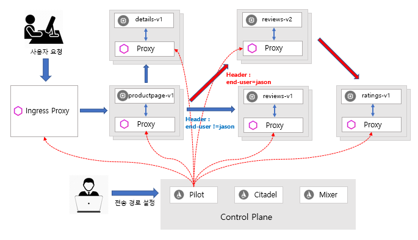
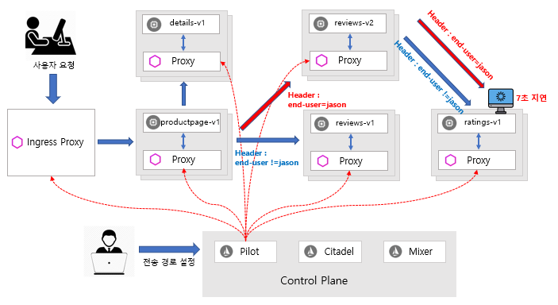
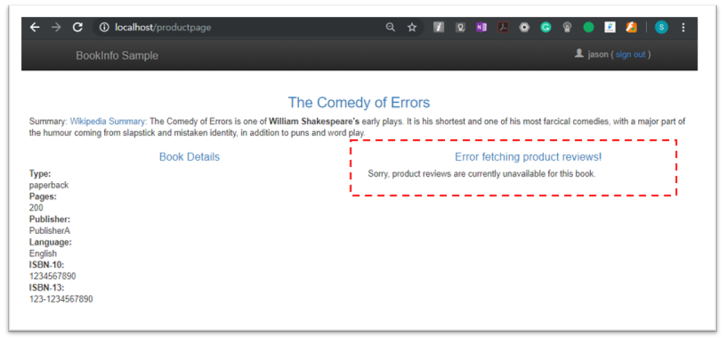
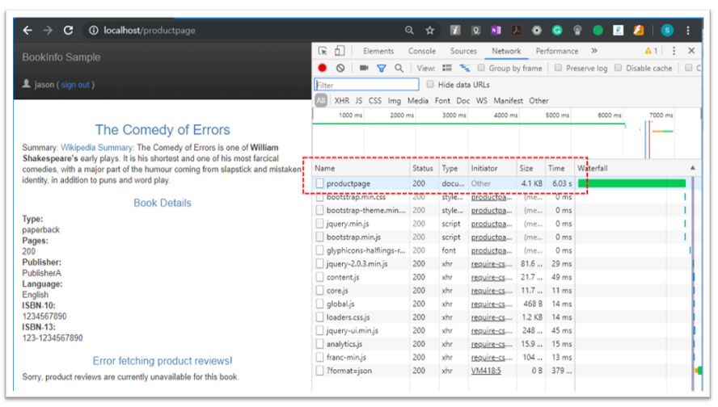
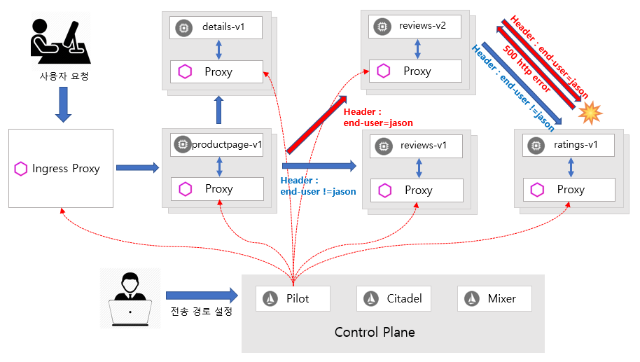
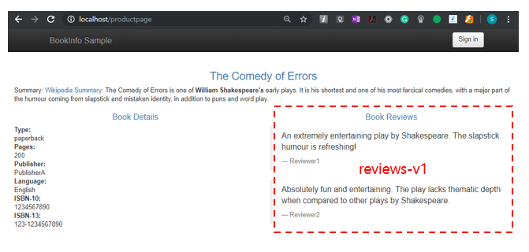

# Hands-on : 결함주입\(Fault Injection\)

### 준비 작업

* 설치 안내서의 지침에 따라 Istio를 설정하세요.   [https://istio.io/docs/setup/kubernetes/install/](https://istio.io/docs/setup/kubernetes/install/)
* 기본 대상 규칙\(default destination rules\)이 포함된 Bookinfo 샘플 어플리케이션\(Application\)을 배포합니다.  [https://istio.io/docs/examples/bookinfo/](https://istio.io/docs/examples/bookinfo/)
* 시작하기 전에 서비스 복원성\(Service Resiliency\)에서 결함주입\(Fault Injection\)을 다시 한번 보세요.
* 요청 라우팅 작업\(request routing task\)을 수행하거나 다음 명령을 실행하여 어플리케이션 버전 별 라우팅\(routing\) 적용합니다.

  ```bash
    $kubectl apply -f samples/bookinfo/networking/virtual-service-all-v1.yaml
  ```

  ```text
    apiVersion: networking.istio.io/v1alpha3
    kind: VirtualService
    metadata:
      name: productpage
    spec:
      hosts:
      - productpage
      http:
      - route:
        - destination:
            host: productpage
            subset: v1
    ---
    apiVersion: networking.istio.io/v1alpha3
    kind: VirtualService
    metadata:
      name: reviews
    spec:
      hosts:
      - reviews
      http:
      - route:
        - destination:
            host: reviews
            subset: v1
    ---
    apiVersion: networking.istio.io/v1alpha3
    kind: VirtualService
    metadata:
      name: ratings
    spec:
      hosts:
      - ratings
      http:
      - route:
        - destination:
            host: ratings
            subset: v1
    ---
    apiVersion: networking.istio.io/v1alpha3
    kind: VirtualService
    metadata:
      name: details
    spec:
      hosts:
      - details
      http:
      - route:
        - destination:
            host: details
            subset: v1
    ---
  ```

  ```bash
    $kubectl apply -f samples/bookinfo/networking/virtual-service-reviews-test-v2.yaml
  ```

  ```text
    apiVersion: networking.istio.io/v1alpha3
    kind: VirtualService
    metadata:
      name: reviews
    spec:
      hosts:
        - reviews
      http:
      - match:
        - headers:
            end-user:
              exact: jason
        route:
        - destination:
            host: reviews
            subset: v2
      - route:
        - destination:
            host: reviews
            subset: v1
  ```

  위의 설정으로 요청 처리 흐름 방식은 다음과 같습니다. 

* productpage -&gt; review:v2 -&gt; ratings \(사용자가 jason인 경우\) 
* productpage -&gt; review:v1 \(이외 모든 사용자인 경우\)  




### HTTP 시간 지연 결함 주입하기 \(Injecting an HTTP delay fault\)

서비스 복원성 \(service resiliency\)을 위한 Bookinfo 어플리케이션 \(Application\) 마이크로 서비스\(Microservice\)를 테스트하기 위해서 사용자가 jason인 경우 reviews:v2와 ratings 마이크로 서비스 사이에 7초의 시간 지연 \(delay\)을 주입\(inject\)한 테스트는 Bookinfo 어플리케이션에 의도적으로 주입된 결함을 발견할 수 있습니다.

reviews:v2 서비스는 ratings 서비스 호출하기 위해서 연결 시간 제한 \(connection timeout\)을 10초로 어플리케이션내 **하드 코딩 \(hard-coded\)** 되어 있다는 것을 주의하세요. 적용한 7초의 지연 시간 \(delay\)에도 불구하고 여전히 오류 \(errors\)없이 종단 간 흐름 \(end-to-end flow\)을 계속 진행되는 것을 기대합니다.

1. 테스트 사용자인 jason에서 오는 트래픽을 지연시키는 결함 주입 규칙\(fault injection rule\)을 설정합니다.

   ```bash
    $kubectl apply -f samples/bookinfo/networking/virtual-service-ratings-test-delay.yaml
   ```

2. 설정된 결함 주입 규칙 \(fault injection rule\)을 확인합니다.

   ```bash
    $kubectl get virtualservice ratings -o yaml
    apiVersion: networking.istio.io/v1alpha3
    kind: VirtualService
    metadata:
      name: ratings
      ...
    spec:
      hosts:
      - ratings
      http:
      - fault:
          delay:
            fixedDelay: 7s
            percent: 100
        match:
        - headers:
            end-user:
              exact: jason
        route:
        - destination:
            host: ratings
            subset: v1
      - route:
        - destination:
            host: ratings
            subset: v1
   ```

   새로 규칙이 모든 파드 \(pod\)에 전파되는데 몇 초가 걸립니다.



### 시간 지연 설정 테스트 하기 \(Testing the delay configuration\)

1. 웹 브라우저에서 Bookinfo 웹 어플리케이션 \(Application\)을 엽니다.
2. /productpage 웹페이지에서 사용자 jason으로 로그인하세요.

#### 로그인 화면

약 7초 안에 Bookinfo 홈페이지가 오류 \(error\)없이 로드 될 것으로 기대하지만 문제가 있습니다 : reviews 섹션에 오류 \(error\) 메시지가 표시됩니다.

```text
   Error fetching product reviews!
   Sorry, product reviews are currently unavailable for this book.
```



#### 웹 페이지 응답 \(Response\) 시간 보기 

1. 웹 브라우저에서 개발자 도구 메뉴를 엽니다.
2. 네트워크 탭을 엽니다. 
3. /productpage 웹 페이지를 재로드하면 페이지가 실제로 약 6초 안에 로드 된다는 것을 알 수 있습니다. 



### 무슨 일이 일어났는지를 이해하기 \(Understanding what happened\)

reviews 서비스에 있는 시간 초과 \(timeout\)의 하드 코딩 \(hard-coded\) 때문에 서비스 실패를 발생시키는 버그 \(bug\)를 발견할 수 있습니다.

예상되는 것은 \(1\) reviews와 ratings 서비스 간의 시간 제한 \(timeout\)이 10 초로 하드 코딩 \(hard coded\)되어 있기 때문에 \(2\) 적용된 7초 시간 지연 \(delay\)은 reviews 서비스에는 영향이 없을 것입니다. 

그러나 \(3\) productpage와 reviews 서비스간에 하드 코딩 된 시간 제한 \(hard-coded timeout\)으로 총 6초 동안 3초 \(timeout\) + 1회 재시도 \(retry\)로 코딩 되어 있으므로 결과적으로 productpage가 reviews 서비스 호출이 예상한 것 보다 너무 빠른 6초 후에 시간 초과 \(timeout\)가 발생하는 오류 \(error\)가 있습니다.


* 결함 주입 테스트 \(fault injection test\)는 로그인 사용자가 jason일 때에만 수행된다는 점에 유의하세요. \(reviews:v2 전송경로 설정된/routing 경우\)
* 다른 사용자로 로그인하면 지연이 발생하지 않습니다.  \(reviews:v1 또는 reviews:v3로 라우팅 되는 경우\)

이와 같은 버그\(bug\)는 다른 팀이 서로 다른 마이크로 서비스를 독립적으로 개발하는 일반적인 엔터프라이즈 응용 프로그램 \(Enterprise application\)에서 발생할 수 있습니다. Istio의 결함 주입 규칙 \(Fault injection rules\)은 최종 사용자에게 영향을 미치지 않으면서 이러한 이상 \(anomalies\)을 식별하는데 도움이 됩니다.

#### 참고 URL

```http
https://github.com/istio/istio/blob/master/samples/bookinfo/src/productpage/productpage.py
https://github.com/istio/istio/blob/master/samples/bookinfo/src/reviews/reviews-application/src/main/java/application/rest/LibertyRestEndpoint.java
```

### 버그 수정하기 \(Fixing the bug\)

6초 후 시간 초과 발생하는 문제는 일반적으로 다음과 같이 해결할 수 있습니다.

1. productpage를 reviews 서비스 시간 초과 \(service timeout\) 보다 늘리거나 reviews를 ratings 시간 초과를 줄이세요.
2. 수정한 마이크로 서비스를 중단 후 재시작을 하세요.
3. /productpage 웹페이지의 응답이 오류\(Error\)가 없는지를 확인합니다.

그러나 reviews 서비스의 v3에서 이미 하드 코딩된 것이 있으며 reviews:v3 서비스는 ratings를 10초에서 2.5초로 제한하여 \(위의 그림에서 1번 참조\) 다운스트림으로 productpage 요청의 시간 초과 timeout \(미만\)에 영향을 줍니다.

```python
Integer timeout = star_color.equals("black") ? 10000 : 2500
```

* reviews:v2 인 경우 ratings 서비스의 등급\(별 모양\) 컬러는 검정색\(black\) 이고
* reviews:v3 인 경우 ratings 서비스의 등급\(별 모양\) 컬러는 빨간색\(red\) 입니다.

모든 트래픽을 reviews:v3으로 마이그레이션하고 ratings 서비스의 지연 규칙\(delay rule\)을 2.5초 보다 작은 값\(예를 들면 2초\)으로 변경하면 오류 없이 종단 간의 \(end-to-end\) 흐름이 계속되는지를 확인할 수 있습니다.

1. 모든 트래픽을 reviews:v3으로 마이그레이션 및 응답시간 확인

   ```bash
    $kubectl apply -f samples/bookinfo/networking/virtual-service-reviews-v3.yaml
   ```

   ```text
    apiVersion: networking.istio.io/v1alpha3
    kind: VirtualService
    metadata:
      name: reviews
    spec:
      hosts:
        - reviews
      http:
      - route:
        - destination:
            host: reviews
            subset: v3
   ```

2. ratings 서비스의 지연 규칙 \(delay rule\) 변경 \(7초 -&gt; 2초\)

   ```bash
    $ kubectl apply -f - <<EOF
    apiVersion: networking.istio.io/v1alpha3
    kind: VirtualService
    metadata:
      name: ratings
      ...
    spec:
      hosts:
      - ratings
      http:
      - fault:
          delay:
            fixedDelay: 2s
            percent: 100
        match:
        - headers:
            end-user:
              exact: jason
        route:
        - destination:
            host: ratings
            subset: v1
      - route:
        - destination:
            host: ratings
            subset: v1
    EOF
   ```


### HTTP 중단 결함 주입하기 \(Injecting an HTTP abort fault\)

마이크로 서비스 복원력 \(microservice resiliency\)을 테스트하는 또 다른 방법은 HTTP 중단 오류 \(HTTP abort fault\)를 발생시키는 것이고 이 작업에서는 테스트 사용자 jason의 ratings 마이크로 서비스에 대한 HTTP 중단 \(abort\)을 소개합니다.

이 경우에서는 페이지 \(Page\)가 즉시 로드되고 ratings 서비스는 현재 사용할 수 없다는 메시지가 표시됩니다.

1. 사용자 jason에게 HTTP 중단\(abort\)을 전송하는 결함 주입 규칙 \(fault injection injection\) 작성하세요.

   ```bash
    $kubectl apply -f samples/bookinfo/networking/virtual-service-ratings-test-abort.yaml
   ```

2. 규칙이 생성되었는지를 확인하세요.

   ```bash
    $kubectl get virtualservice ratings -o yaml
    apiVersion: networking.istio.io/v1alpha3
    kind: VirtualService
    metadata:
      name: ratings
      ...
    spec:
      hosts:
      - ratings
      http:
      - fault:
          abort:
            httpStatus: 500
            percentage:
              value: 100
        match:
        - headers:
            end-user:
              exact: jason
        route:
        - destination:
            host: ratings
            subset: v1
      - route:
        - destination:
            host: ratings
            subset: v1
   ```



### 중단 설정 테스트하기 \(Testing the abort configuration\)

1. 브라우저에서 Bookinfo 웹 어플리케이션을 엽니다.
2. /productpage 페이지에서 사용자 jason으로 로그인합니다. 가상 서비스 규칙 \(Virtual Service rule\)이 모든 파드 \(pod\)에 성공적으로 전파되면 페이지가 즉시 로드되고 "Ratings service is currently unavailable" 메시지를 보여줍니다.

3. 사용자 jason에서 로그 아웃하거나 Bookinfo 웹 어플리케이션을 익명 창 \(또는 다른 브라우저\)에서 열면 /productpage는 여전히 jason을 제외한 모든 사용자에 대해 reviews:v1 \(ratings를 전혀 호출하지 않음\)을 호출한다는 것을 알 수 있습니다. 따라서 오류 메시지 \(error message\)가 표시되지 않습니다.




### 정리

* 어플리케이션 라우팅 룰 \(routing rule\) 을 제거 하세요.

  ```bash
    $kubectl delete -f samples/bookinfo/networking/virtual-service-all-v1.yaml
  ```

### 

