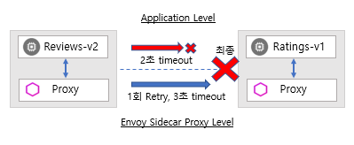

# 어플리케이션 수준의 결함 처리와의 호환성

Istio 장애 복구 기능 \(failure recovery features\)은 어플리케이션\(Application\)에 대하여 완전히 투명하지만 사이드카 프록시\(Envoy, sidecar proxy\)가 응답\(response\)을 리턴 하기 전에 호출된 서비스의 실패\(Failures\)를 처리했는지 여부를 어플리케이션이 알 수 없습니다.

어플리케이션 코드 \(Application code\)에서 내결함성 \(fault tolerance\) 라이브러리 활용해 구성한 것과 Envoy 프록시 장애 복구 정책\(failure recovery policies\)을 설정하는 경우 둘 다 독립적으로 작동하므로 충돌할 수 있다는 것을 명심해야 합니다. 예를 들어, 하나는 가상 서비스 \(Virtual Service\)에 설정되고 다른 하나는 어플리케이션내 코딩으로 제한 시간이 두 개가 있다고 가정합니다.

어플리케이션내 API 호출 서비스에 대한 2초 시간 초과\(timeout\)를 코딩한 다음 가상 서비스\(Virtual Service\)에서 1번의 재시도\(Retry\)로 3초 시간 초과\(timeout\)를 설정 하는 경우에는 어플리케이션 코드의 시간 초과\(timeout\)가 먼저 실행이 되기 때문에 가상 서비스\(Virtual Service\)에서 설정한 시간 초과\(timeout\) 및 재시도\(retry\)는 효과가 없습니다.

Istio 장애 복구 기능 \(failure recovery features\)은 메시에서 서비스의 신뢰성 \(reliability\)과 가용성 \(availability\)을 향상시키는 반면, 어플리케이션은 실패 \(failure\)나 오류 \(error\)를 처리하고 적절한 대비책에 대한 조치 \(fallback action\)를 실행해야 합니다.

예를 들어 로드 밸런싱 풀 \(load balancing pool\) 내의 모든 인스턴스가 실패하면 사이드카 프록시 \(Envoy, sidecar proxy\)는 HTTP 503 코드를 반환하고 어플리케이션\(Application\)은 HTTP 503 오류 코드 \(error code\)를 처리하는데 필요한 대비책 \(fallback\) 로직을 구현 해야 합니다.

