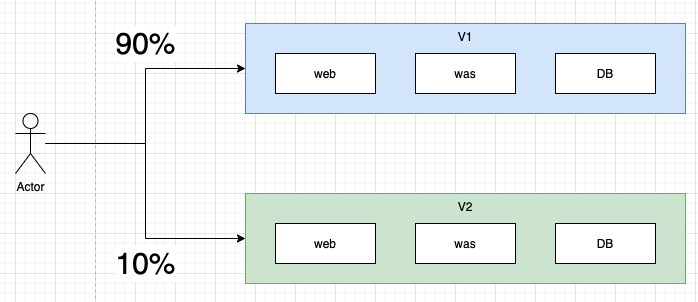

# 4. Canary Deployment \(JJ\)

Canary 배포는 새로운 버전을 배포할때 운영중인 환경에 영향을 최소화 하면서 무중단 서비스를 운영하는 배포 기술입니다. 기본적인 개념은 새로운 버전의 소프트웨어를 배포하고 트래픽 전송량을 조금씩 올리면서 위험을 조기 발견하여 안전하게 배포하는 것입니다. 트래픽을 올리면서 새로운 버전에 대한 사용자들의 반응을 살필수 있고, 트래픽 전송량을 높이는 중간에 문제가 발생하면 바로 이전 버전\(검증된 버전\)으로 롤백 할 수 있습니다.

> canary 라는 이름은 광부들이 광산에 카나리아와 함께 진입하는데에서 유래했습니다. 광산에서 유독가스가 누출되면 카나리아가 먼저 죽기 때문에 광부들은 위험에 미리 대처할 수 있습니다. canary 배포 방식은는 전체 인프라 또는 서비스에 영향을 미치기전에 잠재적인 문제를 조기 발견 할 수 있는 기술입니다.

무엇보다 Canary 배포의 가장 큰 장점은 운영환경에 배포할 수 있다는 것입니다. 테스트 환경을 구축할때 늘 운영환경과 동일한 환경을 갖추려고 노력합니다. 그것은 VM, container 는 물론이며 Data 또한 마찬가지 입니다. \(그래서 Stage 환경, Stage Database 등 을 따로 구축하고 운영하기도 합니다.\) 그러나 Canary 배포 방식은 운영환경에서 추가로 배포한 뒤에 트래픽 제어만을 활용하기 때문에 Canary 방식의 배포를 통해 테스트가 끝난 시점은 곧 배포 완료 시점과 동일합니다.



Canary 배포에 대한 자세한 내용은 [여기](https://martinfowler.com/bliki/CanaryRelease.html) 에서 확인 할 수 있습니다.

> Martin Fowler 가 이 방식을 소개한 책입니다. Continuous Delivery: Reliable Software Releases through Build, Test, and Deployment Automation \(Addison-Wesley Signature Series \(Fowler\)\)

## Canary deployment 구현

istio 는 트래픽을 제어하는 기술이기 때문에 canary 배포를 쉽게 지원할 수 있습니다. 실제 예를 통해 살펴보겠습니다.

### Kubernetes 기능만 사용한 canary deployment

쿠버네티스의 기본 기능만으로 이미 canary 배포를 구현할 수 있습니다. 쿠버네티스에서 소개하는 방식은 deployment spec 에 labels 를 구분해서 2개의 deployment 를 배포하고 1개의 service 에 붙이는 방법입니다. 예를 들어, 이미 배포한 서비스 helloword version v1 를 새 버전 v2 로 배포하는 과정을 살펴봅시다. 쿠버네티스에 helloword v2 버전 deployment 를 배포하여 작은 개수의 pod 를 띄우고 service 의 selector, deployment 의 label 설정합니다. helloworld service 는 두 deployment 에서 컨트롤하는 v1 pod 와 v2 pod 로 트래픽을 분산해서 보내게 됩니다. 이때 v1 pod 개수가 많을수록 v2 canary 배포의 영향은 줄어듭니다. 이후 비율을 조정해서 배포를 진행하거나, 롤백하기 전에 v2 에 나타나는 영향을 확인할 수 있습니다. 그림에서는 v1 3개, v2 1개 pod 가 배포된 예를 보여줍니다. 이때 canary 용 v2 pod 는 전체 트래픽의 25% (1/4) 를 받습니다.
deployment 에 [HPA(Horizontal pod autoscaler)](https://kubernetes.io/docs/concepts/workloads/controllers/deployment/#scaling-a-deployment) 를 적용하면 rollout 과정중에 트래픽 부하에 따른 pod 수 조절을 자동화 할 수 있습니다.


```yaml
apiVersion: v1
kind: Service
metadata:
name: helloworld
labels:
  app: helloworld
spec:
  selector:
    app: helloworld
  ...

```

```yaml
     name: helloworld
     replicas: 3
     ...
     labels:
        app: helloworld
        track: stable
     ...
     image: helloworld:v1
```

```yaml
     name: helloworld-canary
     replicas: 1
     ...
     labels:
        app: helloworld
        track: canary
     ...
     image: helloworld:v2
```

이 방식은 배포하려는 버전(v2)이 적절하게 테스트 된 경우에 적합합니다. 쿠버네티스의 canary 배포는 공통 pod label 이 있는 두 개의 deployment 를 사용하여 수행됩니다. 이 경우에는 두 개의 auto scaler (HPA) 가 각 deployment 에 하나씩 수행되므로 helloworld 서비스 전체에 대한 auto scaling 은 사용할 수 없습니다. 따라서 배포된 pod 개수로 부하의 비율을 조절하는것은 한계가 있습니다.


kubernetes 외 다른 container orchestration 플랫폼들 어느것을 사용하더라도 (docker/docker swarm, mesos/Marathon) deployment 와 같이 instance 개수로 canary 배포를 관리하는것은 옳지 않습니다. 배포된 버전에 상관없이 모든 pod 는 worker node 의 kube-proxy 를 통해 round-robin pool 내에서 동일하게 처리되므로 pod 개수로 canary 비율을 제어하는것이 유일한 방법입니다. 만약 그 비율을 적게 유지하려면 더 많은 pod 가 필요합니다 (예: 1% 에는 v1 버전 99개, v2 버전 1개가 필요함). pod 개수만으로 canary 배포를 확인하는것 외에도 특정 기준에 따른 canary 배포 가시성을 위해서도 또 다른 솔루션이 필요합니다.

다음은 istio 에서 지원하는 canary 배포를 살펴보겠습니다.

---

### Istio 를 사용한 canary deployment

Istio 에서 트래픽 라우팅과 pod 개수는 완전히 독립적인(orthogonal) 기능입니다. 위에서 kubernetes 의 카나리 배포 구현 방식을 보고 pod 개수를 조절함으로써 트래픽을 v1, v2 로 분산할수 있는것처럼 표현했었지만, 실제로 두 기능은 완전히 서로 상관없습니다. 트래픽 부하량이 증가함에 따라 pod 수가 auto scale out 되어도 istio 는 그와 상관없이 비율을 조절하여 버전에 따라 트래픽을 라우팅합니다. 이러한 특성은 HPA (auto scaling) 가 있는 상태에서 카나리아 버전을 관리하는 문제를 간단하게 만들어줍니다.

또 다른 중요한 이점이 있습니다.
Istio 의 라우팅 규칙 (routing-rule) 은 트래픽 비율을 훨씬 세분화하여 제어할수 있습니다. 위의 예처럼 파드수를 100개가 있어야 1% 를 라우팅하는 방식과는 다릅니다. 또, 다른 기준으로 트래픽을 제어할 수 있습니다. (예: 특정 사용자에 대한 트래픽을 카나리아 버전으로 라우팅)

helloworld 서비스 배포를 가지고 문제가 단순해 졌는지 확인해봅시다.

위와 동일한 서비스를 먼저 배포합니다.
```yaml
apiVersion: v1
kind: Service
metadata:
name: helloworld
labels:
  app: helloworld
spec:
  selector:
    app: helloworld
  ...

```

다음 각 버전에 대해 deployment 를 배포합니다. (v1, v2)
```yaml
apiVersion: apps/v1
kind: Deployment
metadata:
  name: helloworld-v1
spec:
  replicas: 1
  template:
    metadata:
      labels:
        app: helloworld
        version: v1
    spec:
      containers:
      - image: helloworld-v1
        ...
---
apiVersion: apps/v1
kind: Deployment
metadata:
  name: helloworld-v2
spec:
  replicas: 1
  template:
    metadata:
      labels:
        app: helloworld
        version: v2
    spec:
      containers:
      - image: helloworld-v2
        ...

```

여기까지는 위의 쿠버네티스 방식과 다르지 않습니다. 위의 방식대로라면 여기서 replica 수를 조절하여 일부 트래픽을 v2 로 보낼수 있을것입니다.

그러나 Istio 기능을 활용한다면, 트래픽 분산을 제어하는 라우팅 규칙을 설정하기만 하면 됩니다. 예를 들어 트래픽 10% 만 카나리아 (v2) 로 보내려면 다음과 같이 라우팅 규칙을 설정할 수 있습니다.

```yaml
apiVersion: networking.istio.io/v1alpha3
kind: VirtualService
metadata:
  name: helloworld
spec:
  hosts:
    - helloworld
  http:
  - route:
    - destination:
        host: helloworld
        subset: v1
      weight: 90
    - destination:
        host: helloworld
        subset: v2
      weight: 10
---
apiVersion: networking.istio.io/v1alpha3
kind: DestinationRule
metadata:
  name: helloworld
spec:
  host: helloworld
  subsets:
  - name: v1
    labels:
      version: v1
  - name: v2
    labels:
      version: v2

```

### HPA 설정

더이상 v1, v2 deployment 의 pod 수 비율을 조절할 필요가 없습니다. 두 버전에 대한 HPA 를 설정해봅시다.

```bash
kubectl autoscale deployment helloworld-v1 --cpu-percent=50 --min=1 --max=10

```

```bash
kubectl autoscale deployment helloworld-v2 --cpu-percent=50 --min=1 --max=10

```

```bash
kubectl get hpa

```

이제 트래픽 부하를 발생시키면 트래픽이 비율에 따라 라우팅 되고, 그에 따라 각 HPA (v1, v2) 가 독립적으로 동작하게 됩니다.

```bash
kubectl get pods | grep helloworld
helloworld-v1-3523621687-3q5wh   0/2       Pending   0          15m
helloworld-v1-3523621687-73642   2/2       Running   0          11m
helloworld-v1-3523621687-7hs31   2/2       Running   0          19m
helloworld-v1-3523621687-dt7n7   2/2       Running   0          50m
helloworld-v1-3523621687-gdhq9   2/2       Running   0          11m
helloworld-v1-3523621687-jxs4t   0/2       Pending   0          15m
helloworld-v1-3523621687-l8rjn   2/2       Running   0          19m
helloworld-v1-3523621687-wwddw   2/2       Running   0          15m
helloworld-v1-3523621687-xlt26   0/2       Pending   0          19m
helloworld-v2-4095161145-963wt   2/2       Running   0          50m

```

만약 라우팅 규칙 비율을 50:50 으로 변경한다면, v1 은 줄어들고 v2 는 늘어나게 되는 과정을 보게 됩니다.

```bash
kubectl get pods | grep helloworld
helloworld-v1-3523621687-73642   2/2       Running   0          35m
helloworld-v1-3523621687-7hs31   2/2       Running   0          43m
helloworld-v1-3523621687-dt7n7   2/2       Running   0          1h
helloworld-v1-3523621687-gdhq9   2/2       Running   0          35m
helloworld-v1-3523621687-l8rjn   2/2       Running   0          43m
helloworld-v2-4095161145-57537   0/2       Pending   0          21m
helloworld-v2-4095161145-9322m   2/2       Running   0          21m
helloworld-v2-4095161145-963wt   2/2       Running   0          1h
helloworld-v2-4095161145-c3dpj   0/2       Pending   0          21m
helloworld-v2-4095161145-t2ccm   0/2       Pending   0          17m
helloworld-v2-4095161145-v3v9n   0/2       Pending   0          13m
```

최종 결과는 kubernetes 의 배포(rolling update)와 유사합니다. 그러나 하나의 서비스에 대한 배포의 전체 과정은 한곳에서 관리되지 않습니다. 여러 구성요소들이 원인과 결과를 주고 받는 방식으로 동작하며, 각 구성요소들은 독립적으로 작업을 수행합니다.

### 특정 기준에 따른 canary test

istio 라우팅 규칙을 사용하여 특정 기준에 따라 트래픽을 라우팅할 수 있습니다. 예를 들어 내부 사용자 또는 일부 사용자에게만 카나리아 테스트를 수행하는것을 가정해보겠습니다.

```yaml
apiVersion: networking.istio.io/v1alpha3
kind: VirtualService
metadata:
  name: helloworld
spec:
  hosts:
    - helloworld
  http:
  - match:
    - headers:
        cookie:
          regex: "^(.*?;)?(email=[^;]*@some-company-name.com)(;.*)?$"
    route:
    - destination:
        host: helloworld
        subset: v1
      weight: 50
    - destination:
        host: helloworld
        subset: v2
      weight: 50
  - route:
    - destination:
        host: helloworld
        subset: v1

```

위 설정은 some-company-name.com 에 있는 사용자의 트래픽 중 50% 를 카나리아(v2) 버전으로 보내고 다른 사용자들은 영향을 받지 않습니다.
HPA 또한 이전의 설명과 마찬가지로, 트래픽 양에 따라 auto scaling 되지만 트래픽 분산에는 영향이 없습니다.

### 요약

지금까지 istio 에서 지원하는 카나리아 배포 방식과 kubernetes 의 기본 방식으로의 지원이 어떻게 다른지 살펴보았습니다. istio 의 서비스 메시는 hpa, replica 수 조절 등과 완전히 독립적으로 트래픽을 분산 관리하는데 필요한 제어 방식을 제공합니다. 이를 통해 카나리아 테스트 및 rollout 배포를 더욱 간단하게 수행할 수 있게 되었습니다.

canary 배포는 운영중인 환경에서 수행하는 매우 중요한 배포방식입니다. 또한 이를 구현하고 운영하는데에는 많은 비용 (인프라 자원, 인적 자원, 개발 비용 등) 이 필요합니다. istio 의 다양한 기능이 있지만 이 부분만 잘 활용할 수 있더라도 상당한 비용을 절약할 수 있습니다.

istio 홈페이지에서 소개하는 위 샘플코드는 [링크](https://github.com/istio/istio/tree/release-1.12/samples/helloworld) 에서 확인하실 수 있습니다.


> ref : https://istio.io/latest/blog/2017/0.1-canary/