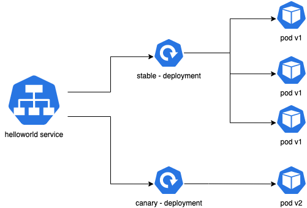

# 4. Canary Deployment \(JJ\)

Canary 배포는 새로운 버전을 배포할때 전체 서비스에 영향을 최소화 하면서 무중단 서비스를 운영하는 배포 기술입니다. 기본적인 개념은 새로운 버전의 소프트웨어를 배포하고 트래픽 전송량을 조금씩 올리면서 위험을 조기 발견하여 안전하게 배포하는 것입니다. 트래픽을 올리면서 새로운 버전에 대한 사용자들의 반응을 살필수 있고, 트래픽 전송량을 높이는 중간에 문제가 발생하면 바로 이전 버전\(검증된 버전\)으로 롤백 할 수 있습니다.

> canary 라는 이름은 광부들이 광산에 카나리아와 함께 진입하는데에서 유래했습니다. 광산에서 유독가스가 누출되면 카나리아가 먼저 죽기 때문에 광부들은 위험에 미리 대처할 수 있습니다. canary 배포 방식은는 전체 인프라 또는 서비스에 영향을 미치기전에 잠재적인 문제를 조기 발견 할 수 있는 기술입니다.

무엇보다 Canary 배포의 가장 큰 장점은 운영환경에 배포할 수 있다는 것입니다. 테스트 환경을 구축할때 늘 운영환경과 동일한 환경을 갖추려고 노력합니다. 그것은 VM, container 는 물론이며 Data 또한 마찬가지 입니다. \(그래서 Stage 환경, Stage Database 등 을 따로 구축하고 운영하기도 합니다.\) 그러나 Canary 배포 방식은 운영환경에서 추가로 배포한 뒤에 트래픽 제어만을 활용하기 때문에 Canary 방식의 배포를 통해 테스트가 끝난 시점은 곧 배포 완료 시점과 동일합니다.

Canary 배포에 대한 자세한 내용은 [여기](https://martinfowler.com/bliki/CanaryRelease.html) 에서 확인 할 수 있습니다.

> Martin Fowler 가 이 방식을 소개한 책입니다. Continuous Delivery: Reliable Software Releases through Build, Test, and Deployment Automation \(Addison-Wesley Signature Series \(Fowler\)\)

## Canary deployment 구현

istio 는 트래픽을 제어하는 기술이기 때문에 canary 배포를 쉽게 지원할 수 있습니다. 실제 예를 통해 살펴보겠습니다.

### Kubernetes 기능만 사용한 canary deployment

쿠버네티스의 기본 기능만으로 이미 canary 배포를 구현할 수 있습니다. 쿠버네티스에서 소개하는 방식은 deployment spec 에 labels 를 구분해서 2개의 deployment 를 배포하고 1개의 service 에 붙이는 방법입니다. 예를 들어, 이미 배포한 서비스 helloword version v1 를 새 버전 v2 로 배포하는 과정을 살펴봅시다. 쿠버네티스에 helloword v2 버전 deployment 를 배포하여 작은 개수의 pod 를 띄우고 service 의 selector, deployment 의 label 설정합니다. helloworld service 는 두 deployment 에서 컨트롤하는 v1 pod 와 v2 pod 로 트래픽을 분산해서 보내게 됩니다. 이때 v1 pod 개수가 많을수록 v2 canary 배포의 영향은 줄어듭니다. 이후 비율을 조정해서 배포를 진행하거나, 롤백하기 전에 v2 에 나타나는 영향을 확인할 수 있습니다. 그림에서는 v1 3개, v2 1개 pod 가 배포된 예를 보여줍니다. 이때 canary 용 v2 pod 는 전체 트래픽의 25% (1/4) 를 받습니다.
deployment 에 [HPA(Horizontal pod autoscaler)](https://kubernetes.io/docs/concepts/workloads/controllers/deployment/#scaling-a-deployment) 를 적용하면 rollout 과정중에 트래픽 부하에 따른 pod 수 조절을 자동화 할 수 있습니다.



```yaml
     name: helloworld
     replicas: 3
     ...
     labels:
        app: helloworld
        track: stable
     ...
     image: helloworld:v1
```

```yaml
     name: helloworld-canary
     replicas: 1
     ...
     labels:
        app: helloworld
        track: canary
     ...
     image: helloworld:v2
```

사실 이 방식은 배포하려는 버전(v2)이 적절하게 테스트 된 경우에 적합합니다. 쿠버네티스의 canary 배포는 공통 pod label 이 있는 두 개의 deployment 를 사용하여 수행됩니다. 이 경우에는 두 개의 auto scaler (HPA) 가 각 deployment 에 하나씩 수행되므로 helloworld 서비스 전체에 대한 auto scaling 은 사용할 수 없습니다. 따라서 배포된 pod 개수로 부하의 비율을 조절하는것은 한계가 있습니다.


사실 kubernetes 외 다른 container orchestration 플랫폼들 어느것을 사용하더라도 (docker/docker swarm, mesos/Marathon) deployment 와 같이 instance 개수로 canary 배포를 관리하는것은 옳지 않습니다. 배포된 버전에 상관없이 모든 pod 는 worker node 의 kube-proxy 를 통해 round-robin pool 내에서 동일하게 처리되므로 pod 개수로 canary 비율을 제어하는것이 유일한 방법입니다. 만약 그 비율을 적게 유지하려면 더 많은 pod 가 필요합니다 (예: 1% 에는 v1 버전 99개, v2 버전 1개가 필요함). pod 개수만으로 canary 배포를 확인하는것 외에도 특정 기준에 따른 canary 배포 가시성을 위해서도 또 다른 솔루션이 필요합니다.

이제 istio 에서 지원하는 canary 배포를 살펴보겠습니다.


### Istio 를 사용한 canary deployment

