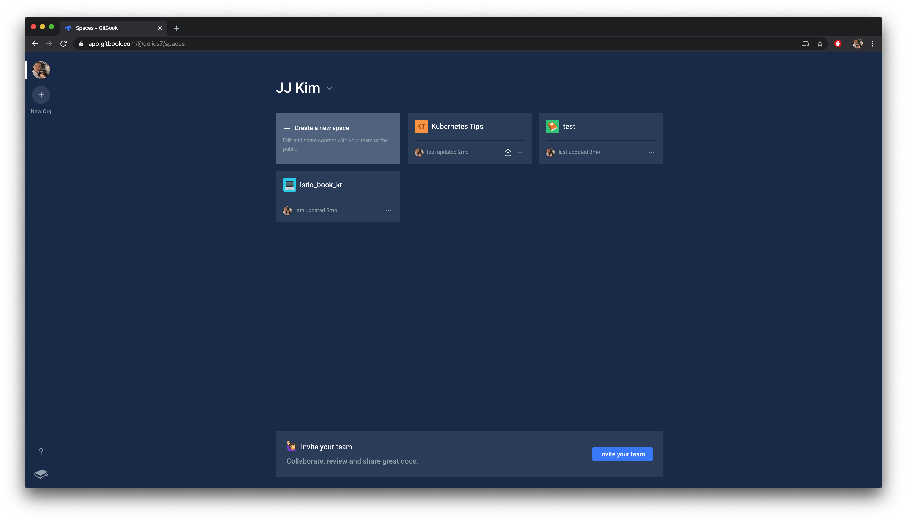
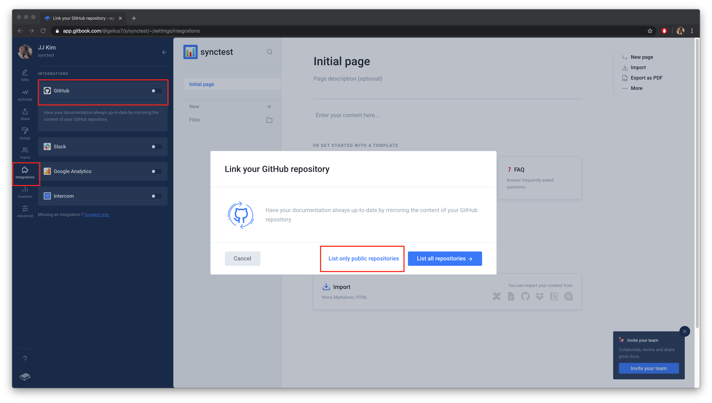
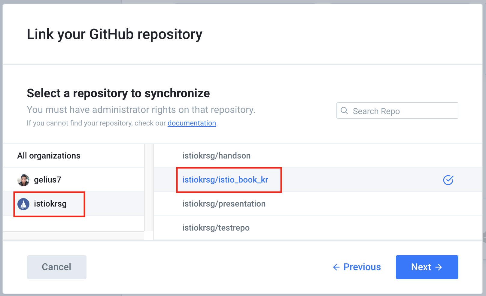
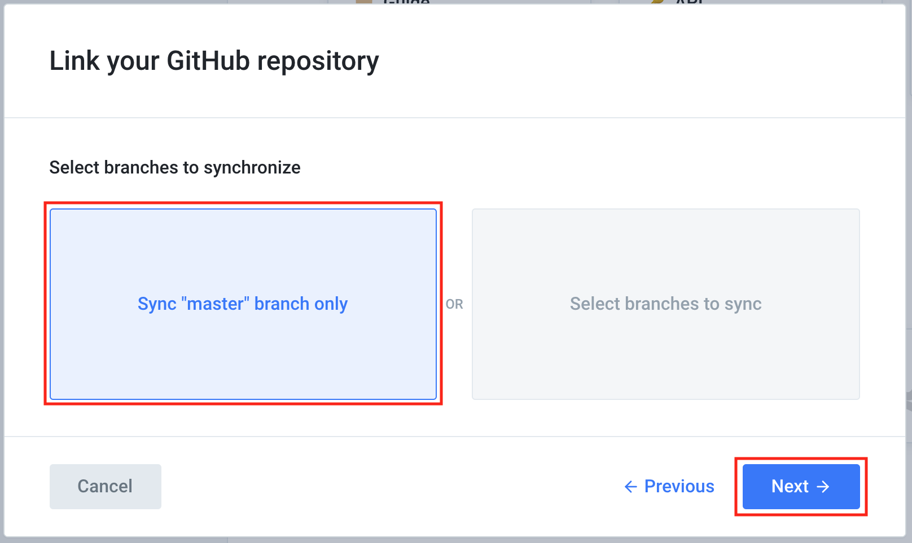
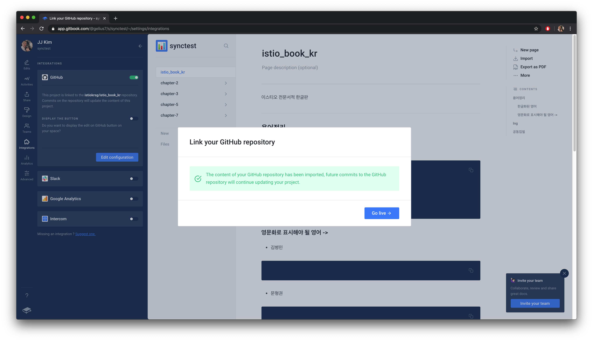

# gitbook 작업 환경 셋팅

## 시작하기전에...

각자 gitbook 계정이 있다고 가정합니다. 공동 작업공간은 github 에 있다고 가정합니다. \([https://github.com/istiokrsg/istio\_book\_kr](https://github.com/istiokrsg/istio_book_kr)\)

## gitbook 셋팅

먼저 create a new space 를 선택합니다.

원하는 타이틀을 적습니다.

왼쪽 끝에 Integrations 를 선택하고 github 과의 integration 을 시작합니다.

github 에 로그인하는 과정까지 마치고 나면 다음과 같이 선택해줍니다.

master branch 에서 공동작업 할것이기 때문에 master branch only 를 선택해줍시다.

우리는 github 에 이미 내용이 있고 gitbook 으로 옮겨와서 작업할 것입니다. github 에 있는 컨텐츠를 gitbook 으로 가져오도록 선택합시다.

열심히 컨텐츠를 가져오는군요

이제 작업할 준비가 완료되었습니다.

진행중 잘 안되시면 문의주세요. gelius7@gmail.com

